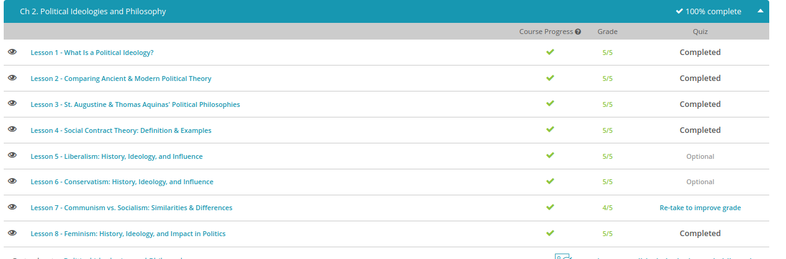

#### Andrew Garber
#### Sep 13 2022
#### Chapter 2: Political Ideologies and Philosophies  

#### What is a political ideology

 - A political ideology is a set of related beliefs about political theory and policy held by an individual, group of individuals or a particular social class(generally, that kind of thought enforcement is generally projected on to that class.)
 - Liberalism is one of the major political ideologies of the world. It focuses on individualism, self-reliance, personal responsibility, equality before the law and limited government.
 - Socialism is another major political ideology of the world. As a socialist, Liam shares some of the same beliefs as Ron. Socialists believe that individuals should be equal before the law, just like liberals. However, socialists don't believe that all people can develop independently of each other. In other words, individual development is a collective, or social, effort.

#### Ancient and Modern Political Theory
 - Socrates, Plato, and Aristotle are the main three philosophers of the ancient political world
 - Socrates main teachings revolved around how to best organize society, though he was against democracy as he believed it was a straightforward path to tyranny based on human nature. He believed in a philosopher king ruling society, though his beliefs on the structure of how this person should be selected are somewhat unclear.
 - Plato was concerned with the question of what justice meant, Plato also believed that democracy would lead to tyranny and expressed the idea that justice is not simply what a majority of people believe, enshrining the right of the "minority opinion" in his teachings.
 - Aristotle was a big believer in the power of deductive reasoning(and taught this philosophy to Alexander the Great, arguably leading to some of his great tactical victories) and some modern interpreters have cast him as a believer in what would now be called a technocracy, or objective meritocracy where intellectual prowess and ability to do a job is valued above all else - though if he thought directly along these lines cannot be known.

#### St Augustine and Thomas Aquinas 
 - St Augustine was a Roman bishop in Algeria, who wanted to reconcile Roman, Greek and Papal beliefs on the way the political world should work. His works are defined by the concept of the two cities, the earthly and spiritual cities, St Augustine believes that despite the fact that the world is unjust the best way to live a good and valuable life is to strive for justice across all things.
 - Thomas Aquinas was an Italian theologian in the 13th century, he merged Aristotelian theory with Papal teachings, and believed that divine nature and purpose was evident throughout basic human nature. These were described by him as the eternal laws of humanity, and were not so much laws as the automatic inclinations of human psychology. One of his natural laws, those eternal laws that can be disobeyed due to humanity's free will, a unique trait, is the desire to build political societies to maintain both order and justice on a large scale.
 - St Augustine believed that war was just another manifestation of the imperfect world, and that a just war was a closer mandate to the spiritual city than an unjust one, so if a war was basic human nature it was better that it be for a just reason instead of greed or bloodlust.

#### Social Contract Theory
 - The social contract theory is a simple underpinning of modern political system, it argues that people benefit from living together both for psychological reasons but also economic ones, that specialization begets human development and human development makes more just political systems.
 - Hobbes, Locke and Rousseau were some of the foundational thinkers of this idea and advanced it from a general concept to a more specific definition, they had different views on it however. 
 - The contractual theory of government is the political manifestation of the idea, that people had to willingly do things like pay taxes and serve in the military, but in return the government had to listen to their desires and provide for their basic needs like security and a right ot property. American Supreme Court Justice Oliver Wendell Holmes Jr later put this succinctly as, "Taxes are the price we pay for a civilized society".

#### Liberalism 
 - Liberalism is a group of political, social and economic theories that centers on the values of individual liberty, equality, economic freedom, limited and democratic government and the rule of law. 
 - Liberty is a political concept that refers to freedom from undue or oppressive restraints on a person's actions, thoughts or beliefs imposed by the state. Some important liberties in modern liberal states include freedom of speech, press, religion and association. Liberty is constrained by the harm principle, which states that you have liberty as long as you do not harm others.
 - Liberalism holds that all individuals should have equal treatment before the law regardless of social status, race or sex.
 - Economic freedom is also closely associated with liberalism and involves support for free markets and private property rights.
 - A limited and democratic government is also fundamental to liberalism. A limited government is one constrained by the law. For example, the powers of the United States government are limited to the powers enumerated in the U.S. Constitution. A democratic government exists where government is controlled either directly by citizens or through representatives elected by citizens.
 - Liberalism can be traced back to John Locke. Locke was a 17th century English philosopher and political theorist. Locke's the Two Treatises of Government is considered to be the first exposition of liberalism. Locke argues that legitimate political authority only comes from the consent of the governed. The purpose of the government, according to Locke, is to protect citizens' lives, liberty and property. Locke also supported limited government and the idea of a separate executive branch, legislation and the rule of law.

#### Conservatism
 - Conservatism is a political ideology that values the creation and maintenance of stable societies based upon a hierarchy of power lodged in a traditional class of leaders and deep respect for traditional values.
 - The modern conservative school of thought can be traced to the 18th century British philosopher Edmund Burke and his 1790 work Reflections on the Revolution in France. Burke found that humans were not just rational but also full of passion and prejudice and inherently unequal. However, according to Burke, despite the reality of unequal status and wealth, humans are interdependent. Society is 'organic,' or real, rather than just an abstraction created by the musings of philosophers. Burke believed that the state holds the wisdom accumulated by society over time and should be given a great deal of respect.
 - An important aspect of Burke's conservatism is the suspicion of change. According to Burke, change should only occur if absolutely necessary in order to avoid a greater evil. For example, a country that has remained neutral in times of war would only change that policy of neutrality to avoid the greater evil of being invaded and conquered. Any proposed change should be reviewed carefully in light of the facts on the ground rather than through a prism of abstract theory
 - American conservatives reviewing this lesson may be utterly confused at this point. That's understandable because traditional American style conservatism is better understood as classical liberalism, which values individual liberty and securing it through limited government. American conservatives seek to conserve the principles and values of the classical liberal tradition, which served as the ideological foundation for the United States.

#### Communism vs Socialism
 - Socialism is a social and economic philosophy that attempts to reduce inequality among different social classes of people through creating a more equal distribution of resources, largely through governmental wealth redistribution policies.
 - Nations like Sweden, Norway and Finland are social democratic countries that provide for their citizens via a comprehensive social welfare policy that while having high taxes, redistributes wealth through universal health care, state owned services and other such policies. This is different from countries like Canada, New Zealand, and Australia where some of these services are provided, but not in the entirety that the social democratic countries espouse, leading to lower rates of taxation and a more business friendly atmosphere.
 - North Korea is an authoritarian government with central planning, and is at least in theory a communist nation that seeks the complete sharing of resources and rule by the proletariat, or the workers. Different strains of communism, including Marxism, Stalinism, Trotskyism, Maoism and others have large differences in how to achieve communism, a utopian ideal, but almost always includes the collectivization of resource production and the institution of a "temporary" dictatorship in order to achieve communism. 
 - Communist economies are centrally planned, in contrast to socialist countries where businesses are largely left alone, except for more stringent consumer protection laws and higher taxation.

#### Feminism
 - Feminism is a group of social theories, moral philosophies and related political movements that advocates social, political and economic equality between the sexes. Though the name implies that this would be a society where women are superior to men, this is an inaccurate view of feminist theory that simply wants complete and total equality between sexes.
 - The seeds of modern feminism were planted with the writings of Mary Wollstonecraft and John Stuart Mill. Wollstonecraft wrote the Vindication of the Rights of Women in 1792, which argued that women should have the same rights as men, including the right to education, earnings and property. John Stuart Mill, in his 1869 book, The Subjection of Women, also argued that women should have the same legal rights as men.
 - Economic feminism and political feminism are different ideas, but frequently overlap and muddle the messages of different groups focused on either one - economic feminism wants equal legal protection for women, the same as political feminism, but is more focused on things like pay disparity, work force participation and childcare policies that systematically disenfranchise women from being active participants in the workforce, in their view(while modern economic theory largely agrees with this view, how these problems should be solved is a matter of political debate)
 - Political feminism cares about the economic issues, but is more focused on ensuring legal equality between the races.
 - The second wave of the movement began in the 1960s. The focus of the second wave was for employment and reproductive rights. Some notable laws were passed during this period, including the Equal Pay Act; Title VII of the Civil Rights Act, which prohibited gender discrimination in employment; and Title IX, which prohibits discrimination in education. The landmark Supreme Court decisions of Griswold v. Connecticut, involving birth control, and Roe v. Wade, regarding abortion, greatly extended female reproductive rights. *UNTIL IT WAS OVERTURNED IN JUNE OF 2022
 - There are more extreme types of feminism, including Liberal feminism, radical feminism, marxist feminism, socialist feminism and others. 

 Quiz result:
 - 