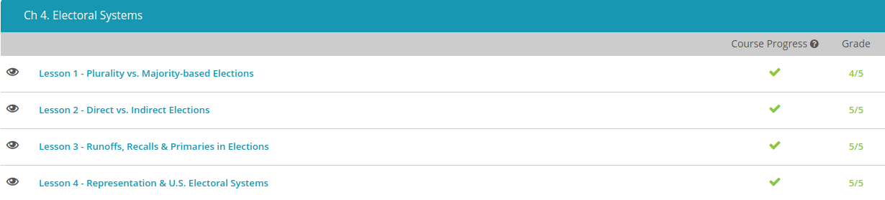

### Andrew Garber
### September 29th 2022
### Electoral Systems - Political Science

#### Plurality vs Majority
 - A plurality voting system, also known as "first past the post" is simply based on who has the greatest percentage of votes. The UK uses this system for their MP elections
 - Majority Voting is different, this system requires a candidate to receive some percentage of the vote - normally 50% - in order to win, or for the top candidates to advance to a runoff election.

#### Direct vs Indirect Elections
 - Unlike in the presidential election, when you vote for your state representative, the total number of votes will determine the winner of the election. The votes cast directly by citizens is known as the popular vote, referring to the actual votes of the people. So, if you and five million of your neighbors vote for a particular candidate and that is the most votes that any candidate receives, you have yourself a winner.
 - This is generally seen as the most fair, and many are pushing for the mass adoption of this for Presidential elections in the US, however many fear that this will make small states overlooked
 - The process to elect the president, on the other hand, is an example of an indirect election, one in which an intermediary body, elected by the people, is responsible for the outcome of an election. The Electoral College of the United States is an example of the intermediary group that determines the winner. The electoral college deliberately apportions votes so that smaller states have an outsized impact on the electoral result, so that they are not overlooked, at least in theory.

#### Runoffs, Recalls and Primaries
 - In regions that opt for this method, runoffs are a way to determine a winner when no one candidate gains more than 50% of the vote. Instead of only being allowed to cast one vote for one candidate during the election, a voter may have an opportunity to express their preference for more than one candidate.
 - Using the recall process, voters work to remove an elected official before the end of their term. This involves the voters obtaining a certain number of signatures proposing recall. A ballot is then held, and if a certain threshold is reached they are recalled and a new election held. This is a more immediate way for citizens to participate in government directly.
 -  A primary is an election held by a political party to determine their candidate for the general election. The primary election is held internally, meaning that only registered members of that political party can vote in it. Though in most states, those registered as "independent" are sent ballots for both parties and given a decision on which to vote in, though only one is allowed.

#### Representation and U.S Elections
 - While initially many people were restricted from voting in the United States, over time the rights of voters would expand to include more of the population, such as women and people of color.The United States today is divided up into different districts. If you've ever voted for a member of the House of Representatives, you may have noticed that you were choosing a candidate for your particular congressional district. 
 - Each state needs its own representation in Congress so that all regions of the country can have their voice heard. Each state has two Senators, so are represented equally in this respect. The challenge comes when we start to look at states with different numbers of people.
 - In most states, the system used to choose a candidate for representative follows the equation of one representative for each individual district. This is known as a single-member district because one single member of the legislature represents a district. Another possibility, though much more rarely used at this time, is the multi-member district. In this system, multiple members of the legislature represent a district. This can be accomplished in part by having larger districts, rather than smaller ones.
 - While most states use the single-district approach, multi-member districts can be helpful when aiming for proportional representation. Proportional representation refers to a method of ensuring that the number of seats held by a particular political party is based on the number of votes for that party.

 - 