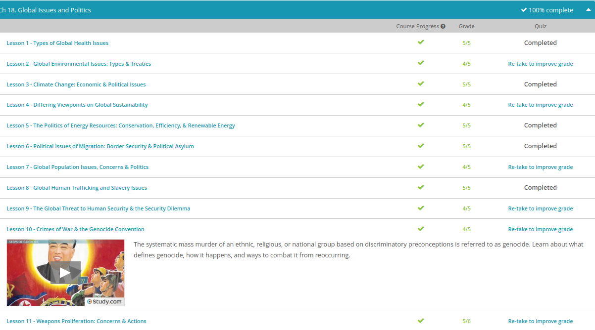

### Andrew Garber
### November 7
### Global Issues

#### Global Health
	- Infectious diseases are intertwined with numerous global issues and are inseparable from other political, economic, and cultural components. The average child growing up in the United States, most likely very similar to yourself, is able to remain relatively healthy because of things like vaccinations, easy access to medicine, and public services that are committed to keeping us healthy, such as doctors and hospitals.
	- The risk for global health concerns spreading is increased because of factors such as:
		-Poor economies
		-Ethnic conflicts
		-Environmental degradation
		-Population growth and urbanization
		-International trade
	- Countries with poor economies often don't have the money and resources for adequate health care and health research to combat a serious health issue. Ethnic conflicts contribute to the collapse of public services that may have been normally available to help treat health concerns. Fighting also may create large refugee populations, which encourages overcrowding and unsanitary conditions that make diseases ripe for spreading.
	- The more time you spend with your class, the more time you give the germs inside of you to spread to others, who in turn get sick themselves. If an illness spreads to a large number of people, we call this an epidemic. If an epidemic is long-lasting and affects the population globally, we call this a pandemic.
	- Covid-19 was a prime example of this, the greatest example of a pandemic shutting down effectively the whole world due to the infectiousness of the disease.
	- Most global health concerns arise from the spread of infectious diseases. Some of the most dangerous infectious diseases that continually affect large populations include HIV/AIDS, influenza, malaria, tuberculosis, and SARS. These diseases spread in part because of poor education as to how to prevent their spreading, in addition to all the reasons we previously mentioned.
	- It should be noted, however, that some global health concerns aren't caused primarily by infectious germs and viruses but may result instead from inadequate diets and activity levels, like obesity. Obesity is one of the few global health concerns that is unique to highly developed countries.

#### Environmental
	- First, contemporary environmental issues have taken on a global scale, whereas in the past, such issues were confined to small parts of the globe. Secondly, current environmental concerns are often products of our own doing, whereas in the past, concerns were much more to do with the confines of nature. Lastly, current environmental concerns are worsening at a more rapid pace than in the past.
	- Ancient societies had more time and space to deal with environmental threats than we do today. Collectively, each of these qualities make an ecological challenge a global environmental concern. In this lesson, we will briefly cover some of the more major global environmental concerns, as well as discuss measures that are being taken to help correct them.
	- Heat waves can lead to more refugees and migration concerns, deaths from heat stroke, and forest fires. Warmer weather also encourages wetter weather conditions, which are ripe for insect-transmitted illnesses. Droughts can also lead to crop failure and a decrease in tourism, all of which would have an effect on the global economy.
	- There is a consensus among scientists that greenhouse gases are altering the atmosphere in ways that ultimately contribute to climate change and higher temperatures. Furthermore, the assumption is that human activities are the main causes of these climate developments due to the heavy development of industry, which creates pollution. What causes this situation is when the amount of carbon dioxide increases in the atmosphere and traps solar radiation, which then increases the atmosphere's temperature. This is called the greenhouse effect. The increase of pollution in the atmosphere not only leads to the changing in the global climate, but it also leads to some other serious problems.
	- We also face the danger of becoming burned by the growing holes in our ozone layer, which is a layer of the atmosphere that blocks UV radiation. Without this protection, UV exposure can lead to skin cancer, eye disorders, and genetic changes in plants and animals. Ozone depletion is most severe in Antarctica and in the Northern Hemisphere.
	- Challenges to sustainable living are of concern primarily in the forms of water scarcity and the decline in biodiversity. At the foundation of human existence and life on Earth is water. We need water to create and sustain life. As more water sources dry up because of misuse or become undrinkable because of pollution, there becomes a lack of secure, uninterrupted, long-term availability of adequate clean freshwater, known as water scarcity.

#### Resources
	- Thus, the viewpoint of putting personal advantage ahead of all of humanity is no longer seen as a wise quest, and rather it is becoming increasingly clear that we move towards a course of sustainable development. Sustainable development is economic growth that does not deplete the resources needed to maintain life and prosperity. So, in other words, I can go ahead and fill that water balloon up to increase my fun and enjoyment, but I shouldn't fill it up too much because more isn't always better. And while the view of sustainable development is a good one, not everyone agrees if that is attainable.
	-  One of the more famous views on sustainability is the Neo-Malthusian school of thought that says that the growth of the global population is outpacing the amount of food available to adequately sustain everyone. Neo-Malthusiasts believe that since food is an essential component to human life, people need to have it, but there needs to be some preventative or positive checks on population to slow its growth so that it keeps pace with the rate of food production.
	- Unlike the views of the Neo-Malthusians, which originated over 100 years ago, the concept of sustainable development is even more directly traceable to 1987. In 1987, a commission known as the Bruntland Commission submitted a report called Our Common Future, which concluded that the world cannot sustain the growth required to meet the needs and aspirations of the world's growing population unless it adopts radically different approaches to basic issues of economic expansion, equity, resource management, and energy efficiency.
	- The Bruntland Commission agreed with the Neo-Malthusians that our population was outpacing the needs of our growing population, but where it differed is that instead of calling for checks on population growth, like the Neo-Malthusians would, the Bruntland Commission instead supported using what resources we have more wisely and efficiently. The thought was to meet the needs of the present without compromising the ability of future generations to meet their own needs. Thus, you can see that this view is more optimistic than the previous one.
	- The last view on sustainability again agrees with the fact that population growth leads to an increase for a demand for food much like the previous two views. However, this new view, known as the Anti-Malthusian view of sustainability, claims that instead of the increased demand for food leading to starvation and death, that humanity will adapt to meet current needs through its innovation and technology. You can see how this view is much more optimistic than the Neo-Malthusian view and even more optimistic than the Bruntland Commission.
	- Energy conservation is the act of saving energy by reducing a service. In other words, to conserve energy, you need to cut back on your usage. Simple examples might include turning off the lights when you leave a room, driving your car less and taking public transportation more, or by buying a programmable thermostat that can regulate the temperature of your house. Or in our competitive eater example, remember that a conservative eater only eats as many hot dogs as his stomach can hold.
	- Energy efficiency, on the other hand, is defined as saving energy but keeping the same level of service. For example, if you turn off the lights when you leave a room, you are practicing energy conservation. If you replace an inefficient incandescent light bulb with a more efficient compact fluorescent bulb, you are practicing energy efficiency. Or in our competitive eater example, remember that an efficient eater looks for ways to get the hot dogs in his stomach in the best way possible; for instance, by dunking them in cups of water.
	- This, paired with the fact that the amount of oil that the Earth has will someday run out, has led to the search for renewable, or replaceable, sources of energy. Thus, the shift has been towards natural resource conservation, cutting back on the amount of oil that the globe consumes, while also looking towards more efficient sources, ones that are renewable, to help wean ourselves off the sole reliance on oil. Technologies that derive energy from the sun, wind, water, and nuclear and chemical reactions are examples of renewable energy strategies.
	- Among known technologies, nuclear energy has often been championed as the leading alternative to fossil-fuel dependence. In fact, the United States in 2010 provided billions of dollars in federal loan guarantees for companies to build two nuclear reactors. So the desire for renewable energy resources is there. For some countries, however, safety and financial concerns may limit the surge toward nuclear power. Thus, the cost/benefit implications of renewable resources have profound implications for global environmental policies. Germany and Japan, for example, are decommissioning their nuclear power plants over safety concerns, but at the same time, nuclear power plants are also the cheapest zero-carbon electric power generators.
	- [Nuclear Energy](../../Q3-Q4_10TH/Science/Completed%20Assignments/Research%20Papers/nuclear_energy.md)
	- ^^ My Views on why Nuclear Energy is actually awesome.

#### Day 1 

#### Migration
	- We normally associate migration as movement from one country to another, but far more common is the movement of people within countries and from one country to another but within a particular geographical or cultural region. An example would be if our world traveler Kyle moved from France to Germany. He is moving to a different country but is still also staying within Western Europe.
	- Although the causes for migration are diverse and vary from one person to the next, all reasons for migration can generally be divided into two categories: push and pull factors. Push factors are negative developments and circumstances that motivate or force people to leave their homes. Pull factors, on the other hand, are positive developments inducing people to move from their homes to someplace else.
	- Specifically for instances where abuses to human rights and high levels of violence and political instability are involved, many migrants often become refugees, or migrants living outside of their country of origin who are unwilling or unable to return. If a refugee attempts to obtain permanent residence in the country to which they fled, they are said to be asylum seekers. The concept of granting asylum was first put into practice during the 1951 United Nations Geneva Convention that stressed that individuals or groups persecuted on the grounds of race, religion, nationality, membership in a particular group, and holding certain political opinions would be recognized as refugees and granted asylum. Some countries have since expanded this definition to include women and homosexuals fleeing violence and sexual abuse.
	-There are also pull factors, which include:
		-Freedom
		-Economic opportunities
		-Globalization
		-Family reunification
		-Sparsely populated areas
		-Educational and cultural opportunities
#### Population
	- At the center of population growth is the extent to which the global population growth threatens the Earth's carrying capacity, which refers to the maximum number of humans or animals that can survive within a given area. Overpopulation, too many people living in an area that has inadequate resources to support them, has been a global concern for centuries. The growing global population is also affecting some groups of people more than others.
	- Again, if we think back to our too-small-of-a-house analogy, the easiest solution might be to find a way to get a bigger house. Unfortunately, this solution isn't possible when our house is our planet. The Earth isn't going to grow anymore, and except for moving to a bigger planet, we need to find other solutions to keep our global population rate in check. The goal of addressing global population growth is to keep the global replacement rate stable. The global replacement rate is the rate at which the number of people leaving the Earth, either through death or migration to different regions within, balances out the rate at which people are entering a region, by birth or immigration.
	- Governments and nongovernmental organizations have done a number of things to try and address problems arising from rapid population growth. For instance, it is generally agreed that women's level of education strongly influences fertility rates. Education helps influence things such as choices to use contraception, the age of marriage and childbearing, as well as employment opportunities outside the home. Thus, educating women has been a solid option for population control.

#### Trafficking
	- The forced movement of people within or between countries is known as human trafficking. More specifically, when people are forcibly moved under false pretenses and then forced into labor or prostitution, this is known as contemporary slavery. It is impossible to know exactly how many people are trafficked worldwide, but the CIA estimates that 20,000 people are trafficked in the United States alone.
	- The reason for human trafficking's continued existence is strongly related to the increasing levels of economic and cultural globalization. Global inequality and demographic factors in many countries contribute to the rapid growth of labor migration, a development in which most countries participate. Migrants are employed to do the most strenuous and undesirable jobs in most countries because it is often the only way they can earn a wage. This is because most people who are targets of trafficking and contemporary slavery come from disadvantaged areas and are looking for ways to support themselves and their families.
	- Another factor that makes human trafficking increasingly prevalent is the feminization of migration, or the increasing percentage of women and people who identify as women in the migrant population. In many areas, they are generally perceived to be replaceable commodities by human traffickers. Thus, many criminal organizations collaborate to maximize their profits by trading women and girls like property.
	- The Fourth World Conference on Women declared that women's rights are human rights and adopted a platform that called on governments to dismantle criminal networks engaged in trafficking women. The United Nations has also put forth a measure called the UN Protocol Against the Trafficking in Women and Children to get countries to commit to ending the practice. In the United States, a coalition of Democrats, Republicans, feminists, and evangelical Christians pressured the U.S. Congress to enact the Victims of Trafficking and Violence Protection Act to prosecute traffickers in the United States and to take action abroad against this global crime. 
