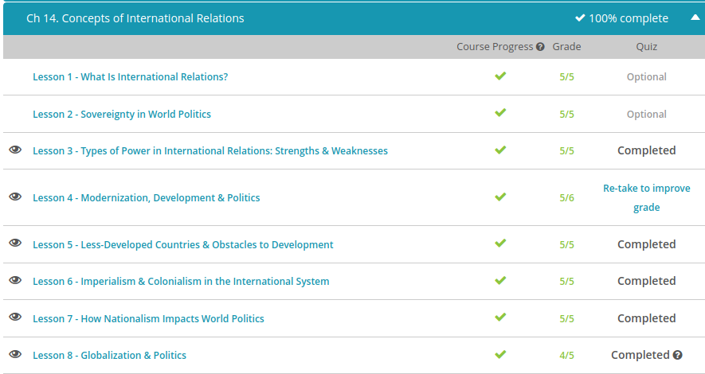

### Andrew Garber
### October 20
### Concepts of International Relations

#### Types of Power:
 - The goal of power is to influence others to do something. Hard power, according to Joseph Nye, Jr., an American political scientist born in 1937 who has defined many of our modern theories of power, and particularly power in international relations, sees coercion as the best way to get this done.
 - Countries that have foreign policies of hard power rely on their military or economic strength to basically force other nations to cooperate. As a result, nations with the best resources tend to be the strongest in a hard power system. They have more room for economic development and can impose their will over others via either a carrot or stick. Empires, for example, influence foreign policy by conquering another people and forcing them to contribute to the imperial economy.
 - To be frank, proponents of hard power policies result in stuff getting done. There's no negotiation or compromise, and it's a simple matter of survival. Those who oppose hard power policies point out that it tends to cause destruction (in terms of both lives and resources) and builds up resentment. Nobody likes being pushed around, and international markets and relationships can become quickly destabilized.
 - The next power is soft power. This term was actually coined by Joseph Nye, and it is the opposite of hard power. Nye describes soft power as a policy based around negotiation and subtle influence. In short, hard power policies make other nations cooperate through coercion and aggression, while soft power policies try to gain cooperation through persuasion and example. In this system the concept of legitimacy is critical, as it is believed that in order to persuade people to voluntarily adopt a viewpoint, one must prove that it is worth adopting.
 - We've seen this before in American history. In fact, American democracy was founded as an ideal that was meant to inspire others to follow this example. The goal was not to conquer other nations and force them to become democratic, but rather to provide a model that inspired them to adopt this system on their own. Much later in the Cold War, the USA tried a similar tactic by sending capitalist products like nylons and Coca-Cola to developing nations.
 - Some people prefer hard power policies, while some people prefer soft power policies. So, why not both? Since the advent of the 21st century, Nye added a new form of power to this list: smart power, which combines elements of both hard and soft power. A nation that relies on smart power maintains a strong military, but also focuses on alliances and international partnerships.
 - So, what would this look like, and when would it be useful? Realistically, this has been a growing trend since the 1990s. When U.S. president George Bush, Sr. had to decide what American foreign policy would look like in the post-Cold War world, this is basically what emerged. The USA became a leader of multinational coalitions but still used its military to create an international political environment that was favorable to its interests.

#### Modernization
 - A lesser-developed country (LDC) is a country with a low level of economic development compared to developed countries, such as Japan, Europe and North America (with the exception of Mexico). Many people residing in LDCs often live in severe poverty and struggle to obtain basic necessities, such as food, clean water, sanitation and healthcare. Most LDCs are found in Asia, Latin America and Africa.
 - Modernization theory tends to generalize a development model that is based on the development of the West -- Europe and North America. Modernization theory advocates for social, political and economic changes to make LDCs more 'Western.' Free markets, acceptance of foreign investment in the country and democratic political institutions are encouraged.
 - Modernization theory is not without critics. It is very ethnocentric that it assumes that the historical path of Western development is ideal and other cultural approaches are inferior. It tends to ignore the fact that the West had a head start. Modernization theory also focuses only on the internal dynamics affecting an LDC and ignores the external factors, such as a history of colonial oppression and the LDC's role in the global division of labor.
 - Dependency theory developed as an alternative to modernization theory in the 1960s. Dependency theory utilizes Marxism and focuses on external factors affecting development. It argues that the successful development of the developed countries was dependent upon the underdevelopment of the LDCs. In other words, the development of the developed countries of the Northern Hemisphere was based upon the exploitation of the lesser-developed countries of the South due to unequal trade practices, abuse of LDCs' low-skilled labor market and extraction of profits from LDCs to the developed countries.
 - Dependency theory has its critics, too. Critics argue that the theory views LDCs as passive and incapable of taking action. It also treats all LDCs as the same, as if all were victimized by global capitalism in the same way to the same degree. The theory also tends to ignore internal causes of poverty. And, perhaps most importantly, its claim that global capitalism always creates poverty in LDCs is contrary to the evidence as Hong Kong, South Korea, Taiwan and Singapore, often referred to as the 'four tigers of East Asia,' have demonstrated through their rapid economic development in the 1970s and 1980s.
 - The world-systems theory concedes that LDCs can achieve upward mobility in the world, but also holds that in order to understand what's going on internally in a country, you also have to understand the external factors that affect it. The theory also acknowledges that capitalism can take different forms.
 - One of the most important distinctions between the world-systems theory and the others we've discussed is that the world-systems theory posits a tripartite division of the world. Instead of just developed countries and LDCs, this theory says that there are really core, periphery and semi-periphery countries. Core countries are our familiar, developed countries, characterized as wealthy and industrialized 
 - Periphery countries are our familiar LDCs, characterized as rural, impoverished countries with an economy focused on agriculture and raw materials. Periphery countries are often subject to authoritarian governments. The new kid on the block is the semi-periphery country. Semi-periphery countries have characteristics of both core and periphery countries. You can think of these as the most developed of the LDCs, like Mexico, Brazil and Thailand.

#### Less Developed Countries
 - A lesser-developed country (LDC), sometimes called a developing country, is a country with a low level of economic development compared to developed countries, such as Japan, Europe and North America, with the exception of Mexico. LDCs are located in Asia, Latin America and Africa.
 - LDCs have some political and social hurdles to overcome in pursuing development. A rapidly growing population is a giant hurdle for many LDCs. Most of the world's population is actually in LDCs rather than in the developed countries, and people take resources just to survive. The more people there are, the more resources are necessary to provide basic necessities like food, clean water and adequate sanitation. More resources used for survival means there are less resources available for economic development.
 - Gender inequality also adds to the problem. In many LDCs, the culture frowns upon women working outside of the home. Downplaying or ignoring half of a country's valuable human resources is typically not a good development plan.
 - Many LDCs are run by corrupt and inefficient governments. A developed economy requires predictability in the application of law, and trust in the government, given the power it can wield over businesses. Corruption prevents this predictability and creates instability and uncertainty, both of which are bad for business. Corruption also creates inefficiency when those in power make decisions based not on sound development strategy but rather on what benefits them or their patrons.
 - LDCs also face several economic and financial hurdles in their race to development. A lack of capital and investment is a serious obstacle for development. Many LDCs simply don't have the ability to invest in things like factories, machinery, equipment, infrastructure and higher education to support a developed economy.
 - Since most people in LDCs are poor, they aren't big spenders. If the consumers in a market can't afford the goods and services, it doesn't make much sense to invest in the market. At the end of the day, the developed countries offer investors safer and better investment opportunities. Consequently, LDCs are often plagued by capital flight, where wealthy businesses and individuals in a country deposit and invest their money overseas in the economically and politically-stable developed countries.

#### Imperialism and Colonialism
 - Imperialism is the dominance of one political community over another political community. The weaker political community is influenced to serve the dominant power's interests. You can think of it as empire building, which was often a bloody affair. For example, the European imperialism in Africa and North and South America was accomplished through military conquest and colonization.
 - Nevertheless, imperialism can be pursued through the assertion of political, economic and cultural influence, often referred to as neoimperialism. Some point to the United States as a maestro of the art of neoimperialism. The United States exerts a great deal of influence over the entire world. Although the U.S. uses its military might to forward its interests, it also relies on economic power, its influence in the design and policy of important international institutions, such as the United Nations, the World Bank and the International Monetary Fund, and alternative methods to spread social, political and economic values and culture across the world.
 - Colonialism is traditionally defined as conquering and settling occupied or unoccupied territory. For example, England, Spain and France colonized North America. Imperialism is a broader category of domination that encompasses colonialism. You can think of it as one of the tools you can use to build an empire. Colonialism pretty much became extinct as the final remnants of the old colonial empires were dissolved after World War II.
 - Even though the colonial system is now pretty much extinct, its effect is still being felt across the old colonies. Some of the old colonies suffer from internal conflict because their boundaries were based on the colonial system, which separated some ethnic groups and placed traditionally hostile groups within the same boundaries.
 - Neocolonialism involves a continued relationship of dominance between former colonial powers and their former colonies through economic dependency. Even though many former colonies gained their legal independence, they remain under the de facto control of the Western powers of Europe and the United States.

#### Nationalism
 - Nationalism is one's identification and patriotic loyalty to his or her nation and its interests.
 -  A sense of nationalism binds the people of a state with different socioeconomic classes, religions and education together by providing them a common identity and common purpose. The United States is a perfect example of the power of nationalism since its population is very diverse, and yet, pretty much all of its citizens have a strong devotion to the United States and its national goals.
 - If taken to extremes, nationalism can create a great deal of international instability and violence. Extreme nationalism can lead to a sense of superiority and even militarism and aggression towards others who are not part of the nation. One need only look at the extreme nationalism of Nazi Germany and the utter destruction it wreaked upon the world during World War II - as well as the horrors of the Jewish Holocaust - to see nationalism gone wild.
 - Since the Global Financial Crisis of 2008, there has been a significant increase rise in populist and nationalist political parties. This could be seen throughout Europe as such options gained political power in countries including France, Germany, Hungary, and many others. These nationalist positions were largely based on anti-immigration policies and on economic protectionism.

#### Globalization
 - Basically, globalization means that all the countries, their economies, and their cultures become interconnected and interdependent. Instead of being islands unto themselves, globalization means that states are increasingly becoming a part of a larger global system that has the ability to exert influence upon them.
 - Closely related to globalization is globalism, which is defined by Robert O. Keohane and Joseph S. Nye, Jr., professors of international relations, as the state of the world consisting of networks of interdependence resulting from the flow of goods, services, people, culture, and ideas across the world. If globalization is the process, you can think of globalism as the result.
 - Economic globalism is about the flow of goods, services, and capital around the globe and the perception about these global economic exchanges.
 - Military globalism involves networks of security interdependence, where states in the network provide for each other's security through use of force or threats of force. 
 - According to Keohane and Nye, environmental globalism involves 'the long-distance transport of materials in the atmosphere or oceans, or of biological substances, such as pathogens or genetic materials, that affect human health and well-being.' For example, given the frequency of international air travel today, national governments have become more concerned about pandemic threats, which are the regional or global spread of dangerous diseases, such as avian flu or Ebola
 - Social and cultural globalism is about the movement of ideas, images, and people across the globe. Chris sees this in his travels. There are not many places in Europe and Asia where Chris travels that he can't find familiar political ideas or culture from the United States. 
 - The vast majority of the world's human population resides in the South, where they live in severe poverty without access to adequate food, water, and other necessities of life. This extreme difference between the development, wealth, and prosperity in the North and the poverty and lack of comparative economic development in the South is often referred to as the North-South gap.
 - Globalization can be viewed both negatively and positively as it relates to the North-South gap. Some argue that early globalization, in the form of imperialism, caused much of the disparity today as the Northern powers arguably exploited the people and resources of their Southern colonies. In fact, some argue that the exploitation continues as companies take advantage of the lower costs of labor and looser regulations in the South. On the other hand, Northern investment in Southern markets helps build up the economic base and alleviate some of the poverty

 