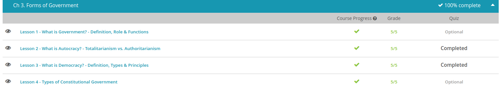

#### Andrew Garber
#### September 15 2022
#### Types of government notes

#### What is government 
 1. 'the group of people who control and make decisions for a country, state, etc.'
 2. 'a particular system used for controlling a country, state, etc.'
 3. 'the process or manner of controlling a country, state, etc.'
 - Dr. Harold Damerow, a professor of government and history, gets a bit more specific with his definition. He says that government is 'responsible primarily for making public policy for an entire society.' He also mentions that government is 'the steering mechanism for a given society.' It forms the policies that keep a particular society heading in the right direction.
 - The purpose of the U.S government is defined as, 1. 'To form a more perfect Union' 2. 'To establish Justice' 3. 'To insure domestic Tranquility' 4. 'To provide for the common defense' 5. 'To promote the general Welfare' 6. 'To secure the Blessings of Liberty'

#### Autocracy vs Authoritarianism
 - In an autocracy, political power is held by one person who can control most or all aspects of people's lives. Autocrats may be called dictators, emperors, and other names. In the past, Egyptian pharaohs were a type of autocrat for that society. Others may play a role in helping maintain the power of an autocrat, such as elite members of society who benefit from the leader staying in power.
 - To maintain control, an autocratic government may use force and the repression of individual rights. Autocracies are authoritarian in this way, meaning that an authority has most of the control over people's lives. Authoritarian leaders may employ a variety of means to prevent a loss of power, including threats of violence to those speaking up in opposition.
 - In some cases, having one strong leader can unite groups that were in conflict in the past or had been divided. This may help create one functioning society. Yet the trade-off includes a lack of freedom or path to express dissatisfaction. Authoritarian governments are often unpopular due to this repression, as Bridget has discovered in her own society.
 - a totalitarian government in which an authority has control over all aspects of people's lives. If led by one ruling person or party, totalitarianism is an extremely authoritarian version of an autocracy. It's authoritarianism taken beyond a leader having control over most aspects of society and, instead, a way of saying that leadership has nearly total control over day-to-day life. Nazi Germany is an example of a totalitarian regime, one in which there was little to no room for differences in ideology, even in private life.

#### What is Democracy 
 - At the most basic level, it is a type of government or political system ruled by citizens, people who are members of a society. In a democracy, citizens hold some level of power and authority, and they participate actively in the political, or decision-making, process of their government
 - a representative democracy - the members of a society vote for leaders to represent them in the decisions and actions of the political process.
 - The officers and directors have the final decision-making power for the club, and the members abide by their choices. They are, however, quick to express their displeasure if they don't like what their leaders are doing, and if they get really upset with an officer or director, they have the option of voting him or her out in the next annual election.
 - 

#### Types of Constitutional Government
 - Just about everyone in the country agrees on one thing: they need to determine the limits to the legal power of the government and document this. Abuses by past government leaders have made this a priority.
 - leaders with too much power concentrated in their hands made choices not in the interest of the people, such as when their previous leader controlled what the news media was allowed to say about government policies.
 - Governments that establish documented rules or principles about the legal limits of the government are known as constitutional governments. These norms help determine how power will be distributed in the nation and who gets to make what decisions.
 - One style of constitutional government that the nation will consider is a unitary approach. This type of government concentrates more power at a national level. For instance, governments that are unitary systems will generally determine most laws and policies so that they apply to all regions of the nation, rather than having each region set their own laws. Local governments typically carry out the decisions made at the national level.
 - Others disagree with Higgins and want a unitary style of government. They work to convince him that a more unitary style will have benefits, such as making it clear what is expected of individual regions and ensuring a level of uniformity across the country. They say that this uniformity will help improve pollution everywhere, including his region, and this will help the government run more efficiently. Countries with a unitary style include France and Norway, for instance.
 - In a government that is more federal in style, as Higgins wants, power is less concentrated at the national level. This involves a balance between decision-making at a regional level and at a national level. Regional governments will make key decisions, not just carry out the decisions of the national government. These regional and local areas may be called states, regions, communities, provinces, or may have other names, depending on the particular nation. The United States is an example of a more federal style of government, 

#### Quiz Results
 - 