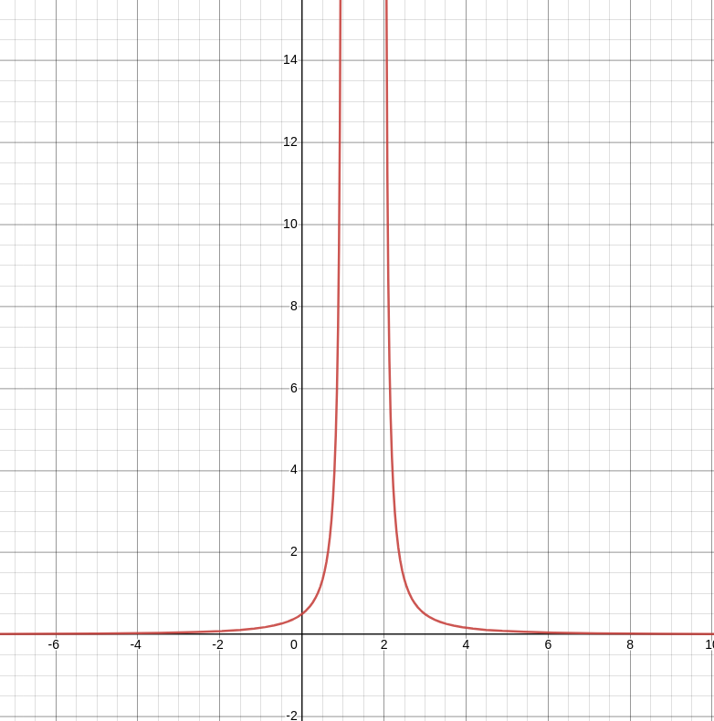

#### Andrew Garber
#### September 9 2022
#### Graphing With Functions Review

 - Quadratics are an arc
 - Linear functions increase in a straight line, based on slope and y intercept coordinate
 - Factoring quadratic equations is done by finding two things that multiply together to equal the whole quadratic polynomial | $2x^2 + 7x + 3$ = $ (2x+1)(x+3)$
 - Tangent is the slope of a curve at a single point, slope = steepness
 - Asymptotes are not achievable in reality, they eventually reach infinity - and thus we have to a approximate.
 - A horizontal asymptote is defined as: If y approaches a number N(y->N) as x goes to +-infinity (x->+-infinity) then the line y=N is a horizontal asymptote.
 - Horizontal Asymptote Example: 
 - 
 - A vertical asymptote is similar, If x approaches a number N(x->N) as y goes to infinity (x->infinity) then the line x=N is a horizontal asymptote.
 - 
 
 #### Quiz Results
 - Graphing Basic Functions
 - 
 - Polynomial Functions
 - 
 - Exponents and Simplifying
 - 
 - Slopes and Tangents on a graph
 - 
 - Horizontal asymptotes
 - 
 - Implicit Functions
 - 