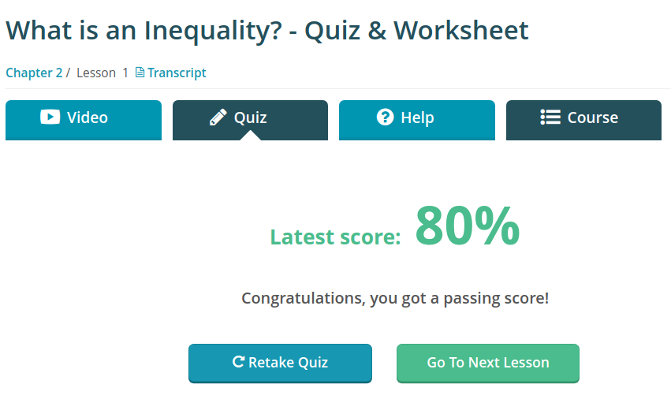
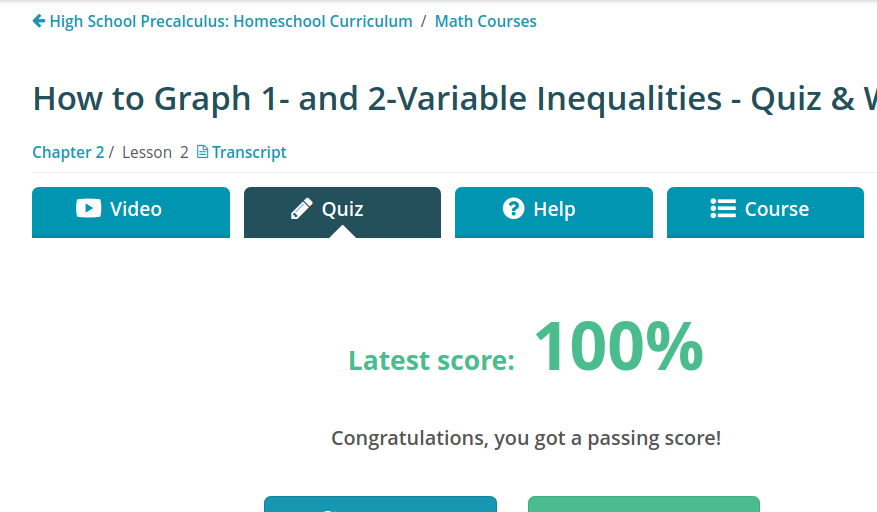
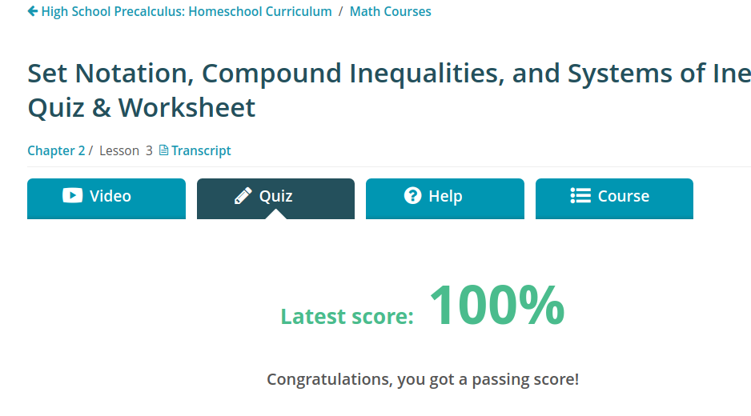
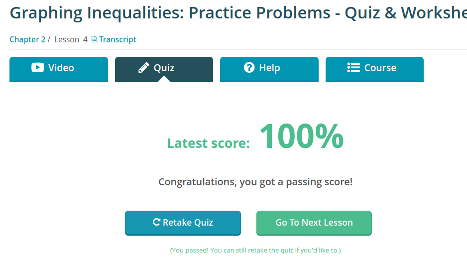
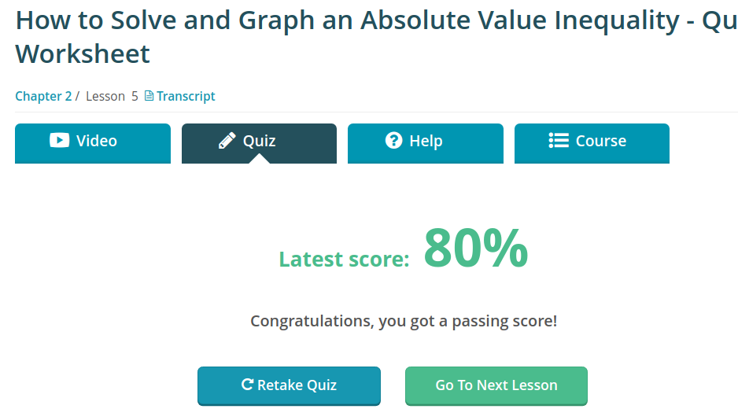
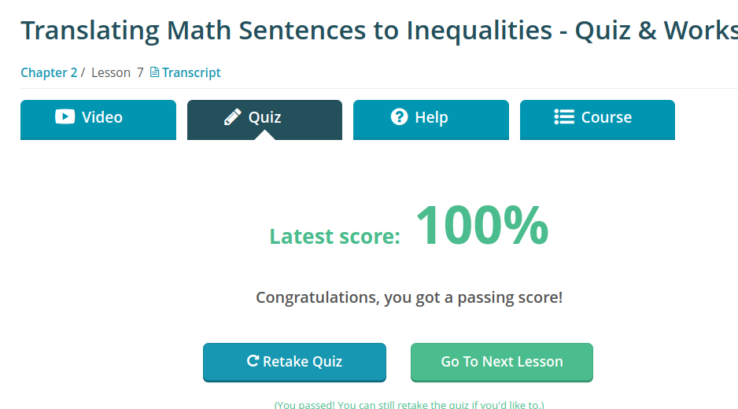

### Andrew Garber
### September 12 2022
#### Working with inequalities review

An inequality is an equation that us >, <, <=. >=.

#### How to graph 1 and 2 Variable Inequalities

One variable inequalities are very simple, they can simply be graphed on a number line, for example: 4x + 3 < 15. This can be solved as 4x < 12, and x < 3. 

Two variable inequalities must be graphed on a coordinate plane, thus something like y < 2x-5 can be graphed making the line of y=2x-5 and shading everything less than that line on the graph.

#### Set Notation, Interval Notation and compound inequalities
A compound inequality is just specifying a condition that has two or more requirements, this is frequently done in programming use symbols or keywords like `and`, `or`, `else`.  One variable compound inequalities can be graphed on a number line with the circles on either end of them, or pointing outwards.

Set notation is a system of enumerating compound inequalities to be more readable, and easier to decipher. An example would be, `{x | x > 80 and x < 90}` what this says is, "all values of x, such that x is greater than or equal to 80 and less than 90." 

Interval notation is an extremely concise way of showing compound inequalities, frequently displayed simply as, `[80,90)`. The first number is the lower bound, and the second is the upper bound. The opening bracket, [, indicates that 80 is included in the solution and is equivalent to saying greater than or equal to. The closing parenthesis on the other end, ), indicates that 90 is not included in the solution and is the same as saying less than.

#### Systems of inequalities

If these two are graphed, they would overlap in a fixed area where both conditions are met.
 - y > x + 1
 - y ≤ -x + 5

#### Quiz Results:

 - What is an inequality
 - 
 - Graphing 1 and 2 Var Inequalities
 - 
 - Set Notation and Compound Inequalities
 - 
 - practice problems
 - 
 - Absolute Value Inequality
 - 
 - Translating Math
 - 