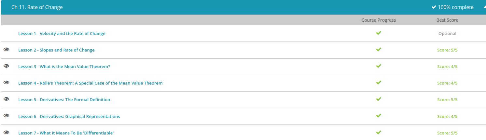

### Andrew Garber
### October 18 2022
### Rate of Change

#### Mean Value Theorem
 - The average rate of change is the total distance divided by the total time
 - Well the instantaneous rate of change is how fast they're going at any point in time exactly. It's their speed at 20 minutes in or 30 minutes in on a specific path, at their individual speeds and other extraneous factors included. So the instantaneous rate of change is the tangent to this position-time graph. You can just think of it as the velocity at a single point in time. While the average rate of change for all three of these drivers is 62 mph, the instantaneous rate of change is going to vary; it's going to depend not only on the time, but also on the driver.
 - The Mean Value Theorem says that for a function where you always have an instantaneous rate of change, the average rate of change will be equal to the instantaneous rate of change somewhere in the region where you've taken the average.
#### Rolle's Theorem
 - Rolle's theorem, which is really just a specialized case of the average value theorem. Rolle's theorem says that if the average rate of change is zero, specifically because the start and end points are both at zero, then the instantaneous rate of change equals zero at somewhere along that path.

 - You have some region, a to b, where both f at a and f at b equal zero. So your endpoints are at zero. Rolle's theorem says that somewhere between a and b, you're going to have an instantaneous rate of change equal to zero. This means that somewhere between a and b, the tangent to your curve is going to be zero. Just looking at this graph, you can see that the tangent to the curve has zero slope at four points.
 - So if you have a function $f(x) = (2 - x)(x - 1)(4 - x)(6 - x)$, you know that f(x) is going to equal zero at 1, 2, 4 and 6. Because f(x)=0 at those four points, you know that in between those four points, we have some place where the tangent to this line equals zero. Specifically, somewhere between x=1 and x=2, the tangent to this curve will equal zero. Somewhere between x=2 and x=4, there will be a tangent to the curve that is equal to zero. Somewhere between x=4 and x=6, there will be a tangent to the curve that equals zero.
#### Derivatives
 - if you were to shoot a cannonball, the velocity increases drastically at the very start and then fades. The cannonball's velocity at any point in time is the instantaneous rate of change, and that is the derivative.
 - The derivative is a function for the instantaneous rate of change. So how do we find this derivative? Well, what is the instantaneous rate of change? We know that the average velocity, the average rate of change, is the end point minus the start point, divided by the region: $(f(b) - f(a))/(b - a)$. So this is the change in location divided by the change in time.
 - Well, that's the average over some long time period. But maybe we should look at it over a very short time period. Maybe, to make this an instantaneous rate of change, that time period is really zero. To make this an instantaneous rate of change, we're going to look at the limit as the change in time goes to zero - so, as our little region of time that we care about goes to zero.
 -The derivative is the rate of change at a single instance. We write that as the limit of some interval going to zero of f(x) at one end of the interval minus f(x) at the other end of the interval, all divided by the interval length.

#### Differentiable
 - Being differentiable means that you have a derivative. It means that if you have a graph, that graph is going to be smooth

 