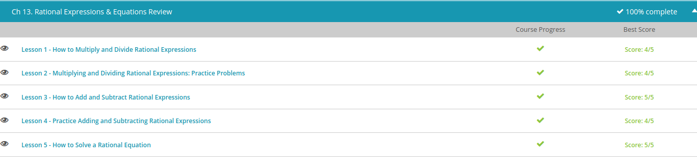

### Andrew Garber
### October 25
### Rational Functions Overview

#### Multiplying and Dividing
 - A polynomial rational expression is a fraction containing polynomials. Example of a rational expression: $(r - 4) ÷ (r^2 - 5r + 6)$
 -  The steps for it are quite simple, for multiplication: Factor - Slash - Multiply
 - For division: Factor, Flip, Slash, Multiply

#### Add and Subtract
 - The steps for adding and subtracting are many, but they aren't too hard. We need to factor. Find a common denominator. Rewrite each fraction using the common denominator. Put the entire numerator over the common denominator. Simplify the numerator. Factor and cancel if possible. Write the final answer in simplified form.
  - 
  - 
  
  
  
  