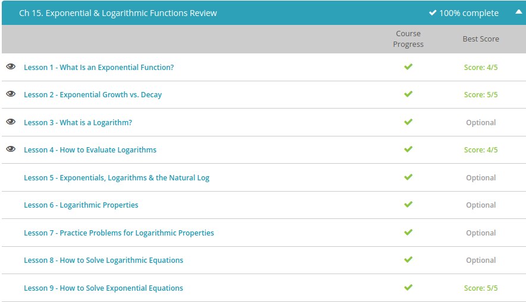

### Andrew Garber
### October 28
### Exponential & Logarithmic Functions

#### Exponential Function + Growth + Decay
 - An exponential function is a function where the independent variable is the exponent. For example, $y=4^x$
 - Exponential Growth is where it infinitely increases, for example $2*3^x$ where as you increase x it infinitely increases as the x value increases.
 - Exponential decay still follows the same rule of repeated multiplication, only the number we multiply by has to be smaller than one. What this ends up looking like is something that appears to be repeated division.
 - For example $y = 1,600*(1/2)x$.
 

#### What is a logarithm
 -  A logarithm is the power that you raise a certain base to, in order to get a given number. It's just another way of looking at exponential expressions, which you already know how to work with. Just like addition reverses subtraction, and multiplication reverses division, logarithms reverse exponential expressions.
 - To make it easier to solve for the exponents, logarithms use a special kind of notation. The expression $x^y = z$ in exponent form would turn into $log_x (z) = y$ in logarithm notation.

#### Evaluating Logarithms
- Example: log base 5 of 25 
- This is the same as asking 5 to what power equals 25, to which the answer is 2. Thus $5^2 =25 $
