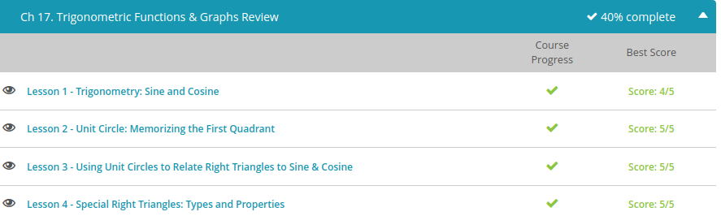
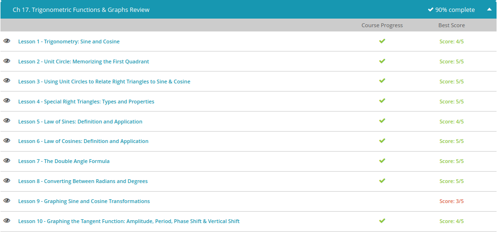

### Andrew Garber
### Nov 3
### Trigonometric Functions & Graphs Review

#### Sine & Cosine
 - Sine equals the opposite over the hypotenuse. If I go back to my unit circle, then my hypotenuse has a length of 1. My opposite edge has a length of y. So sine theta in the unit circle equals y. This helps us in graphing sine theta. So let's draw a graph - sine theta as a function of theta.
 - 
 - Cosine is equal to the adjacent edge divided by the hypotenuse. In our unit circle this is x divided by 1, or just x. I can do the same thing - what happens to x as I go around this circle counterclockwise?
 - 
 - Tangent theta is equal to the opposite edge divided by the adjacent edge. It's harder because we aren't using 1 at all in this, we're using x and y, so tangent of theta in our unit circle is y divided by x, or sine divided by cosine. 
 - 

#### Unit Circle
 - For trigonometric calculations, the most important thing you can memorize is the unit circle. The unit circle contains several useful angles along with their x and y coordinates.
 - Memorizing the unit circle can be extremely helpful because, if you have it memorized, you can calculate the trig values of the angles without a calculator. You can even go backwards by taking a trig value and finding the angle that created it.
 - The first quadrant angles range from zero degrees to 90 degrees. To get angles in between, we split it in half and in thirds. This gives us angles of zero, 30, 45, 60, and 90 degrees. Now that we know the degree measures for the angles, we need to write the radian measures. You can convert all the degree measures into radian measures by multiplying them by 2pi/360.
 - Zero multiplied by anything is zero, so that angle is zero radians. 90*2pi/360 simplifies to pi/2 radians. For the other three angles, you can convert or you can use a pattern. Take the first number from the angle in degrees and put pi over them. Reverse the order and you have pi/6, pi/4, and pi/3.
 - Knowing the angles is the first step, but to be able to do calculations, we have to know the x and y coordinates for each angle. Again, we will start with the zero and 90 degree angles. These are straightforward. The coordinates are read directly off the graph. The point for a zero angle on the unit circle is the point (1,0). The point for a 90 degree or pi/2 radian angle is the point (0,1).

#### Special Right Triangles
 - The first special right triangle is the 30-60-90 triangle.
 - So, what is special? The ratio of the side lengths. If the hypotenuse is 2, the short leg is 1, and the long leg is the square root of 3.
 - So, how do you remember which is which? Just think about the logical relative length of the sides. The short leg is the shortest side, so that's your 1. And the long leg is opposite the 60-degree angle, which makes it the middle one, so that's your square root of 3. Finally, the hypotenuse is the longest, and it's opposite the largest angle, so that's your 2.
 - our 45-45-90 triangle is less stylish but easier to work with
 - It's an isosceles triangle! And it's the only kind of isosceles right triangle you can make. Now, what's great about isosceles triangles? The two legs are always the same. That makes finding the hypotenuse easy if you just know one of the legs - just use the Pythagorean Theorem.

#### Law of Sines
	- And, in fact, we can still use sine to help us. And not just 'SOH CAH TOA', but something called the Law of Sines. This law has nothing to do with where you can and can't post signs. No, it's a super-helpful tool for tackling any triangle.
	- It goes like this: $a/sin A = b/sin B = c/sin C$. With our triangle, the capital A, B and C are the angles. And the lowercase a, b and c are the lengths of these sides opposite their respective angles.
	- With the Law of Sines, we're comparing ratios. The ratios of the sides to the sines are equal to each other.
	- Again, this works with any triangle. And you'll never need to use all three sides and angles. You only need two. So if you know two angles and one side, you can use the Law of Sines to find the missing side.
	- For example:
	
	- So it's a/sin 82 = 6/sin 20. The sine of 82 is .99, or almost 1. The sine of 20 is about .34. Let's cross multiply. 1 times 6 is 6. a times .34 is .34a. 6 divided by .34 is about 18. So side a is about 18 units long.

#### Law of Cosines
	- The law states that $a2 = b2 + c2 - 2bc(cosA)$. So the square of this side equals the sum of the squares of the other two sides minus the cosine of the angle opposite times twice the product of the two other sides.
	- We can modify the formula to fit whatever angle we have. So it could also be$ b2 = a2 + c2 - 2ac(cosB)$ or $c2 = a2 + b2 - 2ab(cosC)$. Just match the corresponding angle and side so they're on opposite sides of the equation.

#### Double Angle Formula
	- The double angle formulas are formulas that define the relationship between a trigonometric value and the double of the original angle. 
	- Let's start with the double angle formula for sine. It's $sin(2x) = 2sin(x) cos(x)$. 
	- Next, let's look at the formula for cosine. This is also derived from the summation formula. If you recall, $cos(x + y) = cos(x) cos(y) - sin(x) sin(y)$. Let's turn those ys to xs; $cos(2x) = cos(x) cos(x) - sin(x) sin(x)$. This simplifies to $cos(2x) = cos^2(x) - sin^2(x)$. And that's our cosine double angle formula!
	- Fortunately, tangent gets simpler as a double angle formula. Let's magically make our ys into xs again, and voila: $tan(2x) = (tan(x) + tan(x)) / (1 - tan(x) tan(x))$. We can simplify that to get $tan(2x) = 2tan(x) / (1 - tan^2(x))$.

#### Converting Between Radians and Degrees
	- When it comes to angles, there are multiple ways to measure size, but the two most common units of measure are degrees and radians. You might already be familiar with one or the other, but knowing how to switch back and forth can be quite helpful as well.
	- In the unit circle, or any circle for that matter, there are 360 degrees that make up the whole circle. In radians, we say there are 2 pi radians that make up the whole circle. We will use these two key numbers to set up a proportion, which is a fancy way to say that we will make the key numbers into a fraction and use that fraction to convert the measurements. When converting degrees to radians or radians to degrees, the key numbers that we use for the proportion are 2 pi and 360 degrees.
	- If we were given 45 degrees and asked to convert to radians, it would look like this: 45 degrees multiplied by our proportion, which is 2 pi/360 degrees.	
	- Now that we have (45 * 2 pi) / 360, we can begin to calculate.
		- 45 * 2 = 90. This leaves us with 90 pi radians / 360.
		- 90 / 360 = 1 / 4. We are left with (1 * pi) / 4.
		- The 1 is understood, so we can simplify and leave it out. Our answer is pi/4 radians.
		- We know that a 45 degree angle and a pi/4 radians angle are the same.

