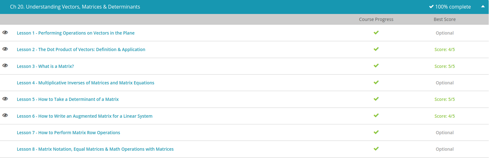

### Andrew Garber
### Dec 13
### Understanding Vectors, Matrices & Determinants

#### Performing Operations on Vectors in the plane
 - Vectors can be defined as measurements that include both magnitude and direction. Just think of an arrow. We can draw arrows of different lengths, but each arrow has its own direction. This is exactly what a vector is. 
 - We draw them on our Cartesian plane; they look just like our arrows. Remember how we write our points on the Cartesian plane with parentheses and then our values separated by commas? Our points look like (3, 4) with our x value first and then our y value (x, y).
 - We write our vectors similarly, as well. When we draw our vectors on our Cartesian plane, we usually have the vector beginning at the point (0, 0) and we mark the point where the vector ends. We mark the end point the same way we mark our Cartesian points with our x value first and the y value second. So, we label a vector that starts at the point (0, 0) and ends at the point (5, 6) with the notation (5, 6) to let us know that it has an x length of 5 and a y length of 6.
 - Most times you will see vectors identified with just two values, but sometimes you will see vectors being identified with more than two values. Theoretically, vectors can be identified with as many values as needed. We could have a vector identified with 3 or even 5 values. For example, (x, y, z) or even (1, 2, 3, 4, 5).
 - Using this notation for our vectors, we can easily perform our operations of addition, subtraction, and multiplication. These vector operations become very easy when we break the notation apart into the vector's separate parts. Even though our vectors may have two or more numbers that identify them, when we do the operations, we do it in stages. First, we add, subtract, or multiply just the x values. Then we add, subtract, or multiply just the y values, and so on and so forth until we've covered all our identifying values.
 - Add vector A (1, 2) and vector B (5, 8).
 - To add these two vectors, we separate each vector into its x part and its y part. For vector A, our x is 1 and our y is 2. For vector B, our x is 5 and our y is 8. Adding them, we get A + B = (1 + 5, 2 + 8) = (6, 10). Do you see how we simply added the two vectors in parts? That's all we have to do. The addition part is the same as we've always done it.
 - Subtract vector A (5, 6) from vector B (11, 23).
 - So our problem is B - A. Let's break our vectors into their separate parts. Vector A has an x part equal to 5 and a y part equal to 6. Vector B has an x part equal to 11 and a y part equal to 23. Performing the subtraction, we get B - A = (11 - 5, 23 - 6) = (6, 17). We took each part and we performed the appropriate subtraction to each part. What do you think? Not too bad? Just remember, break the vector into its separate parts and then do the operation like you always do.
 - Multiply the vector A (-2, 3) with 4.
 - We are multiplying our vector with a number. Again, we break our vector into its parts and then perform the multiplication to each part. We get 4 * A = (-2 * 4, 3 * 4) = (-8, 12). We multiplied each part by 4 to get our answer. And that's all we had to do!

#### The Dot Product of Vectors
 - Now let's talk about the dot product. This is the multiplication of two vectors. We get a scalar result, meaning we get a simple number instead of a number with direction. We have two formulas we can use to find the dot product depending on whether we are given beginning and end points or we are given magnitudes with an angle.
 - The formula to use when we are given beginning and end points is this one:
 - 
 - So, what we do is we take the x lengths of each vector and multiply them together; then we take the y lengths of each vector and multiply those together. Then we add them up to find our dot product.
 - The formula to use when we are given magnitudes and an angle is this one:
 - 
 - This formula is telling us to multiply the two magnitudes together, then find the cosine of the angle between them. We then multiply it all together to find our dot product.
 - 
 - Let's use the first formula for the beginning and end points. We will call the vector on the right vector A and the vector on the left vector B. So for vector A, the x length is 3 and the y length is 4. For our vector B, the x length is -6 and the y length is 8. Plugging these into our formula, we get A*B = 3*-6 + 4*8. This evaluates to A*B = -18 + 32 = 14. So our dot product from this formula is 14.
 - Let's try the other formula. Our magnitude for vector A is 5 and our magnitude for vector B is 10. The angle between them is 73.7 degrees. Plugging these into our formula we get A*B = 5*10*cos (73.7). This evaluates to A*B = 50* 0.2806667 = 14, approximately.

#### What is a Matrix
 - Matrices are the main ingredient of a branch of mathematics called linear algebra. Linear algebra first becomes nice when you begin solving systems of linear equations. By only putting the essential information into a big chart, it allows you to focus on the numbers and you can simplify a lot of the process.
 - For example, let's say you're solving a system of two equations with two variables. You can solve this with elimination by multiplying the top equation by 3 and the bottom equation by 2. This makes the coefficients on your xs opposite, and you can add them together to eliminate the xs and just get the ys by themselves and go from there by solving for y and solving the system.
 - So that's not too bad, but let's say that instead of having two equations and two variables, we had seven equations and seven variables. This gets way messier! I have xs, ys, zs, ws, as, bs and cs, and if I wanted to try to solve this, it would be a huge headache writing out all those different letters every single time.
 - But if we instead take out all the letters and just put it into one big chart, we can kind of cut down on a lot of the work we have to do. We put this chart of numbers in what we call brackets. They're kind of like squared off parentheses. And it's organized into rows and columns. Each row represents one of the original equations from our problem, and each column represents all the different coefficients (numbers in front of the variables) that were on a particular variable. So all the numbers in the first column are all the different coefficients that were in front of the xs, for example.
 - 
 - We can still do the same type of thing. We can still use the elimination method and multiply the whole top equation by 2, which then turns my whole new matrix into this. And again, we can still add rows together in order to eliminate variables. Adding this top row to this second row eliminates my xs.
 - As you can see, this process can still take a pretty long time, so a matrix doesn't necessarily make it easy, but it makes it easier. It also allows us to tell a computer how to do this, and so matrices and linear algebra come up in computer programming a lot because it's really easy to tell the computer what this big grid of numbers is and then the computer can do the whole process for you in a few seconds.
 - 
 - So once we start becoming used to dealing with these grids of numbers, we can start to do more and more complex things with them. We can add them together as long as the number of rows and the number of columns are the same, we can add two matrices by simply adding the numbers that are in the same spots. I can add the 2 and the 4 together because they are in the top left, and I get my new top left number as 6. I can add the top right numbers (-3 and -2) together and get -5. I can add all the individual entries up and end up with my new matrix.
 - 
 - We can even multiply matrices. This is where it starts to get more complicated. The number of columns in the first matrix needs to be the same as the number of rows in the second matrix. It's a process of multiplying the first row in the first matrix with the first column in the second matrix, one entry at a time, and then adding the resulting products up into one entry. The top left entry of my end matrix would be 5.
 - 

#### How to take the determinant of a matrix
 - When the number of rows and columns are the same, we end up with a square matrix. That means that we could have a square matrix that is 1x1 or 2x2 or 3X3. Because they have the same number of rows and columns, the mathematical way of defining a square matrix is to say that it is any matrix that is N x N.
 - Taking the determinant of a 2x2 matrix starts to get a little more complicated. Let's look at the example |5 4 , 8 2|. Again, because the matrix is surrounded by | | we know that we are being asked to calculate the numeric value of the determinant. Now, we have to start with a process that involves multiplying the diagonals and subtracting the products. We start with the top left to bottom right diagonal; in this example, we would do (5)(2). We subtract the bottom left to top right diagonal, which is (8)(4) from that. What we end up with is 10 - 32 = -22, so the determinant of this matrix is simply -22.
 - Once we get to matrices bigger than 2x2 we end up having to calculate a bunch of smaller determinants in a row in order to calculate the main determinant. This skill is not essential for this class, and so we'll just go through one quickly so you can be exposed to it, but don't worry about memorizing the process.
 - For example, if we wanted to calculate the determinant of this 3X3 matrix right here, we would have to do 2 multiplied by the 2X2 matrix determinant that you get when you cover up the row and column that 2 is in. Now, we would take away 1 multiplied by the 2X2 matrix determinant that you get when you cover up the row and column that 1 is in. Finally, -3 times the determinant that you get when you cover up the row and column that -3 is in. Now, it becomes a process of evaluating the determinants of these smaller 2X2 determinants with the formula that we just learned, which is ad - bc. In this case, we'd end up with determinant of this 3X3 matrix being 25. If we were to take the determinant of a 4X4 or 5X5 or 10X10 or 50X50, it gets more and more complex, but it's essentially the same process all over again. You keep taking smaller and smaller determinants until you get down to 2X2 determinants, where you can actually start calculating the values.

