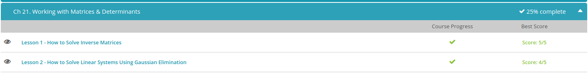
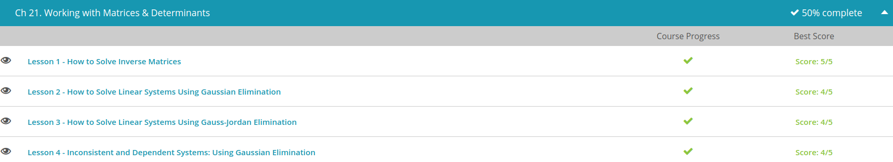
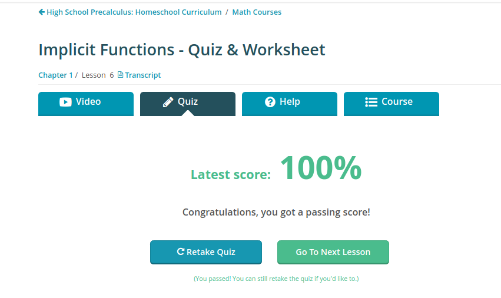

### Andrew Garber
### December 19
### Working with Matrices and Determinants

#### How to solve Inverse Matrices
- The identity matrix is the square matrix that has ones on its diagonal and zeros everywhere else. Think of the identity matrix as the number 1 in the matrix world.
- 
- Do you see how each of these identity matrices are all square, meaning that they have the same number of rows and columns? Also, all the numbers are 0 except the numbers making up the diagonal, which are all 1s. The diagonal is the line that starts at the upper left of the matrix and ends at the bottom right.
- These are called identity matrices because matrices that are multiplied by their matching sized identity matrix will produce the original matrix. We label an identity matrix with a capital I. So, matrix A multiplied by its identity matrix I will equal matrix A.
- Now that we've covered the identity matrix, we can now talk about the inverse matrix. We label inverse matrices with a superscript of -1. So the inverse matrix is defined as the inverse matrix that meets the criteria of A * A sup -1 = I, where A stands for a matrix A, A sup -1 stands for the inverse of matrix A, and I stands for the identity matrix.
- Yes, if we multiply a matrix by its inverse, then we will get the identity matrix as our answer. This is just like when we multiply a whole number by its inverse, we get the number 1. For example, 1/9 is the inverse of 9. When we multiply them together, we get 1. We can also write 1/9 as 9 sup -1.
- Inverse matrices are important in the matrix world because we can't divide in the matrix world. But by using an inverse matrix, we are essentially dividing. To link this to the real world, think of the the inverse of the number 9, 1/9. Aren't we dividing by 9?

- To find the inverse of a particular matrix, we are going to write our matrix and its matching sized identity matrix right next to each other in one big matrix. [A | I]. Then, we are going to use matrix operations to change the first matrix into the identity matrix. What used to be the identity matrix on the right side will now be the inverse matrix. [I | A sup -1]. 

#### Solve Linear Systems using Gaussian Elimination
 - In math, we come across equations by themselves with just one variable that we have to solve. And then we have linear systems, a collection of linear equations. Your linear equations are equations with variables that have no exponents. So 3x + 4x = 5 is an example of a linear equation, as is x + 3y - 4z = 3.
 - We need one equation for each variable in our system in order to solve the system. So if we have two variables, we need two equations. If we have three variables, then we need three equations, and so on. In this video lesson, we will learn about using Gaussian elimination, a method to solve a system of equations, to help us solve our linear system. This method requires us to know how to turn our linear system into matrix form and then use simple matrix manipulations. Let's look at solving this linear system using Gaussian elimination:
 - 
 - Remember that a matrix is just a rectangular array of values put into rows and columns. We first need to turn our linear system into matrix form by turning it into an augmented matrix. An augmented matrix is the combination of two matrices. In our case, we have a matrix for the coefficients of the left side of the equation and another for the right side of the equation.
 - Our linear system is already organized properly, so all we need to do is to isolate our coefficients. Our first row will have 1, 1, 1, | and then 5. Our second row has 2, 0, -1, | and 4. Our third row has 0, 3, 1, | and 2. Our matrix looks like this:
 - 
 - We can now use Gaussian elimination to help us solve this linear system. Gaussian elimination is about manipulating the augmented matrix until we have the matrix that represents the left side of the equations in upper triangular form. What this means is that we want all zeros below the main diagonal. This main diagonal starts at the top left and ends on the bottom right of the coefficients matrix. In other words, we want to manipulate the matrix so the 2 on the second row and the 0 and 3 on the third row are all 0s.
 - To change these numbers into 0s, we are going to use our matrix row operations. To turn our first 2 into a 0, we multiply our first row by a -2 and then we add it to the second row to create a new second row. We get a new second row of 0, -2, -3, | and -6. Now, to change the 3 in the third row into a 0, we will use this new second row combined with the third row. We will multiply the second row by 3 and add it to the third row multiplied by 2. We get a new third row of 0, 0, -7, | and -14.
 - Notice how easy it is to solve now. If we write out our linear equations, we get x + y + z = 5, -2y - 3z = -6, and -7z = -14. We can immediately solve the third equation for z to get z = -14/-7 = 2. We can then substitute this value for z into the second equation to solve for the next variable, y. We get -2y - 3(2) = -6. This turns into -2y - 6 = -6. To solve for y, we add 6 to both sides and we get -2y = 0. Dividing both sides by -2, we get y = 0. So now we have y = 0 and z = 2. To solve our last variable, x, we can use our very first equation. Plugging in these two values, we get x + 0 + 2 = 5. Solving this for x, we get x = 3. So our final answer is x = 3, y = 0, and z = 2. We can also write this in point form, like this: (3, 0, 2).

#### Solve Linear Systems with Gauss-Jordan Elimination
 - So, the process of Gauss-Jordan elimination involves creating an augmented matrix of both sides of our equations, changing this matrix into reduced row echelon form (I will explain this later), then finishing up the problem to find our solution.
 - Let's begin. We first create our augmented matrix. Our first row is 2, 1, -3, and 3. Our second row is -2, 2, 3, and 4. Our final third row is 0, -3, 2, and 1.
 - 
 - 
 - We want to change it into its reduced row echelon form. What is this form? It is when our matrix has zeros on the lower diagonal and the first nonzero number in each row is 1. Also, if a column has a leading 1, then all the other numbers also need to be 0.
 - 
 - Now we can easily finish up our problem by solving for our variables. We have x = 19/3, y = 7/3, and z = 4.

#### Inconsistent and Dependent Systems
 - This video lesson is about inconsistent and dependent systems or collections of equations. What are they? Inconsistent systems are those systems that have no solution. Dependent systems are those systems that have an infinite number of solutions.
 - Once you spot that the system you are working with is either inconsistent or dependent, then you can say that the system has no unique solution because it either has no solution or it has an infinite number of solutions. What causes these situations? For the inconsistent system scenario, this happens when at least two of the equations do not intersect when graphed. This means that they never meet or touch. So, for lines, it means that at least two of the lines are parallel. For planes, it means that at least two of the planes are parallel to each other. For a dependent system, it means that all the equations graph out the same line or plane. Because all the equations are the same, there is no unique solution. Instead, we have an infinite number of solutions because all the equations intersect at all the points.

 - Applying Gaussian elimination, we create our matrix by writing down the numbers associated with the variables as well as the constant numbers. We get this augmented matrix:
 - 
 - We see that for inconsistent systems, when we try to use Gaussian elimination, we end up with a false statement. That tells us that there is no unique solution, and we can't continue.
 - If you take these same systems and you try other methods of solving them, you will come across other obstacles. It all means that there is no method to solving inconsistent or dependent systems because there is no unique solution that can be found.

#### Solving Systems of Linear Equations in Two Variables Using Determinants
 - Linear systems in two variables are common in math. You will see them more and more as you progress. They are collections of two equations with two variables and no exponents. There are several methods that you can use to solve these systems.
 - To help you solve this system, we can use Cramer's rule. Cramer's rule tells you how you can solve the linear system by working with just determinants. First, you create your coefficient matrix, which includes only the coefficients on the left side of the equations. Then you find the determinant of this matrix.
 - We will call this determinant D. Then for each variable, you take your coefficient matrix and substitute the constant numbers, which are the numbers on the right side of the equation, into each column.
 - So, for the c variable, you substitute the constant numbers into the first column of the coefficient matrix. For the d variable, you substitute the constant numbers into the second column of the coefficient matrix.
 - You then find the determinants of these matrices. For the c variable, we will call the determinant D sub c. For the d variable, we will call the determinant D sub d.
 - The solution then is found by division. The c solution is c = D sub c / D. The d solution is d = D sub d / D. Because we have two variables, we need to find three determinants: one general determinant and then one determinant for each variable.

#### Solving Systems of Linear Equations in Three Variables using Determinants
 - 
 - The coefficient matrix is this.
 -  
 - The numbers are just the coefficients in front of the variables on the left side of the equations. The first column is all the x variable coefficients. The second column is all the y variable coefficients. The third column is all the z variable coefficients.
 - The determinant for our coefficient matrix is 1(-1 * -2 - -1 * 3) - 1(2 * -2 - -1 * 0) + 1(2 * 3 - -1 * 0) = 1(2 + 3) - 1(-4 + 0) + 1(6 + 0) = 1(5) - 1(-4) + 1(6) = 5 + 4 + 6 = 15. Our D is 15.
 - Now we need to find our D sub x, D sub y, and D sub z. To find these determinants, we need to substitute each column with the constant numbers. The constant numbers are these.
 - 
 - To find D sub x, we substitute the first column in our coefficient matrix with these constant numbers and then find the determinant of that matrix.
 - 
 - The determinant of this matrix is 6(-1 * -2 - -1 * 3) - 1(-3 * -2 - -1 * 0) + 1(-3 * 3 - -1 * 0) = 6(2 + 3) - 1(6 + 0) + 1(-9 + 0) = 6(5) - 1(6) + 1(-9) = 30 - 6 - 9 = 15. D sub x is 15.
 - The matrix for D sub y is this one. We have substituted the second column with our constant numbers.
 - 
 - D sub z is 45.
 - Now that we've found all our determinants, the next step is to find our solutions by dividing our determinants. To find the x solution, we take D sub x and divide it by D. To find the y solution, we take D sub y and divide it by D. To find the z solution, we take D sub z and divide it by D. Are you ready to find our solutions?
 - The x solution is x = D sub x / D = 15 / 15 = 1. The y solution is y = D sub y / D = 30 / 15 = 2. The z solution is z = D sub z / D = 45 / 15 = 3. Our complete solution then is (1, 2, 3) where x = 1, y = 2, and z = 3. Now we are done.

 