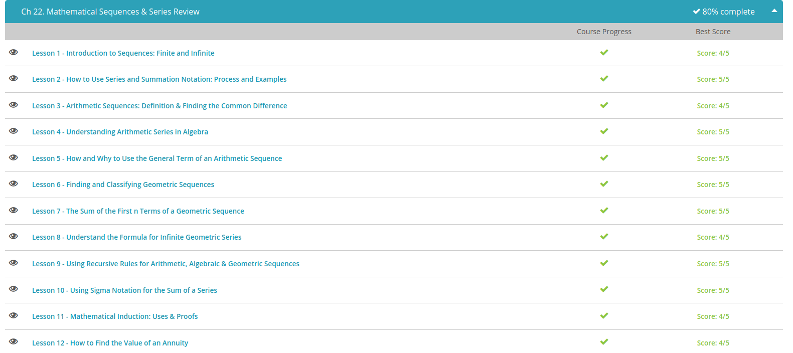

### Andrew Garber
### Jan 11
### Mathematical Sequences and Series 

#### Introduction to Sequences
 - What is a sequence? A sequence is a string(different from a string in programming) of things in order. Because sequences have order, we can usually find a rule or pattern that fits.
 - First, we have finite sequences, sequences that end. These sequences have a limited number of items in them. For example, our sequence of counting numbers up to 10 is a finite sequence because it ends at 10. We write our sequence with curly brackets and commas between the numbers like this: {1, 2, 3, 4, 5, 6, 7, 8, 9, 10}. You can see that this sequence has order to it. It begins with a 1 and goes up by ones. Each number is the previous number plus 1.
 - We can also have a finite sequence made up of other things besides numbers. It can be an ordered sequence of letters, for example. Our alphabet is a finite sequence beginning with a and ending with z: {a, b, c, . . .x, y, z}. It has an order that we understand. We can also make a finite sequence out of names. For example, the name Sarah can be made into the sequence {s, a, r, a, h}, which contains all the letters in the name in order.
 - And this takes us to infinite sequences, which are sequences that keep on going and going. They have no end. For example, our counting numbers is an infinite sequence because it has no end. We can keep on counting forever. We write infinite sequences with the first few numbers to show the pattern and then with three periods in a row to show that it keeps going, like this: {1, 2, 3, 4...}.
 - The possibilities here are endless as well. We can have an infinite sequence of alternating zeroes and ones: {0, 1, 0, 1, 0, 1...}. We can have an infinite sequence where each number is half of the previous number: {16, 8, 4, 2...}. We can have an infinite sequence of all the multiples of 5: {5, 10, 15, 20, 25...}.
 - Why is it important to learn about sequences such as these? It is important to learn about these sequences, both the ones that end and the ones that don't, because understanding them will help us solve problems that involve these sequences. Math problems that involve addition, subtraction, multiplication, and division, for example, all require us to understand the sequence that is the number line. We need to know the order on the number line so we can add and subtract. Sometimes our problems will even ask us to write our sequences.

#### Series and Summation notation
 - Sequences are strings of numbers with a pattern. Examples of sequences include our counting numbers, our even numbers, our odd numbers and so on. Anything with a pattern is a sequence. We can even count by 10s and we would have a sequence because we have a pattern. We can also have a sequence where we multiply each number by the same number, 2, for example, to get to the next number. We write our sequences inside curly brackets with commas between the numbers. For example, we write our odd numbers as {1, 3, 5, 7, . . .} and our multiplication by 2s as {1, 2, 4, 8, . . .}.
 - If we take the sum of a sequence, we have what is called a series. We take the sum of a sequence when we want to find out the total of a sequence. This sum is useful in terms of statistics. When we take the sum, we are simply adding our numbers in our sequence together. So for our sequence of odd numbers, the series would be 1 + 3 + 5 + 7 and so on.
 - While we can write out our series using addition, it is easier to use the Sigma notation to represent our series. The Sigma notation is another way to say 'sum.' It is also referred to as summation notation. This notation looks like a big sideways M. On the bottom of the symbol, we have little letters that tell us our beginning point. On the top of the symbol, there is a little number that tells us our end point. To the right of the symbol, we have a formula for our sequence. For example, our counting numbers have the simple formula of n.
 - Let's go ahead and use this Sigma notation now. We see that our beginning point is n = 1. So, to find our first number that we will be adding to, we plug in this value of n into the formula to the right of the Sigma symbol. To find the second number to add, we increase our value of n by 1, so that now n = 2, and we plug this value into the formula. We repeat this process for the next number, increasing n by 1 again, so now n = 3. We keep repeating until we reach the number at the top of the symbol, when n = 10. That is the last number we are adding. We end up with the series 1 + 2 + 3 + 4 + 5 + 6 + 7 + 8 + 9 + 10. To finish, we add up all these numbers to get our answer of 55.
 - 

 

#### Arithmetic Sequences
 - What is an arithmetic sequence? It is a string of numbers where each number is the previous number plus a constant, called the common difference.
 - Because we have a common difference between all the numbers in our arithmetic sequence, we can use this information to create a formula that allows us to find any number in our sequence, whether it is the 10th number or the 50th number. If you think about it, each number in an arithmetic sequence is actually the first number plus the common difference multiplied by how many times we needed to add it. See, to get to the second term, we added the common difference once to the first term:
 - To get to the third term, we needed to add the common difference twice. Once to get from the first term to the second, and then once more to get from the second to the third term. If we label a as our first term and d as our common difference, our arithmetic sequence would look like a, a + d, a + 2d, a + 3d, and so on. If n represents the location of a number in this sequence, then the formula to find any number in our sequence is:
 - 
 - Let's go back to our candy bar example to see if this formula really works. Our sequence for the candy bars begins with 2, 4, 6, 8, and so on. Let's check to see if the formula will give us the right term for the fourth term. We already know that it is 8. So let's see if the formula will give us 8 as our answer. We plug in 4 for n since we are looking for the fourth term, 2 for a since our sequence begins with a 2, and 2 for d since 2 is our common difference.
 - Plugging all this in and solving for x, we get 2 + 2(4 - 1) = 2 + 2(3) = 2 + 6 = 8. Hey, look at that! We get 8! The formula works! So if we wanted to find out how many candy bars we would get if we have 50 people at the party, we can use this formula for n equals 50. Our a is still 2, and our d is also still 2. Plugging in our new n, we have 2 + 2(50 - 1) = 2 + 2(49) = 2 + 98 = 100. We will have 100 candy bars! Awesome!
 - 

#### Understanding Arithmetic Series in Algebra
 - Arithmetic sequences, or strings of numbers where each number is the previous number plus a constant, can be found all around us. Simply start counting and you are saying the numbers of a very famous arithmetic sequence, our numbers! It goes 1, 2, 3 and so on. Notice how each number is the previous number plus one? This difference between our numbers is called the common difference. We write an arithmetic sequence with curly brackets and commas between the numbers. So our counting numbers can be written {1, 2, 3, . . .} with the three dots in the end telling us that the sequence continues indefinitely.
 - If we add up a few or all of the numbers in our sequence, then we have what is called an arithmetic series. In other words, an arithmetic series is the sum of the numbers in our arithmetic sequence. You will come across math problems that will ask you to find the sum of an arithmetic sequence as you continue on in your math lessons. Keep watching, and I will show you a formula you can use to find this sum. But before we can do that, we need to find the common difference.
 - Finding our common difference is an easy process. What you do is you take any pair of successive numbers and you subtract the first from the second. Now, you take another pair and subtract the first from the second to see if it also has the same difference. If you get the same difference then you have found your common difference. Each arithmetic sequence will have its own common difference.
 - For example, the sequence {4, 6, 8, 10, . . .} is an arithmetic sequence because it has a common difference of two, because each pair of successive numbers has a difference of two between them. We have 6 - 4 = 2. We also have 8 - 6 = 2. Ten minus eight is also two.
 - Look at the sequence {2, 5, 8, 11, . . .}. Does this sequence have a common difference? We subtract 5 - 2, we get 3. What is 8 minus 5? Is it also 3? Yes. Okay; so far, so good. Finally, what is 11 - 8? Oh good, it is also 3. So our common difference is 3.
 - The n represents the number of terms in our series that we are adding up. If we want to add the first 10 numbers, for example, then n = 10. Our problem will tell us how many numbers we are adding up. The a represents the beginning term of our sequence, and d is the common difference. So for our sequence {4, 6, 8, 10, . . .} from before, our a is 4, and our d is 2. If we want to find the sum of the first five terms, then n = 5. Let's go ahead and calculate this. We plug in all our values and evaluate to see what we get.
 - 
 - Let's try finding the first ten terms of the sequence {5, 10, 15, 20, . . .}. First, before we use the formula, we want to see if this is actually an arithmetic sequence. To do this, we look to see if we have a common difference. If we don't, then we don't have an arithmetic sequence, and we can stop right there. We subtract 10 - 5. We get 5. Now, what is 15 - 10 and 20 - 15? Are they also equal to 5? If they are, then this is an arithmetic sequence, and we can go ahead with our formula. If they are not, then we stop and say that this sequence is not an arithmetic sequence and, therefore, has no arithmetic series. In this case, this is indeed an arithmetic sequence. The common difference here is 5. Now we can use our formula to find our arithmetic series for the first ten terms, for n - 10. Our a is 5 since that is our first number. Our d is 5 since that is our common difference. We plug these numbers into our formula and evaluate.
 - 

#### General Term of an Arithmetic Sequence
 - This general term is the formula that is used to calculate any number in an arithmetic sequence.
 - Xn = a + d(n - 1) | General Term Formula
 - The formula tells us that if we wanted to find a particular number in our sequence, x sub n, we would take our beginning number, a, and add our common difference, d, times n minus 1, which is the location of our desired number minus 1. If we are looking for the 30th number, our n is 30, so our formula begins with x sub 30, and n - 1 equals 29 (30 - 1).
 - Let's look at an example to see how we use this general term. Here's a new sequence: {2, 4, 6, . . .}. We want to find the value of the number that is the 25th place in our sequence. Our n in this case is 25. Before we go further, we first have to check whether this sequence is an arithmetic sequence or not.
 - To do that, we look at the difference between each successive pair of numbers to see if this difference is the same. If it is, then we are looking at an arithmetic sequence. If it isn't, then we can't use our general term formula to find our answer. In our case, we subtract 4 - 2 and also 6 - 4 to see if they equal the same thing. They do; they both equal 2. So, this means the sequence is an arithmetic sequence; it is an arithmetic sequence that jumps by 2 with every number.
 - Now that we know this sequence is an arithmetic sequence, now we label our beginning number and our common difference. Our beginning number is 2, so 2 is a. Our common difference is 2, so our d is also 2. Now we go ahead and fill in these numbers into the formula. We get the 25th number is equal to 2 plus 2 times 24. Evaluating this, we get 2 plus 48 equals 50. So, the 25th number is 50.
 - Why do we use this general term? Let's go back to our peach tree example. You would use this general term if you, as the peach tree owner, wanted to find out how many leaves the peach tree will have on the 67th day of growing new leaves.
 - If you use the formula for the general term, you only need to perform three calculations, one for the n minus 1, another to multiply this n minus 1 with the d, and a final one for adding a. Compare doing just 3 calculations to performing 67 additional problems just to find one number. You can see which one is quicker and easier to do.

#### Finding and Classifying Geometric Sequences
 - A sequence is just a pattern, and a geometric sequence is a pattern that is generated through repeated multiplication. Each new term is made by multiplying the previous one by the same thing over and over. For example, we could have the finite geometric sequence 5, 10, 20, 40, 80 by starting with 5 and multiplying by 2 four times. Or we could get the infinite geometric sequence 8, 4, 2, 1, ½, ¼, … by beginning with 8 and repeatedly multiplying by ½, which ends up looking very similar to division.
 - What I'd rather have is a formula that will tell me how many new hits I get at any time simply by substituting in a number. Looking back at the entries we came up with so far will help us to see the pattern that we can try to generalize into a formula. We started at a1=2, then went up to a2=6 (2x3), then a3=18 (2x3x3), then 54 happened because we multiplied by 3 again (2x3x3x3). I keep on multiplying by 3, so the next one is 2x3x3x3x3. We can start condensing these multiplications by 3 into exponents, which means the sixth term would be 2x3^5. Notice that the sixth term had an exponent of 5 on the 3. If I condense the 3s into exponents on the fifth term, I get the 4th power; if I condense them on the fourth term, I get the 3rd power; the third term's the 2nd; the second term's the 1st; and the first term we can call the 0 power, because anything to the 0 power is 1, so we just get 2 x 1, or 2. 
 - 
 - Generalizing the pattern for any term, this means that for any day n after I posted the video, the number of new hits is 2x3^n-1. The 2 in front represents the beginning value a1, the 3 represents what would be called the 'common ratio' and the n-1 represents how many times we had to multiply by 3. It's n-1 because we didn't get any new hits until the second day.
 - Now to figure out how many new hits I'm going to get after two weeks is pretty straightforward. I want to know how many new hits I'm going to get on the 14th day, so we substitute 14 in for n. That gives us that a14=2x3^(14-1) power. We do 3^13 power and we get 1,594,323. We multiply that by 2 and it turns out that 14 short days after I posted the video I'm getting 3,188,646 new hits! My cat has officially gone viral! Soon there will be a meme based on his picture.
 - What we just came up with is the general rule for the nth term of a geometric sequence, an=a1r^n-1. This is actually pretty similar to an exponential function, only the letters have been changed around. An is the general nth term, a1 is the first term, r is the common ratio, or the amount that we multiply by every step of the way. It's called the common ratio because if you divide any two consecutive terms you'll get the same thing. Lastly, the n in the n-1 power is whatever term you're trying to find out. Apparently, if you can come up with a YouTube video that has a common ratio of 3, you're on your way to internet stardom!

#### The sum of the First n Terms of a Geometric Sequence
 - This formula begins with the sigma notation, which tells you that you will be adding up a series of numbers. Next comes the formula for finding each term of our geometric sequence. This part is simply a times r to the kth power. Our sigma notation tells us to add these terms, starting with k = 0 all the way up to n - 1.
 - All of this is equal to a times 1 minus r to the nth power over 1 minus r. This tells us that we can use the part after the equal sign to find our sum of our first n terms. We don't even have to add the individual terms. This is very helpful if we want to find the sum of a large number of terms.
 - In this formula, a stands for our beginning term or number, r is our common ratio, and n is the number of terms we want to find the sum for.
 - 
 - Let's see how we can use this formula now. Let's say we are potato farmers. We want to know how many potatoes we have grown after harvesting for the fourth round. So our n is 4. We began with 1 potato, so our a is 1. Our common ratio is 20 because we multiplied by 20 each time to get our next number in our sequence. We have all the numbers we need to work our formula, so let's go ahead and use it now. We plug in all our values.
 - 
 - Now, we can go ahead and evaluate. We first take our 20 to the fourth power to get 160,000. 1 minus 160,000 is -159,999. 1 minus 20 is -19. -159,999 divided by -19 is 8,421. 8,421 times 1 is itself, 8,421. And there we have our answer.
 - 

 

#### understanding the Formula for Infinite Geometric Sequences
 - If your common ratio is less than 1 or greater than -1, but not 0, then you can use this formula to calculate the sum for your infinite geometric series:
 - 
 - The r is our common ratio, and the a is the beginning number of our geometric series. To use this formula, our r has to be between -1 and 1, but it cannot be 0. Nor can it be -1 or 1.
 - So, if our r is 1/2, 1/4, 1/3, etc., or even -1/2, -1/4, -1/3, then we can use this formula. If our r is outside these limits, if it is greater than or equal to 1 or less than or equal to -1, then the sum of the infinite geometric series cannot be evaluated.
 - Let's try using this formula with our pie example. With our first cut, we set aside half of our pie. So, our beginning number, our a, is 1/2. Our r is 1/2 since we are slicing our pie in half every time.

 - Let's see what kind of answer we get. We plug in our 1/2 for a and our 1/2 for r. Now we evaluate. 1 minus 1/2 is 1/2. 1/2 divided by 1/2 is 1. So, our answer is 1.
 - Adding up all our slices, beginning with our half slice, gives us a whole pie. That makes sense since we are simply cutting our one pie down into very tiny slices.

#### Recursive rules for Arithmetic, Algebraic and Geometric Sequences
 - A recursive rule is like a chicken. You can't get a chicken without an egg. You need the egg to hatch before you can watch a chicken grow up. We define a recursive rule as a rule that continually takes a previous number and changes it to get to a next number. We see recursive rules at work in both arithmetic and geometric sequences. One of the most famous arithmetic sequences of all time is our counting numbers. Think about the numbers you use to count, for a bit. We always start counting with 1. Then we go to 2, then 3, and so on. Each time, we add 1 to the previous number. So our recursive rule here is to add 1 to the previous number with our first number being 1. Just like we can't have a chicken before an egg, we can't count to 2 without the 1.
 - Sticking to our counting numbers example, our recursive formula here is: a sub n is equal to a sub n minus 1 plus 1 where a sub n minus 1 stands for the previous term and n stands for the position of the current term in our sequence. We are told that our first term, a sub 1, is equal to 1. So, a sub 4 stands for the fourth number in our sequence where n equals 4.
 - 
 - What makes this formula recursive is the a sub n minus 1 part, which tells you that you need to plug in the previous term to find the next. For example, to find the fourth term in the sequence, we need to plug in the value of the third term, a sub 3. Likewise, to find the fifth term, we need to plug in the value of the fourth term, a sub 4.

#### Using Sigma Notation
 - In this video lesson, we will talk about the strings of numbers that have a pattern. If there is a pattern, then we can write the pattern as a formula. Once we have a formula, we can use our special notation when we want to add up our string of numbers, our series.
 - For example, say we have 2, 4, 6, ... for our series. We see that we have a pattern. Our pattern is that we add two every time we go to the next number. Our third number is 2 + 2 + 2 or 2 + 2*2. Our fourth number is 2 + 2 + 2 + 2 or 2 + 2*3. We can write this pattern as a formula, such as:
 - This formula will give us the numbers in our sequence. For example, the fourth term will be a sub 4 = 2 + (4 - 1)2; a sub 4 stands for the fourth term. So, for our current series of 2, 4, 6, our fourth term will be 2 + (4 - 1) or 3 * 2. So, we have 2 + 6, which is 8. Our fourth term is 8.
 - Since we are dealing with math, we sometimes want to add up our terms to see what kind of totals we get. We are usually interested in the total of a limited number of terms. For example, we might want to know the total of just the first six terms or the first 20 terms. For our pattern of 2, 4, 6, etc, we can add up our first five terms by writing 2 + 4 + 6 + 8 + 10 and then performing these additions.
 - Of course, with this being math, we like to write things as concisely as possible. We like to substitute symbols for more complicated things to make it easier to work with. For our summation, we have our Sigma notation, which looks like a big sideways M. This notation tells us to add up our series.

 

#### Mathematical Induction
 - Mathematical Induction is a way of proving a mathematical statement by saying that if the first case is true, then all other cases are true too. In the same way that the first domino in a chain proves that all of the other ones will fall.
 - There are two steps to mathematical induction. The first step is to prove the statement for the first case. The second step is to prove that if the statement is true for the first case, then it is true for all other cases.
 - An example of this would be $1+2+3... +n = ((n)(n+1))/2 $ is true, using n=1. Then, assume that n=k is true thus n=k+1 is also true. This is called the principle of mathematical induction. 
 - To prove n=1 is true, $1=((1)(1+n))/2$ - thus 1=1
 - To prove that n=k is true, we have to assume that that $1+2+3... +k = ((k)(k+1))/2 $ is true and then show that $1+2+3... +k+1 = ((k+1)(k+2))/2 $ is also true.
 - To prove this, we have to realize that everything up to k is equal to $((k)(k+1))/2$ thus the equation would actually becoming $((k)(k+1))/2 + (k+1)=((k+1)(k+1)+1)/2$
 - Multiplying these out, we get $(k^2 +3k + 2)/2 = (k^2 +3k + 2)/2$ These two equations are equal, thus the principle of mathematical induction can be applied to this statement. 

#### Find the value of an annuity
 - An annuity is a savings account that starts paying you back in the future. 
 - There is a formula for this exact situation, $FV = PMT((1+i)^n - 1)/i)$ FV is simply the future value and PMT is the monthy payment - these are not variables so much as indicators of what the formula is looking for. i is the interest rate and n is the number of interest payments.
 - For example, if you put $200 into the annuity every month at an annual interest rate of 5% with compounded monthly interest. How much would it be worth in 10 years?
 - In this case, $FV = 200((1 + 0.05/12)^120 - 1)/(0.05/12)$ (i is 0.004167 but it looks nicer as 0.05/12 and is the same)
 - This calculates to $200(155.2856) = $31,057.12$

 

#### Expand a Binomial
 - The Binomial Theorem tells us what happens when you multiply a binomial by itself a certain number of times.
 - The formula of the binomial theorem is $(a+b)^n = \sum_{k=0}^n {n \choose k}a^{n-k}b^k$ which looks extremely complicated but is actually quite simple and repeatable.
 - The only complicated part of the formula is the part inside the parenthesis, which is the notation for a factorial "n choose k" or $(n!)/(k!(n-k)!)$. If n is 4 and k is 2 then it would be equal to $(4*3*2*1)/(2*1*2*1)$ which is equal to 6.
 - for example, (a+b)^3 eventually becomes 
 - 
 - The pattern here, is that the exponent of a starts at n and decreases to 0 and the exponent of b starts at 0 and increases to n. The coefficient of a and b is the number of ways to choose k from n.

#### Special Sequences
 - We begin with triangular and tetrahedral sequences. A triangular sequence is a sequence that gives you the numbers needed to form a triangle. Think of yourself building triangles with marbles. You begin with one marble. To get the next triangle, you would need to add two more marbles. So now, you have a total of three marbles.
 - To grow your triangle again, how many marbles would you need? You would need three more marbles to form the new base of your triangle. Now you have six marbles. Your sequence is now 1, 3, 6... Do you see the pattern? To make our triangles, we add two to our first term, three to our second term, and so on. We continue our sequence by adding four to the third term to get 10, then adding five to the fourth term to 15. We now have 1, 3, 6, 10, and 15.
 - Our next special sequence is a tetrahedral sequence. This is a sequence of the number of units needed to form a tetrahedron, a triangular pyramid. Think of the triangles we just built as each layer of our tetrahedron. So, a tetrahedron of height one will have one marble. For a height of two, it will have one plus three marbles, or four marbles. For a height of three, it will have four plus six, or ten, marbles. We are essentially adding our triangular numbers up with each term. So, our series looks like 1, 4, 10, 20, etc.
 - Our next group of special sequences includes the square and cube sequences. The square sequence is a sequence in which each term is the square of the corresponding number on the number line. So, the first term is one squared. The second term is two squared; the third term is three squared. So, this sequence looks like 1, 4, 9, 16, etc.
 - The cube sequence is a sequence in which each term is the cube of the corresponding number on the number line. So, the first term here is one cubed; the second term, two cubed; the third term, three cubed; and so on. This sequence looks like 1, 8, 27, 64, etc.
 - The last sequence we are going to discuss is the famous Fibonacci sequence. This sequence is a sequence in which each number is the sum of the previous two numbers. So, we start with one for the first term and one also for the second term (since that one is the sum of the previous two terms and we only have a one before it). The third term is then one plus one, or two. The fourth term is one plus two, or three. The fifth term is two plus three, or five. So, the sequence looks like 1, 1, 2, 3, 5, 8, etc.

