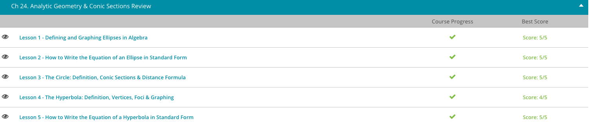

### Andrew Garber
### Jan 31 2023
### Analytic Geometry

#### Graphing Ellipses
 - Just like with circles, an ellipse has a center. Unlike circles, an ellipse has two different measurements for its radius, which is the distance from the edge to the center. Notice how an ellipse is longer in one direction than the other? Because of this, an ellipse will have a radius measurement for one direction and another radius measurement for the other direction. Our equation of an ellipse takes into account all of these measurements. Our equation is (x - h)^2 / a^2 + (y - k)^2 / b^2 = 1, where (h, k) is the center of our ellipse, a is the radius in the horizontal direction, and b is the radius in the vertical direction. Notice that there is always a plus in between the x and y parts of the equation and that the equation always equals 1.
 - For example, if an ellipse had an equation of x^2 / 4 + y^2 / 9 = 1 then the center is 0, 0 because there are no subtraction or addition parts. In this case, a=2 and b = 3. Meaning it stretches two to the right and left, and three to the up and down. This is then easily drawn.

#### Day 1
 - 

#### The Circle
 - What makes circles even more interesting in math is that they are also considered a conic section.
 - The center is a very important point for our circle. It comes into play when we need to calculate the distance of our circle. In math, we call this distance around our circle, the circumference, and of course, we would have a formula for this. This formula is C = pi * d, where C stands for the circumference, pi for the mathematical constant that is approximated by 3.14, and d stands for the diameter of the circle. The diameter of our circle is the distance it takes to walk from one edge of the circle clear across the circle to the other edge, making sure that you are walking through the center of the circle. You can also calculate the diameter of the circle as twice the distance from the center of the circle to the edge.
#### Hyperbola
 - What is a hyperbola? It can simply be described as two arcs back to back to each other.
 - As with many things in algebra, there is an equation to describe this shape. And because this is algebra, this equation actually helps us describe our hyperbola with accuracy.
 - The standard equation of a hyperbola that we use is $(x - h)^2/a^2 - (y - k)^2/b^2 = 1$ for hyperbolas that open sideways. If our hyperbola opens up and down, then our standard equation is $(y - k)^2/a^2 - (x - h)^2/b^2 = 1$.
 - How can you remember these? Notice that the h is always linked with the x and the k with the y. You can think h comes before k just like x comes before y, so h with x and k with y. The a^2 always comes before the b^2. If you are subtracting the y part, then your hyperbola will be sideways, but if you are subtracting the x part, then your hyperbola will be upright. As you know, our variables are x and y. The letters h, k, a, and b are there to help us describe our hyperbola, as we will come to see.
 - Because our hyperbola is made up of two arcs, we will have two vertices, which are the tips of the arcs. We can find these vertices by looking at our h, k and a values. We begin by looking at our h and k numbers. By putting the letters together as in (h, k), we get the location of the center point between the two arcs, which is the center of our hyperbola. The a number tells us that the vertices are that many spaces away from the center in either direction.
 -In addition to our two vertices, we also have two focus points, or foci. There is one focus for each arc. The focus is the point for each arc where the ratio of the distance from any point on the arc to the focus to the distance from that point to a straight line is the same for all points on the arc.
 - To find this point, we use the formula c^2 = a^2 + b^2. We plug in the a and b terms from our standard equation for a hyperbola and then solve for c. If our x appears first in our standard equation, then we add and subtract this c value from the x value of our center point to find the foci. If our y value appears first in our standard equation, then we add and subtract our c value from the y value of our center point to find the foci.

#### Hyperbola Standard Form
 - When you are given a problem asking you to write the standard form equation of a hyperbola, the problem will need to provide you with just a few bits of information. The information that you need to know is the location of the center of the hyperbola, the location of its vertices (the tips of the arcs of the hyperbola) and the location of the foci (the point in each arc where the ratio of the distance from any point on the arc to this focus point to the distance from this same point on the arc to a straight line is always the same).
 - When written in standard form, our hyperbola equation tells us that our center is located at (h, k) and that our vertices are a spaces away from the center in both directions. For hyperbolas that open up and down, the vertices are a spaces above and below the center. For hyperbolas that open sideways, the vertices are a spaces to the left and right of our center. The location of the foci is c spaces away from the center, where c^2 = a^2 + b^2. Just like for the vertices, if the hyperbola is upright, then the foci are located c spaces above and below the center, and if the hyperbola is sideways, then the foci are located c spaces to the left and right of the center.
 - Let's look at an example now. Our problem asks us to write the standard form equation of a hyperbola with a center located at (1, 2), with vertices located at (-2, 2) and (4, 2) and with foci located at (-4, 2) and (6, 2).
 - With this information, we can go ahead and write our complete standard form equation. The first thing we see is that our center is at (1, 2) so that means our h is 1 and our k is 2. So far, so good! We have two of our letters down. We just need a and b now.
 - The next step is to see how far away the vertices are from the center and in what direction. We can plot them on graph paper or just compare the location of the points to our center. We see that (-2, 2) is 3 spots to the left of our center, and the other point (4, 2) is 3 spots to the right of our center. That tells us that our hyperbola is sideways, so the x will appear first. Since the vertices are 3 spots away from the center in either direction, our a is 3.
 - To find our b, we will find how far away the foci are from the center. Looking at the points, we see that both are five spots away from our center. So that tells us that our c is 5. We can then use the formula c^2 = a^2 + b^2 to find our b. We know the value of c and a, which we can plug in. After plugging those in we can solve for b: 5^2 = 3^2 + b^2. To solve for b, I first evaluate all my squares to get 25 = 9 + b^2. Next, I subtract 9 from both sides to get 16 = b^2. Lastly, I take the square root of both sides to find that b = 4.
 - Now that I have all my information, I can now plug these into my standard form equation. I plug 1 in for h, 2 in for k, 3 in for a and 4 in for b. Since my hyperbola is sideways, I will use the standard form where the x appears first. (x - 1)^2 / 9 - (y - 2)^2 / 16 = 1.

