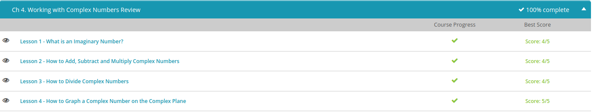

#### Andrew Garber
#### September 15 2022

#### What Is an Imaginary Number
 - Imaginary numbers are numbers that cannot possibly exist, as how can a negative quantity or area of an object exist, but are given meaning only in math.
 - Complex numbers are the combination of real and imaginary numbers, like $2+2i$ ($i$ being the sqrt of $-1$)
 - if you end up with the square root of a negative number, you imagine it exists by putting an i next to it, making the inside of the square root positive and then evaluating it like you normally would. That i is the square root of -1, and it's the most basic unit of an imaginary number. Going from i itself to i^2 to i^3 and on to i^4 shows us the pattern that all following powers of i will follow.

#### Adding, Subtracting and Multiplying Complex Numbers
 - For example, addition of complex numbers is similar to addition of binomials(if not absolutely the same). For example $(3-2i)+(-5-4i)$ simplifies quite cleanly to $-2 - 6i$, exactly as you might expect.
 - Subtraction works basically the same, with the caveat that  $-$ signs do not work exactly as you might expect, for example $(-2+4i)-(3-i)$, simplifying to $-5+5i$ 
 - Multiplying also works the same as with binomials, for example $(3 + 2i)(4 - i)$, it works much the same as with the normal FOIL method, becoming $12-3i+8i-2i^2$, and once condensed become, $-2i^2 +5i + 12$, and then condensed again becomes $5i+14$ because $i^2$ is just equal to -1

#### Dividing Complex Numbers
 - Dividing complex numbers requires knowledge of a Complex Conjugate, a conjugate being a binomial where the sign on the second term has been switched - thus, the complex conjugate of $a+bi$ is $a-bi$. This is useful because finding out how many imaginary numbers are in another is very difficult.
 - For example, in the problem $(3+4i) / (2+i)$ the best way to solve it is to change it from a division problem to a fraction, and then multiply by the complex conjugate of the denominator over itself, so 1. This would be $(3+4i)/(2+i)*(2-i)/(2-i)$. Once simplified, this will give us $(10+5i)/5$, which simplifies to $2+i$
 
#### Graphing Complex Numbers
 - Because a complex number has two parts, a real and imaginary part it can be graphed on a two variable plane, exactly the same as the normal $(x, y)$ plane but with a "real" and "imaginary" plane.

#### Quiz Results
 - 