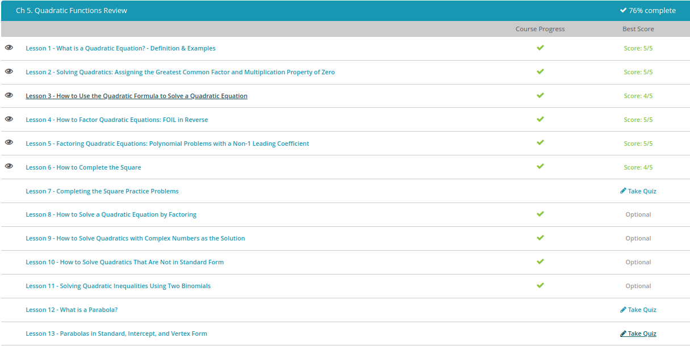

### Andrew Garber
### September 16 20222

#### What is a quadratic equation
 -  In math, we define a quadratic equation as an equation of degree 2, meaning that the highest exponent of this function is 2. The standard form of a quadratic is y = ax^2 + bx + c, where a, b, and c are numbers and a cannot be 0.
 - An interesting thing about quadratic equations is that they can have up to two real solutions. Solutions are where the quadratic equals 0. Real solutions mean that these solutions are not imaginary and are real numbers. Imaginary numbers are those numbers with an imaginary part: i.
 - They are important because for one, they deal with our most basic calculations of area. The area of a circle for example is calculated using the formula A = pi * r^2, which is a quadratic. 

#### Factoring
 - Let's look closely at that last problem we just did. We said we could factor $x2 + 8x + 15$ as $(x + 3)(x + 5)$. 3 + 5 gives us 8, which was the coefficient from the middle term from the trinomial. And 3 * 5 gives us 15, the constant on the end of the trinomial. This means that if you can find two numbers that add to the middle term of your trinomial and multiply to the constant on the end, those are going to be the two numbers in your factored expression.

#### Day 1 Quiz Results
 - 