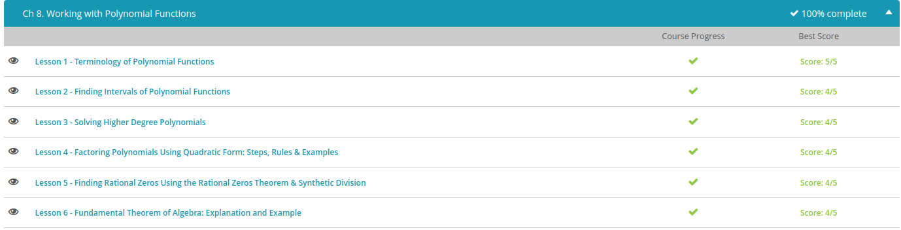

### Andrew Garber
### October 4
### Working with Polynomial Functions

#### Terminology
 - Coefficients: The numbers in front of the variables. The leading Variable is the one with the highest exponent
 - Terms: The products of constants and variables, for example $2x^2$
 - Degree: The highest exponent
#### Intervals of Polynomials
 -polynomial functions are the functions that are made up of constants, variables, and exponents where each term has a different exponent for the function's variable. In math, we want to solve them and find out how they behave or curve.
- To find out a function's behavior, we can find the intervals of the function and then the function's behavior in those intervals. What we look for in these intervals is whether the function is positive or negative.
- The intervals are separated by the solutions of the polynomial function. There will always be one more interval than the number of solutions. If there are three solutions, then there will be four intervals. To check if the function is positive or negative within an interval, we plug in a number from that interval into our function and then evaluate.

#### Solving Higher Degree Polynomials
 - Polynomials of degree 3 and higher
 - Rational roots Theorem: Possible solutions of the polynomial can be found in the list of numbers generated by putting the factors of the last constant term over the factors of the leading term.
 - For example, the polynomial $x^3 + x^2 - 14x -24 = 0$
 - To create the list of possible solutions we would put the factors of constant term, in this case -24 / factors of leading coefficient.
 - Thus, the factors of -24/1=-24 are +/- 1,2,3, 4,6,8,12,24
 - Our list of fractions would be +/- $1/1, 2/1, 3/1, 4/1, 6/1,8/1,12/1,24/1$
 - When graphing this function, three possible solutions(due to it being degree three) emerge, -3, -2, 4. When checking these in the original function, all three are solutions
#### Day 1 Quiz Results 
 
#### Factoring Polynomials using Quadratic Form
 - standard form: $y=ax^2 + bx+ c$
 - quadratic form: an expression where it is rewritten in the form of $au^2 + bu + c$ and u is any expression in x
 - for example, if you are factoring $x^4 + x^2 - 12$ you can substitute u=x^2 and then factor normally, with $(u+4)(u-3)$ and then go back to $x^2=u$, $(x^2+4)(x^2-3)$
#### Finding Rational Zeros
 -Zero: a number that solves the equation f(x)=0
 - Rational Zero: a rational number, which is a number that can be written as a fraction of two integers
 - Irrational Zero: A number that is not rational, so it has an infinitely non-repeating decimal
 - Rational Zero Theorem: if we have a polynomial function of degree n (n>0) and all of the coefficients are integers, then the rational zeros of the functions must be in the form of p/q where p is an integer factor of the constant term $a_0$ and q is an integer factor of the lead coefficient.
 - $p/q = integer factors of a_0 / integer factors of a_n$ 
 - For example: $f(x) = 2x^3 + 3x^2 - 8x + 3$, or $f(x) = (x-1)(x+3)(x-1/2)$, thus all zeros are rational: 1, -3, 1/2 where the numerators of all of these listed as fractions are factors of 3 and the denominators are the factors of the leading coefficient.
#### Fundamental Theorem of Algebra
 - a polynomial function f(x) of degree n(n>0) has n complex solutions for the equation f(x)=0
 - Conjugate Pairs: if a + bi (b does not equal zero) is a solution of f(x) that is a polynomial with real coefficients, then it is conjugate a-bi is also a solution of f(x)
 
 