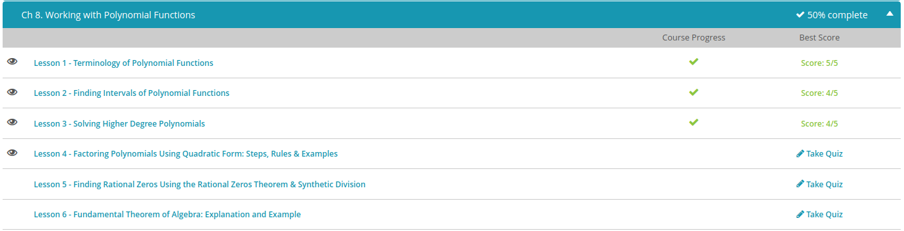

### Andrew Garber
### October 4
### Working with Polynomial Functions

#### Terminology
 - Coefficients: The numbers in front of the variables. The leading Variable is the one with the highest exponent
 - Terms: The products of constants and variables, for example $2x^2$
 - Degree: The highest exponent
#### Intervals of Polynomials
 -polynomial functions are the functions that are made up of constants, variables, and exponents where each term has a different exponent for the function's variable. In math, we want to solve them and find out how they behave or curve.
- To find out a function's behavior, we can find the intervals of the function and then the function's behavior in those intervals. What we look for in these intervals is whether the function is positive or negative.
- The intervals are separated by the solutions of the polynomial function. There will always be one more interval than the number of solutions. If there are three solutions, then there will be four intervals. To check if the function is positive or negative within an interval, we plug in a number from that interval into our function and then evaluate.

#### Solving Higher Degree Polynomials
 - Polynomials of degree 3 and higher
 - Rational roots Theorem: Possible solutions of the polynomial can be found in the list of numbers generated by putting the factors of the last constant term over the factors of the leading term.
 - For example, the polynomial $x^3 + x^2 - 14x -24 = 0$
 - To create the list of possible solutions we would put the factors of constant term, in this case -24 / factors of leading coefficient.
 - Thus, the factors of -24/1=-24 are +/- 1,2,3, 4,6,8,12,24
 - Our list of fractions would be +/- $1/1, 2/1, 3/1, 4/1, 6/1,8/1,12/1,24/1$
 - When graphing this function, three possible solutions(due to it being degree three) emerge, -3, -2, 4. When checking these in the original function, all three are solutions
#### Day 1 Quiz Results 
 
#### Factoring Polynomials using Quadratic Form

#### Finding Rational Zeros

#### Fundamental Theorem of Algebra