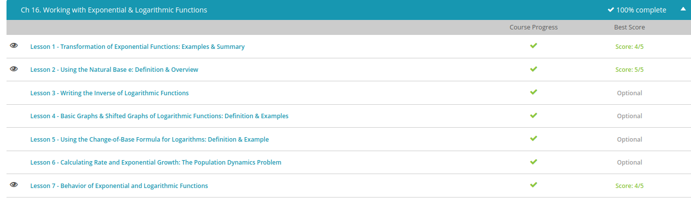

### Andrew Garber
### Exponential & Logarithmic Functions
### Nov 1

#### Transformation of Exponential Functions
 - An exponential function is any function where the variable is the exponent of a constant. The basic exponential function is f(x) = b^x, where the b is your constant, also called base for these types of functions. Keep in mind that this base is always positive for exponential functions. All other exponential functions are based off of the basic exponential function.
 - You will see that different exponential functions will add numbers to the basic exponential function in various locations, and these changes will produce changes in the graph as well. When you graph any exponential function though, they will all have the same general look, based off of the basic exponential function graph. Depending on the change, or transformation, the graph can be shifted up or down, left or right, or even reversed. Keep watching, and we will identify what causes these changes.
 - What can we change? Well, we can change the exponent to a negative so our function becomes f(x) = 2^(-x). What happens then? Think about what is happening to the exponent. The negative sign essentially reverses our variable. As you decrease the x-value and as it gets more negative, the function gets larger and larger more quickly. Why? Well, if we plug in a -2 for our x, the function becomes 2^-(-2) = 2^2 since the negative changes the sign of the exponent. If we plug in a -3, the function becomes 2^-(-3) = 2^3. The more negative we get, the bigger our function becomes. So your graph flips or reverses itself.
 - When you add or subtract a number from the basic function, we get vertical shifts. Think about this. What can you do to the graph to make it go up or down? Wouldn't you just have to add or subtract some numbers? If we added a 3 to our function to get f(x) = 2^x + 3, we would be shifting our graph 3 points upwards. You can think of this as adding 3 to every single point on our basic graph.
 - When we add or subtract from the exponent, the graph moves sideways. If we add a 2 to the exponent, we see the graph shifts 2 points to the left. Why? When we change the exponent, we are changing where the graph crosses the y-axis. Remember that the graph crosses the y-axis when the exponent is 0. So, if our exponent has an added 2, we need to subtract 2 to get back to 0. Going left on the x-axis will give us that minus 2 that we need.
 - $f(x)=2^(2+x)$

#### Base e
 - e is an interesting number. e is an irrational number that begins with 2.718281828459045 and continues indefinitely with no pattern. An irrational number is a number that cannot be written as a fraction and therefore has numbers that never repeat. 
 - When the number e is used as the base for a logarithm, we call the number e the natural base, and the logarithm is called a natural logarithm. Usually, logarithms are assumed to have a base of 10, so when we change the base to e, we write it as ln(x) or we write log with a subscript of e to show that it has e as the base instead of 10.
 - The way the natural log works is if we take the natural log of x, it will be equal to the power of e that gives you x. For example, the natural log of e is 1 since e to the first power is e. The natural log of 1, on the other hand, equals 0 because e has to be raised to the 0th power for it to equal 1.
 - This natural log function with its graph has quite an interesting use. For example, say you were told that you had a savings account where the continuous compound interest rate is five percent. You wouldn't be able to use this percentage in normal interest calculations since it is your continuous interest and not just a compound interest rate. What does continuous mean? Continuous means that your interest is constantly being calculated and you would be paid every single moment that your interest is over a penny. But with the use of e, you can use the formula e^r - 1, where the r equals your continuous compound interest rate to calculate the compound interest rate that you can use in your other interest calculations.

