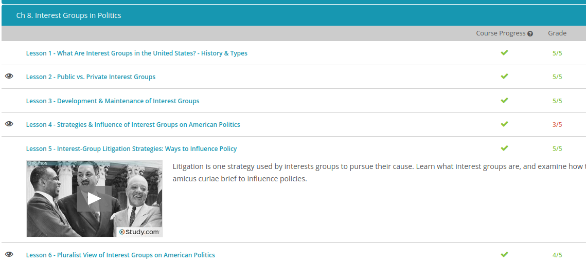

### Andrew Garber
### Oct 6
### Interest Groups in Politics

#### Public vs Private Interest Groups
 -  Speaking rather generally, a public interest group promotes issues of general public concern. For example, public interest groups claim to exist to protect the rights and well-being of all, rather than just the rights and well-being of their members. They exist in order to take care of public concerns, things like pollution, protection for children, and equal rights for women, just to name a few.
 - Again speaking very, very generally, private interest groups exist for the betterment of their immediate members. Many times, private interest groups have their basis in what is usually termed big business, or large-scale, important financial or commercial activity. With this in mind, some examples of private interest groups within the U.S. are the U.S. Chamber of Commerce or the National Association of Manufacturers
 - Apart from things like manufacturing and commercial activity, private interest groups can also represent certain occupations. For instance, there is the American Bar Association, which presides over our country's legal professionals, or any of the national teachers' unions, which represent those in the education profession.
 - When speaking politically, to lobby is to seek to influence a politician or public official on an issue. Sort of like kids trying to shout the loudest to get their mom to take them to their favorite restaurant, interest groups often pay lobbyists to make their voices and their desires known in government.

#### How Lobbying Works
 - Today, lobbying is largely done by professionals working for consulting firms or holding defined positions within interest groups. Some of the direct interactions that a lobbyist might have with a government official include private meetings, testifying at committee and agency meetings, consulting on legislation drafts, and providing political information to legislators on proposed bills.
 - Interest groups may also attempt to influence the behavior of legislators by publicizing their voting records. Oftentimes a legislator is given a score based on the percentage of times that he or she voted in favor of the group's position. Interested citizens may use this information when voting to re-elect an official, and an unfavorable rating may embarrass a legislator. In fact, an environmental group has identified the 12 representatives who the group believes have the worst voting records on environmental issues and labeled them the 'Dirty Dozen.'
 - Interest groups can also try to influence government policy by working through others, who may be constituents of the general public. Indirect techniques are used to mask the interest group's own activities and make the effort appear to be spontaneous. Legislators also tend to look more favorably upon their own constituents rather than an interest group's lobbyist. In some instances, interest groups try to stimulate a large interest in the public to get them to pressure the government to change something. Such efforts may include political ads, mass mailings, and Internet postings. Interest groups also try keep public pressure in check if they represent a group that is not looked upon favorably. Thus, they may donate money and resources to worthwhile causes to keep their public image favorable.

