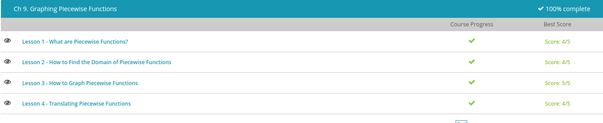

### Andrew Garber
### October 6
### Piecewise Functions

#### What are Piecewise Functions
 - A piecewise function is a function that has different parts, or pieces. Each part of the piecewise function has its own specific job that it performs when the conditions are correct.
 - For example: $f(x) = x - 2, x < 3 f(x) = (x - 1)^2, x ≥ 3$
 - They are simply ways of expressing more complicated conditions for the execution of a function

#### Finding the Domain of the Piecewise Function
 - For example, f(x) = x if x < 5 | f(x) = x + 1 of x > 5
 - Thus, the domain of the function would be expressed as $dom(f) = (-inf, 5) U (5, inf)$

#### Graphing Piecewise Functions
 - f(x) = 4 - x, x is less than or equal to -2 | f(x) = (x +1)/2, x > -2
 - The fence line for this problem is at x = -2, and the equation f(x) = 4 - x is the equation that 'owns the fence.' The next step is to draw each line on the side of the fence where it belongs.
 - 
 
 