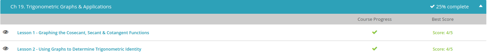

### Andrew Garber
### Nov 22
### Trig Graphs

#### Graphing Cosecant, Secant and Cotangent
 - Remember our basic three trigonometric functions are sine, cosine, and tangent. The three functions that we are talking about today are defined as the reciprocals of our basic three functions. So, we have cosecant (csc) is the reciprocal of sine or 1/sine, secant (sec) is the reciprocal of cosine or 1/cosine, and cotangent (cot) is the reciprocal of the tangent function or 1/tangent.
 - Wow, this is interesting. We get mounds on the bottom and dips on the top. Well, this is to be expected. Since this is the reciprocal of the sine function and our denominator is now the sine function, we know that we will have an asymptote whenever the denominator, the sine function, equals 0. So, we have asymptotes at pi*n = 0, pi, 2pi, .... Also as expected, just like the sine function, we have the same standard period, or length of a cycle, of 2pi.
 - 
 - Moving on to the secant graph. Hey, this looks a lot like our cosecant graph! And if we weren't careful we might mistake it for it. We have the same mounds and dips. The only difference is that these mounds and dips occur at different spots now. Just like our cosecant graph, our secant graph has asymptotes wherever our cosine function is 0, so we have asymptotes at (pi/2) + pi*n = pi/2, 3pi/2, 5pi/2, .... Also, because our cosine function has a standard period of 2pi, so does our secant graph.
 - 
 - Lastly, here is our cotangent graph: Just like the other two graphs, our cotangent graph has asymptotes wherever our tangent function is equal to 0. Our tangent function equals 0 every pi*n spaces, so at 0, pi, 2pi, and so on. We see that our cotangent function does have asymptotes corresponding to these places. We also see that, just like our tangent function has a standard period of pi, so does our cotangent function.
 - 
 - We've covered all our graphs now. Let's talk about shifting our graphs, or transformations. We can easily make our graph move up, down, to the left and right by just adding or subtracting numbers from different areas of our function.
 - To move our graph up or down, we can simply add or subtract numbers from the end of our function. For example, the function csc (x) + 2 has a shift of 2 spaces up. If we wanted to move the graph down, we would subtract two from the end.
 - If we wanted to move our graph to the right, we would subtract numbers from our argument, our variable. So, the graph of cot (x - 2) is the graph of cot (x) shifted 2 spaces to the right. If we add 2 instead of subtracting, we would then have a shift of 2 spaces to the left
 - If we multiply our function by a number, it will change how wide the middle part is. For example, in the cosecant and secant function, this number will change how far apart the mounds are to the dips. Larger numbers make the mounds go lower and the dips higher thereby increasing the distance between the two.

 #### Using Graphs to Determine Trig Identity
  - But first, let's define trigonometric identity. A trigonometric identity is any trigonometric equation that is always true for all values of the variable. What does this mean? This means that if you see an equation and you can say for certain that this equation is always true and you can use the equation with confidence, then this trigonometric equation is a trigonometric identity. Remember identity means the same.
  - We can do that by graphing each side of our equation. So, what we do is we first graph sin (x) cos (x) tan (x), then we graph 1 - cos^2 (x) to see if they are equal. We can use a graphing calculator to do this or any other graphical method that is easy for you.Why don't we go ahead and graph each side.First, the left side, sin (x) cos (x) tan (x). We get this graph:
  - 
 - I've marked three points on this graph so that we can compare these same three points on the next graph to see if they are exactly equal. Now, let's graph the right side, 1 - cos^2 (x): 
 - So, now we can compare these two graphs to see if our trigonometric equation is an identity. At first glance, they look very identical. So, let's compare our three points. The first point and the last point are the same. What about the middle point? The first graph says (1.571, 1) while the second graph says (pi/2, 1). Are these two points the same point?
 - Well, what is pi/2? If we go ahead and do the division, we get 1.571.... So, they are the same point. What does this tell us about this trigonometric equation? It is a trigonometric identity. We have proven that our trigonometric equation is a trigonometric identity.

