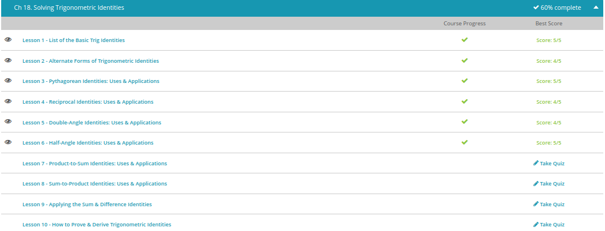

### Andrew Garber
### Trigonometric Identities
### Nov 9

#### List of Basic Trig Identities
	- In this lesson, we will learn and memorize the three basic trig identities. These are sometimes referred to as the Pythagorean identities. Sometimes we can be given equations and expressions that look like a jumbled mess. It's usually better if we can organize everything. Pythagorean identities help us group things together in specific ways that simplify them. Simplifying and organizing equations can be very helpful.
	- If we took a look at the unit circle and chose a point, we could draw a right triangle from it. Let's begin by taking a look at a basic right triangle and see if we can relate it to a trig identity. The hypotenuse is 1, and we know that if we square and add the two legs, they will add to 1. Because we are on the unit circle, we can give the angle that we formed a name. That angle could vary depending on the triangle we drew, so we'll just call it theta.
	- If we took a look at this triangle, we could see that x^2 + y^2 = 1^2 or just 1. More importantly, because we are on the unit circle, we can rename the x and y values to their trigonometric values. To get the x value of an angle, we take cos(θ), and to get the y value of an angle, we take sin(θ). This allows us to simplify the Pythagorean theorem to just use one angle. Since we replaced the variables with their trig values, our formula simplifies into sin^2(θ) + cos^2(θ) = 1.
	
	- We start with sin^2 (θ) + cos^2 (θ) = 1. Let's divide each part of this formula by the first term to see what happens: sin^2 (θ) / sin^2 (θ) = 1. Let's move on to the second term. We keep the plus sign. Cos^2 (θ) / sin^2 (θ) gives us cot^2 (θ). We keep the equals sign and move on to the last term: 1 / sin^2 (θ) gives us csc^2 (θ). Just like that we have an identity with two of the other trig functions: 1 + cot^2 (θ) = csc^2 (θ).
	- Let's go back to the original equation, sin^2 (θ) + cos^2 (θ) = 1, and see if we can come up with the other identity. Last time we divided everything by the first term. This time we want to divide everything by the second term, which is cos^2. Sin^2 (θ) / cos^2 (θ) gives us tan^2 (θ). We keep the plus sign. Cos^2 (θ) / cos^2 (θ) = 1. We keep the equals sign. And we'll move to the last term: 1 / cos^2 (θ) = sec^2 (θ). That's the last of our Pythagorean identities: tan^2 (θ) + 1 = sec^2 (θ).

#### Alternate Forms
	- Recall that all of trigonometry begins with just two functions, the sine and cosine. The rest can be found from these two functions. We have our tangent function equal to sine over cosine. Then we also have cosecant equal to 1 over sine. Secant is 1 over cosine, and cotangent is 1 over tangent. These are our basic trig definitions:
	- By making substitutions to these basic definitions and rearranging, we come up with the alternate forms of our definitions. We have our sine equal to 1 over cosecant. Cosine is equal to 1 over secant. And tangent is equal to 1 over cotangent. What we've done here is simply reverse our beginning definitions for cosecant, secant, and cotangent:
	- 
	- One other alternate form is that for the cotangent. Because it is the reciprocal of the tangent, we can also define it as the reciprocal of the tangent definition, or cosine divided by sine.
	- 

#### Pythagorean Identities
	- Think of these identities as formulas that help you connect our trig functions. You can see that our trig functions are related by the Pythagorean theorem. These identities are also formulas that help us simplify our problems. You can see that if we have a function that is the sum of the square of a sine and the square of a cosine of the same angle, then we can simplify that expression as simply 1.
	- Practice Problem: What does sec^2 (70) - tan^2 (70) equal?
	- At first glance, we might think that we need to calculate each function, square them, and then subtract them. But if we take a moment and think about our trig identities, in particular our Pythagorean identities, we will see that there is a much simpler, quicker, and more accurate way to solve our problem. We look through our identities and we see that our second one has both the tangent and secant functions in it.
	- It isn't written exactly like ours, but we do see that if we use our algebra skills and rearrange the identity a bit we will see that we can get our problem function. If we subtract the tangent from both sides, our identity becomes sec^2 (θ) - tan^2 (θ) = 1. This identity also gives us the answer to our problem. It's just one.

#### Reciprocal Identites:
	- In this video lesson, we talk about the reciprocal identities of trigonometry. What are they? They are the definitions of our trig functions in terms of another trig function. They tell us how the trig functions are related to each other. They also tell us which trig functions are reciprocals of each other.

	- Now we know what the reciprocal identities are. So, what can we do with them? We can use these identities, or true statements, to help us simplify trig problems. We do this by substituting our definitions into the problem where we can to help us simplify and then solve the problem.
	- For example, the problem $sin^2 (π / 2) * csc (π / 2)$ might seem difficult at first. However, we see that we have a sine function, as well as a cosecant function. We know that they are reciprocal functions. We can actually substitute 1 over sine in for the cosecant.
	- After we do that, our function becomes very simple. With the reciprocal, one of our sine functions can be canceled and we are left with just a single sine of $π /2. π /2$ is a radian measure. We can use either our unit circle to find our answer or we can input this into a calculator, making sure our calculator is set to radians. Doing this we see that we get a nice answer of 1

#### Half-Angle Identities
 - We have one half-angle for each of our three basic trig functions. We have one for sine, one for cosine, and one for tangent. As you can see, our angle has been halved, hence the name half-angle identity. On the left side, our trig function is squared, and on the right, we see the equivalent statement in terms of cosine without any exponents. Also, the angle on the right side is no longer halved.
 - So, what can you do with these identities? We use these identities when we need help simplifying a trig function. When we have a squared trig function, it is sometimes difficult to work with in higher math. So, if we turn it into an equivalent statement without exponents, then it will help us solve the problem that much more easily.
 - You can think of these half-angle trig identities as a key that helps you to decode or simplify a harder problem. Without this key, you might not be able to solve the problem at all. But with the key, you are able to find your way to the answer. Also, these identities are used to prove yet other trig identities or statements. Let's look at a couple of examples now to see what we can do with these trig identities.
 - $sin^2(x/2)$ This problem is asking us to write this trig function without any exponents:
 - To prove a statement such as this one, we will begin with the left side, since that is the more complicated side. We will leave the right side alone. What we will try to do is to simplify the left side so that it becomes the right side. Let's begin. First, we see that we have a cosine squared function of a half-angle. We can use one of our identities and make that substitution. We get $2cos^2(x/2)-cos(x)=2((1+cos(x))/2)-cos(x)$
 - Okay. Now we can see if we can cancel anything out or otherwise simplify this further. We see that we have a 2 divided by a 2. These cancel each other out. That leaves us with 1 + cos (x) - cos (x). We have a plus cosine and a minus cosine. Don't these add up to 0? They do! So, what are we left with? We are left with 1. Giving us the final equation of $cos^2(x/2)-cos(x)=2((1+cos(x))/2)-cos(x)=1$
 