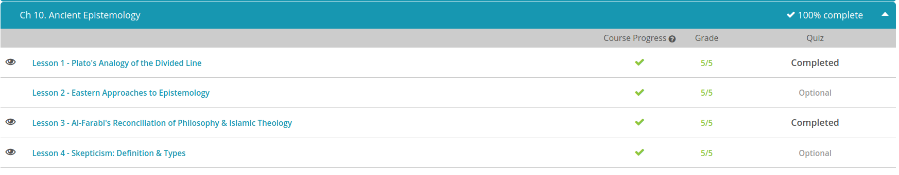

### Andrew Garber
### January 31 2023
### Ancient Epistemology

#### The Divided Line
 - In The Republic, Plato includes a description of how his mentor Socrates understood the world and what is true. In particular, his divided line analogy provides a way to visualize the distinction between different states of mind and to learn which states of mind are more reliable than others. In the same way that some topics of study may be more clear in a person's mind(either due to interest or natural aptitude), some states of mind are more clear than others.
 - He starts with a division between an intelligible world and a visible world. The visible world is understood with our senses, like when you walk down the street and take in your environment through seeing, hearing, smelling, and feeling. The intelligible world, on the other hand, is not focused on our senses, but instead on our intellect and ability to reason, like if you were to sit down and work on a geometry problem.
 - Socrates describes the line for the visible world as subdivided into two specific states of mind. He says that one section is made up of reflections and shadows. In a shadow or reflection, you see a version of an object, like when you look into a pool of water and see a fuzzy and unclear reflection of your face. This form of accessing knowledge is the least reliable.
 - However, Plato was likely referring to more than just literal shadows and reflections. For example, this category also includes the kinds of ideas we get from hearing secondhand stories from others. Some even argue that Socrates would include some art forms, like theater, as part of this lowest category of knowledge. We can't be sure of everything that he thought would fit into this category, but we do know that Plato viewed this state of mind as less useful for understanding the world as it really is. The other state of mind in the visible world includes the observation of physical objects and ordinary things, such as we might experience as we walk down the street and take in the buildings, people, plants, trees, noises, and smells around us.
 -  The intelligible world is another story. In the world of higher reason, so much more is possible, from Plato's point of view. While our understanding of the visible world is made up of opinions, the intelligible world can reveal knowledge.
 - Imagine drawing a square, for instance. If your square is drawn a tiny bit lop-sided by mistake, it still represents something more abstract, the bigger idea of a true square that has four perfectly equal sides. Even if you can't draw a perfectly accurate square, to the point where even a microscope could confirm each side is equal, we can still think of the idea of a perfect square as a form or a universal idea. An absolutely 100% perfect square can't be perceived by the senses, but in the intelligible world, using our reason and intellect, we can work with these abstract ideas. Yet, even a person performing mathematical equations is not using their most accurate state of mind, according to Socrates.
 - What we can do is talk about what the essence of justice is like, and try to understand it better. Socrates claims that being a philosopher is a great way to start to know more about these forms, which are the universal, eternal ideals that make up reality. Your physical body, the device you are using to watch this lesson, the building you are in, or the plant growing near it are all part of the less-real, visible world, while the forms, like justice, beauty, courage and the ultimate ideal, the good, are what's real.
 - Do the forms sound pretty mysterious to you? Plato saw it as the job of philosophy to work toward knowledge of the forms, even though we can't observe them directly.

#### Al-Farabi on Philosophy and Islamic Theology
 - For Al-Farabi, God was central to everything that exists, as a knower and creator of it all. To him, religion and philosophy were highly related and just different ways to describe the same reality. He saw the job of philosophers like himself to obtain greater knowledge of the intellect. Ultimately, he viewed the perfect human being as someone who has developed virtue through this work. To him, virtue and knowledge of the intellect are connected ideas.
 - For instance, you might think that practicing moral behavior, like helping out a person in need, is a kind of virtue, while learning science is increasing your intellectual knowledge. Al-Farabi saw the two as interrelated, and both relevant to the human soul. (This is actually similar to many of the Greek schools, but is overlooked in the West because of its connection with religion.)
 - Aristotle's work had a significant effect on Al-Farabi's philosophy. Both Aristotle and Al-Farabi were interested in a concept called the active intellect, sometimes translated as the 'the agent intellect.' According to Al-Farabi, the active intellect is the key to the development of human knowledge and involves a force outside of humans and God that allows humans access to abstract, divine ideas. This active intellect is viewed as coming from an overflow of intellect from God.
 - Through reason, a person can observe the material world and rationally think about it, but it's more than that capacity that gives a person the truth about things. The active intellect plays a part in taking what we could potentially know and makes it possible for us to actually comprehend it for what it is. This helped him explain how prophets, like Muhammad, who are central to Islamic beliefs, could receive revelation from God.
 - In fact, Al-Farabi saw happiness as an ultimate goal of the active intellect. By exposing us to the understanding of what is divine, we could understand truths and stay in line with what is natural and good.

#### Skepticism
 - (Note: "Skepticism" with an uppercase "S" refers to a specific school of philosophy, while "skepticism" with a lowercase "s" refers to a general attitude.)
 - In philosophy, skepticism refers to a worldview that is more than just doubting a particular claim. It's an approach that goes beyond just demanding evidence and, instead, questions the evidence itself. Broadly speaking, skepticism is the view that we cannot know anything about the world with certainty. While we're used to thinking that we can and do have knowledge about things we have studied or experienced, skepticism questions whether that's really possible.
 - There is also another way to distinguish between forms of skepticism: academic skepticism and Pyrrhonian skepticism. Both of these particular traditions have their roots in the philosophy of ancient Greece and involve doubt as a way to avoid assuming something that could be untrue.
 - An academic skeptic might say to the astronomer that you cannot know anything about an asteroid for sure. There's no way to prove an asteroid has particular qualities. Even if you have samples of asteroids here on Earth, and even if you can see them with telescopes, nothing can be said for sure about them.
 - The other type of skepticism, in contrast to academic skepticism, is Pyrrhonian skepticism. In this view, we cannot say for sure whether we can know anything. Think of this approach as admitting that you might be able to know things about asteroids.
 - A Pyrrhonian skeptic would say to the astronomer that it's possible you can know about the qualities of an asteroid for sure, but it's also possible that you cannot know for sure. They suspend judgment completely about whether this knowledge could be obtained. You can't be certain your senses are trustworthy, but it's also equally likely that you can trust them. There's no telling either way; no way to prove that either approach is correct.
 - Though there are objections to skepticism, there are also some who advocate for its benefits. Think of how often an area of proven science is actually then proven incorrect. Think of the variety of beliefs and customs throughout the world and how often people disagree about even basic concepts.
 - If our senses are perfectly reliable, and our knowledge so comprehensive, why does it sometimes seem that we know so little without a doubt? Skepticism gives an explanation for why our knowledge is lacking: we have no method by which we can know anything for sure.

