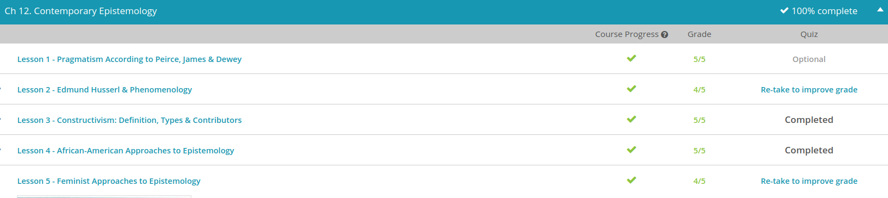

### Andrew Garber
### February 3
### Contemporary Epistemology

#### Edmund Husserl & Phenomenology
 - Phenomenology looks at first-person, lived experiences for information.
 - The person considered the founder of the phenomenological movement was a German philosopher named Edmund Husserl who lived in the late 1800s and early 1900s. He described our everyday approach to the world around us as the natural attitude; one in which we go about our business as though there is a separate world of things that exists outside of our consciousness. For instance, wherever you are right now, look around you or listen to the noises you hear and you probably would say these things and noises exist, as facts. This, Husserl saw as our default way of thinking about the world.
 - Husserl wanted to go beyond this way of thinking. He was interested in our direct observations of the world around us as we experience them. His hope was that one could use a first-person perspective to accurately describe what is around them, without trying to explain what causes them.
 - Why was this important to Husserl? He was responding with an alternative to other methods that sought to explain human consciousness the way you might explain the design of a machine or the functioning of an organ. He pointed out that studying consciousness requires a far different approach than how scientists study the natural world. The conversation with your friend is an example of a more phenomenological approach; one that relies on a person reporting on what they themselves experience.

#### Constructivism 
 - Constructivism is the view that people construct knowledge through their experiences and interactions with the world. The belief that pets are like family, for example, has been constructed over time. The belief is not what you might think of as an observable scientific fact. Yet many people feel as though their pet can be described as a family member and have constructed the idea that pets are similar to children or grandchildren.
 - One important thinker in constructivist research is Jean Piaget. Originally a zoologist, Piaget was ultimately best known for his work as a Swiss psychologist who theorized about cognitive development. He was a pioneer of genetic epistemology. Genetic epistemology is a theory for explaining how human beings learn and proposes that we are active participants in the construction of reality.
 - While some philosophers have theorized that we are born with the ability to reason in a particular way, Piaget proposed that our abilities develop over time. Consider how babies begin to form knowledge about their environment as they grow. First, babies get opportunities to encounter new objects, like the building blocks in their play area. Over time, a child may start to learn how to think about objects like blocks more abstractly, learning how adding one block to two blocks gives them a total of three.
