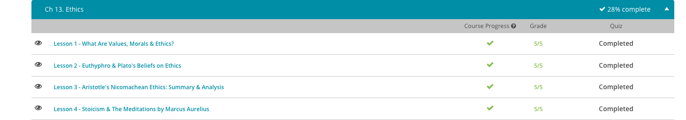

### Andrew Garber
### Feb 6 2023
### Ethics

#### Values, Morals, and Ethics
 - Morals are understood as the ways people should act or how they believe they should act. Morality can be either descriptive or prescriptive, depending on how one approaches the topic. Descriptive morality is focused on describing how people believe they should behave, without necessarily agreeing or disagreeing with their actions. Prescriptive morality, on the other hand, is focused on prescribing how a person should behave.
 - Outside of the academic field of philosophy there are other ways of describing ethics and morals. What most approaches have in common, however, is that they take an interest in our values, or aspects of life that we consider important and worthwhile. The field of ethics acknowledges tough moral decisions and aims to understand them better.

#### Euthyphro & Plato's Ethics
 - Euthyphro is a dialogue written by Plato describing a man being prosecuted for causing another man's death. In the dialogue, Socrates has a conversation with Euthyphro's son who is prosecuting his father to determine what the man sees as virtuous and pious.
 - In his writings on ethics, Plato could have looked at this topic from a variety of angles. He could have focused on the positive and negative consequences of a person's actions, such as what impact Euthyphro's prosecution would have on his family. Or, he could have focused on whether a particular action follows the rules or not, such as the question of whether his father violated a law. These are some approaches of other philosophers.
 - But, these were not Plato's main interests; Plato was eager instead to consider, what actions are most beneficial for the human soul? As a result, Plato is known for his focus on virtue ethics, an approach to ethics that places emphasis on one's moral character.
 - The Greek word aretê can be used to describe the kind of excellence and virtues that Plato saw as so important(the word has a much larger meaning than can be readily translated into English, but in this context it mostly means "Excellence of Character"). But, why live a life of aretê, a life of virtue and excellence? Well, Plato views human life as an opportunity to aim for eudaimonia, translated as human well-being, happiness, or flourishing. 
 - According to Plato, well-being, or eudaimonia, is our highest aim as human beings, and virtue, or aretê, is our way to achieve this. In other words, the best way to live life is in pursuit of virtue. As a result, Plato's text Euthyphro has Socrates repeatedly coming back to the topic of how precisely to define what is pious and virtuous.

#### Aristotle's Ethics
 - Aristotle, quite logically, believed that life as a philosopher was the best life. The two fields that seem the most opposite to that, Politics and Gluttony were not reviled by him however but rather were seen as important by themselves. 
 - Like others before him, such as Socrates and Plato, Aristotle was a Greek philosopher who was interested in the best way to live a good life and to cultivate virtue. In particular, he believed virtue to be something that a person not only needs to understand but that a person also needs to live out in their actual lives.
 - He didn't view ethics as a purely intellectual pursuit to understand what it means to live a better life. Instead, an understanding of ethics is both intellectual and also a way to actually become better. Aristotle aimed for ethics to be both an intellectual and a practical pursuit, with the ultimate goal of human well-being and happiness.
 - Aristotle believed that being raised with a focus on the development of virtue was important, and considering that one of his students was Alexander the Great, it's hard to object to his approach.
 - When we do something that others would view as immoral or unethical, such as taking money that's not ours, we expect that some type of blame would be placed on us when others find out. Likewise, if we do something especially virtuous, such as risking our life to save another's, we might expect praise for this. Our moral responsibility for a particular action, therefore, is the blame or praise that our actions deserve. For Aristotle, a person only deserves blame or praise for their actions when they're acting voluntarily. His two conditions for this consideration are whether the person is acting freely, and whether the person is aware of what they're doing - these two are the basis of intent in criminal law.
 - Spending one's life focused on questions of what actions are worthy of blame or praise might sound bland at first. Yet, Aristotle was ultimately aiming to understand what is the purpose of our lives and how to be the best version of what we are capable of becoming. This led to his belief that Philosophy was the best basis of life, but he also knew that a society of ONLY philosophers wouldn't last very long - so he noted that politics was also important for the health of the community. 
 - Similar to this, pleasure isn't something that is inherently bad - in Aristotle's view, if it was associated with something positive, it could just be. If a great conversation with a friend gave you pleasure, why would you not want to have that conversation?
 - He also notes that a political life is also important to the health of the community. If no one engages in political debates and investigation, how will cities get created that help human beings in developing good habits? Who will create opportunities and provide resources to help people understand the purpose of their lives? So, not only does pleasure have a place, but politics do as well.

#### Meditations by Marcus Aurelius | Stoicism
 - "Meditations" is a collection of notes that Marcus Aurelius, the emperor of Rome, wrote to himself. In fact, no one really knows where the term "Meditations" comes from - the original work was titled Ta eis Heauton, which means "To Himself" and is probably a better title for the work.
 - Marcus Aurelius was a busy man, but every day he made time to write in a journal that survives to us today as a guide on how to live a balanced life from a man who dealt with challenges far beyond what most of us will ever face.
 - If you asked Marcus if he was a "Stoic" it is more likely that he would respond that he was just a student of philosophy, not indebted to any specific school. However, he did have a strong interest in Stoicism from a young age and was influenced greatly by the Stoic philosopher Epictetus, and his teacher and mentor, the Stoic philosopher Junius Rusticus.
 - In modern times, "stoic" is used to describe someone with few emotions and superhuman self control - but this is not what the Stoic school set out for. On the contrary, they believed that natural emotions were more than acceptable: they were undeniable and healthy. However they believed that the emotions should be controlled and dissected such that those built on false judgement and irrational beliefs could not be allowed to control the person.
 - While a Stoic(uppercase, as in the school) would appear to be a poor friend, who would not be able to empathize with you this is not the case. The Stoics believed that they were membered of a community, a cosmic community, (frequently referred to as a Cosmopolis, and the root of the word "cosmopolitan") and that there was a base love of other humans built into every person. 
 - In Stoicism, Virtue is defined as the ability to act in accordance with Nature, or more specifically the Logos, the order and reason of the universe. This is not to be confused with THE four stoic VIRTUES, which are Wisdom, Justice, Courage, and Temperance. Any action can and should be derived from these four virtues, and any action that is not is not virtuous.
 - To a Stoic, the base human kindness that exists in all of us is diverted and corrupted by irrational passions that push us away from the Logos. They weren't trying to be emotionless, passionless robots, but rather to enjoy the things they had but not be controlled by them. Seneca, a Stoic philosopher and advisor to Nero, widely considered one of the worst Emperors of Rome, was one of the richest men in Rome but he was not controlled by his wealth. He was able to enjoy it, but frequently lived in poverty of his own choosing to prove to himself that he was not controlled by it.
 - For a Stoic, it doesn't make sense to overindulge in pleasures or complain too long about pain. These are not significant elements of life compared with the happiness that can result from living virtuously. Today, you can still see the legacy of stoic philosophy in our culture. A phrase like 'it's no use crying over spilled milk' reminds us that it's ultimately not helpful to focus on circumstances you cannot change or events that are minor in the grand scheme of things.

