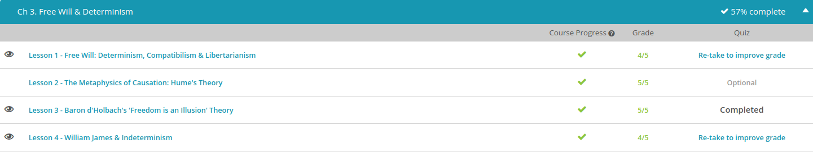
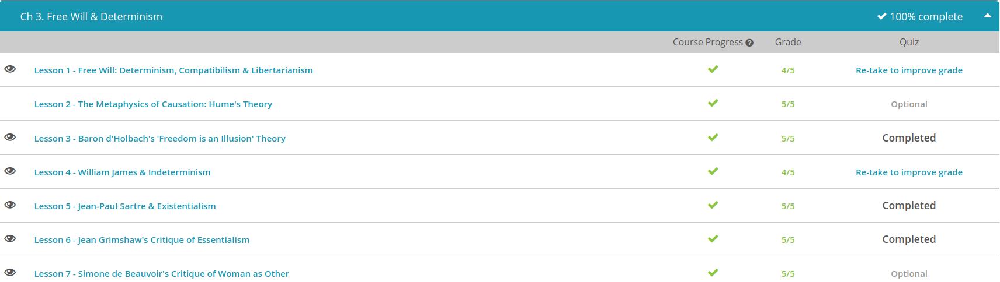

### Andrew Garber
### Dec 20
### Free Will and Determinism

#### Free Will: Determinism, Compatibilism & Libertarianism
 - Let's start by discussing freedom. When speaking philosophically, there are two types of freedom, circumstantial and metaphysical. Circumstantial freedom is the liberty to accomplish an action without interference from obstacles. In short, it means you have the physical ability to get something done. For example, I have circumstantial freedom to jump up and down. However, if someone were to tie me to a chair, I'd lose this circumstantial freedom.
 - Differing from this, metaphysical freedom is the power to choose between opportunities. Usually being linked to intellect and ethics, it's the power to choose. It's the power of the self to select one opportunity or possibility over another.
 - When discussing freedom, philosophers sit in three different camps: the determinism camp, the compatibilism camp, and the libertarianism camp.
 - Often considered the most dogmatic of the three, determinism asserts that man may have circumstantial freedom, but he does not have metaphysical freedom. In other words, we may have the freedom to stand up and sit down, but we don't really have the freedom to choose a path in life. For this, we're at the mercy of our physical bodies and circumstance. Using its name as its definition, determinism asserts that man's path is predetermined. In other words, freedom is an illusion. When we think we're making choices, we're really just at the mercy of physical impulses or events which have already occurred(or have already been decided for us).
 - Of course, this type of hard determinism causes some serious ethical dilemmas. Most pointedly, if we're all just puppets on the path of existence, how can anyone ever be held responsible for their actions? How can we punish the criminal and elevate the saint? Under hard determinism, man can't be held responsible. 
 - Building on this question, many philosophers hold to the opposite of determinism, libertarianism. Also called indeterminism, libertarianism asserts that man has both circumstantial and metaphysical freedom. We aren't just puppets dangling from a string, nor are we subject to some predetermined path. We've got the capacity and intellect to choose between options.
 - Filling the gap between determinism and libertarianism is compatibilism. Also called soft determinism, compatibilism is rather easy to remember. It proclaims that determinism and libertarianism can be compatible.
 - Bridging the two, compatibilism sides with determinism in that it agrees actions can be predetermined in the metaphysical realm. However, it also gives a nod to libertarianism. On this side of the coin, compatibilism asserts we are all still responsible for the actions we perform through our circumstantial freedom.

#### Baron D'Holbach's 'Freedom is an Illusion' Theory
 - To begin, Baron d'Holbach was an 18th-century philosopher who espoused materialism. Materialism is the belief that only matter exists. There is no supernatural entity that somehow floats around as an unseen reality. There is only matter.
 - Materialists also believe that all matter is subject to physical laws. These laws determine how matter will act and react. In other words, matter is not free to just willy-nilly exist. Water can't decide to start moving upstream, and a wheel in motion can't just stop itself. Now, when talking about things like water and wheels, people didn't get too uptight. However, when men like Baron d'Holbach began applying their beliefs to humans, a few feathers started to ruffle.
 - This leads us to determinism. Determinism is the idea that, since all matter is subject to physical laws, there is no choice or freedom of will. Interestingly, determinism also includes human actions. This is seen in Baron d'Holbach's work The System of Nature. In this, he espoused that man, like matter, is governed by physical laws. In other words, just like a rolling wheel can't stop itself on a dime, we humans are just as bound by physical law.
 - Keeping things simple, the determinism argument goes something like this: Reality is made up of only matter. All this matter is subject to physical laws. No matter can escape them. Now, here's where we come in. Since humans are made up of matter, we, too, are subject to physical laws. Not only do we lack the power to control or manipulate the universe, we really don't even have the power to determine our own course in life. In other words, freedom is an illusion.
 - There isn't some mystical mind or consciousness leading us through life; all our actions are just impulses coming from a physical brain. Therefore, when we think we're actually making free will choices, we're really just responding to physiological impulses that will give us the best advantage to work within physical laws.

#### William James and Indeterminism 
 - indeterminism holds that not all events are predetermined. On the contrary, human life is rife with choice and possibility.
 - One famous proponent of indeterminism was William James, a 20th-century American philosopher. Summing up the beliefs of many indeterminist philosophers, James believed choice and freewill are all part of the human equation. In fact, choice only ceases to exist once a choice is made. Interestingly, and very unlike some of his deterministic counterparts, William James did not dogmatically espouse his beliefs. In fact, he openly admitted that he could not prove the existence of free will or choice. To him, the argument centers on possibilities. Since possibilities can't be poked, prodded, and measured by science, there can be no declared victor in the determinism versus indeterminism debate. As he said in 'The Dilemma of Determinism', 'We have not yet ascertained whether this be a world of chance or no: at most we have agreed that it seems so.'

#### Jean-Paul Sartre & Existentialism  
 - For starters, Jean Paul Sartre was a famous 20th-century existentialist who authored many works, including plays, novels, screenplays, stories and philosophic essays. Two of his most famous philosophical works are 'Existentialism and Humanism' and 'Being and Nothingness.' Existentialism is a philosophy that recognizes a person as free to decide the course of his or her own life and actions.
 - According to Sartre's existential philosophy, there are two types of reality. There is the reality of existence in itself, and the reality of existence for itself. If something exists in itself, it simply is because it is. Rather than living consciously for itself, it is an object of consciousness. On the contrary, if something exists for itself it has consciousness and choice. It has a desire for being. It is not bound to some predetermined path of what it should be. It is free to choose its own path.
 - According to Sartre's famous work, 'Being and Nothingness,' we humans have traded in the reality of an existence for ourselves for a life of existence in ourselves. Stating it simply, we've let our governments, our money, and our religions turn us into objects. Rather than living a life of choice and possibility, we're just screens regurgitating what we've been programmed to regurgitate.
 - According to Sartre and his existential cronies, absolute freedom to choose is what makes us human. Therefore, we must stop trading freedom for absurdity, the idea that things must be as they are simply because they are as they are! In his mind, we should stop living as if we were inanimate objects - we are human because we are animate, and have the power to choose.
 - Sartre takes the position that we all have traded in life for what he coined bad faith. To Sartre, bad faith is the belief that things have to be a certain way. In short, we are victims to circumstance rather than victors with consciousness. Sartre argues that we have done this due to anguish. Anguish is caused by the reality that we are free to choose.
 - Unlike our inanimate screens, we live with the knowledge of our own limits and mortality. In other words, it's pretty scary to own up to the idea that the buck stops here. As a consequence of this anguish, we have swallowed our governments' and our religions' bad faith ideas that yell, 'necessity is a part of reality!' Sartre would say that just because our churches tell us it's necessary to believe a certain way, or just because our governments tell us it's compulsory to act a certain way, that doesn't mean it is. We are free to create our own realities. 
 - Sartre argued that anguish can ultimately propel us to live freely. To him, the anguish of knowing we are mortal should push us to grab every opportunity we can. Since life is short, we should live it to the fullest! (These ideas are similar to the Stoic concept of `momento mori`, remember that you will die, and live accordingly.)

#### Essentialism (Jean Grimshaw's Critique of it)
 - When speaking of men and women, philosophical essentialism argues that the genders each have essential, inborn thought and reasoning patterns that define them. Stated simply, a baby boy is born with thoughts that make him a man, and a baby girl is born with thoughts that make her a woman. It's not nurture; it's nature.
 - When speaking of women, essentialism has traditionally asserted that a woman's inborn patterns of thought and reasoning pull her toward the role of wife and mother. Many essentialists even argue a woman maximizes her full potential within these roles.
 - To an essentialist, a woman's intellect is made for the private sphere of the home, not the public one. It's not a freewill choice to act in the role of wife and mom; it's the predetermined course her intellect is programmed toward.
 - Grimshaw's work, *The Idea of a Female Ethic*, espouses that there is no inborn difference in the intellect of men and women. Putting this notion aside, it argues that women and men think differently because they are assigned different roles: it's not nature; it's nurture.
 - Broadening the scope of this, feminism argues women have been relegated to the hearth and the home since the beginning of time. This, and not biology, has led them to develop different priorities and thought processes. These priorities are learned, not inborn.
 - In short, Grimshaw's feminism argues that there's no fundamental inborn difference between the intellect of men and women. Any differences that are perceived are the byproducts of experience and nurture. They're by no means biological and natural.

#### Simone de Beauvoir Critique of Woman as Other.
 - According to Simone de Beauvoir, women are not born with a natural inferiority. In her view, throughout history man is seen as the superhero; woman is the subordinate. Man is always the subject; woman is always the object.
 - Speaking philosophically, the subject is what has identity. It exists independently, apart from context. It simply is because it is! On the other hand, the object is dependent on the subject. The object is the observed; the subject is the observer. The subject takes action. The object is acted upon. Again, man is the subject. Woman is the Other. Being sickened by this premise, de Beauvoir authored The Second Sex.
 - de Beauvoir points out that a woman's biology is often used as justification for repression and reduction to Other status. In fact, she called reproduction a curse! Because of it, and I quote, woman 'is a womb, an ovary. A woman's ability to gestate life makes her a biological curiosity to men, who sees woman as inhuman.'
 - Being rather specific, she discusses how Aristotle, who she saw as being particularly hostile toward women, says that even the female egg passively waits for fertilization. It is the male sperm that does the invading. She points to this as an invalid biological justification for the practice of keeping women tied to the house, the home, and passivity. de Beauvoir argues that hostility toward women is so entrenched and pervasive that no matter how rich or how poor, woman is seen as wife, mother, and hostess.
 - Speaking of the woman's role, de Beauvoir admits that woman has played a part in her relegation to the position of Other. It's not just history and biology's fault; woman has been complicit in ways as well. According to de Beauvoir, woman has traded in freedom for security. She has chosen comfort over conquering. She has allowed herself to be seen as inferior, because she has passively accepted being the Other. After all, being second is usually easier than being first! This isn't to say that de Beauvoir thought that women were completely at fault, but she was frustrated that women seemed to willingly accept the passive role that was imposed upon them.

