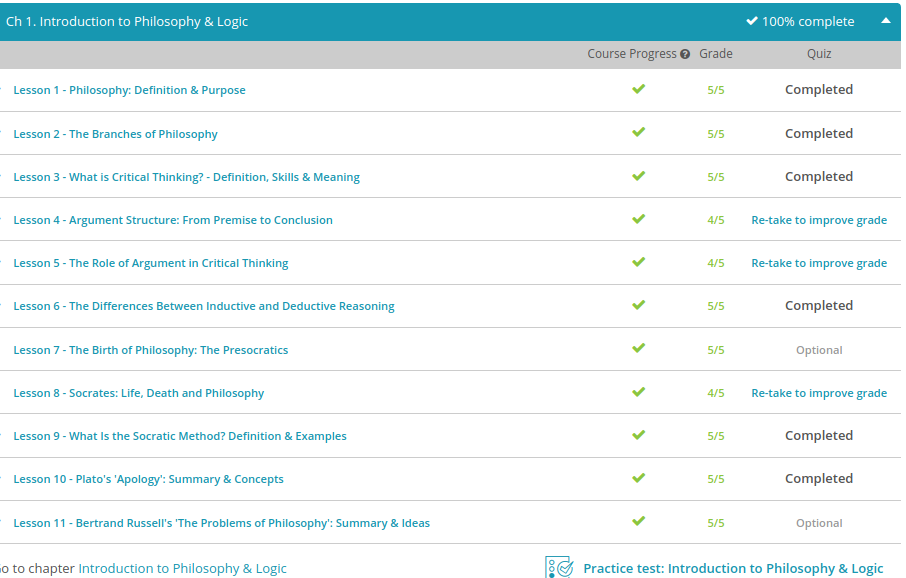

### Andrew Garber
### December 13
### Introduction to Philosophy and Logic

#### Philosophy: Definition & Purpose:
 - Philosophy overall aims to question assumptions we make about our lives and really dig in to the details of why we think what we think and how we choose to act. It can get complicated at times, but it can also help a person to see more clearly that there are other ways of looking at the world than is our habit. Other branches deal with different types of questions. The topic of the different branches of philosophy will be covered in another lesson.
 - Doing philosophy, on the other hand, is actively questioning and inquiring about the nature of our lives and different ways of understanding things. One benefit of doing philosophy is that it helps you think critically. For a small issue, such as whether to eat someone else's ham sandwich, decisions may be simpler, but life is filled with more complicated decisions and debates, and philosophy can help with thinking through these questions, engaging in discussions, and coming to your own conclusions. Other fields of study use philosophy to inquire more deeply about their specific area of interest, whether it's science, art, politics, or any other discipline.
 - If you study philosophy, you will not necessarily have all the answers to what life is about or come to definite conclusions about how to live your life. Experts still debate many of the subjects of philosophy and will indefinitely. What studying philosophy can do is to help you engage in the world around you in a way that is thoughtful, questioning, and open to learning new things. Whether you end up in the world of business, politics, raising children, or any other arena of life, philosophy is concerned with every nook and cranny of existence.

#### The Branches of Philosophy:
 - Epistemology, put simply, is the study of knowledge. Put in a more comprehensive way, epistemology focuses on how we come to acquire knowledge and what type of limits there are to our knowledge. It even asks the question, 'What is the nature of knowledge?' You can remember this term by thinking of how -ology refers to the 'study of', while episteme- refers to 'knowledge'.
 - Metaphysics looks more deeply into topics such as this and focuses on determining what, if anything, can be said to be real. The abstract idea of personal identity, for instance, can benefit from this kind of questioning, as can concepts such as time and space.
 - The idea behind logic is that arguments and claims need to be evaluated closely and weighed to determine whether they involve correct reasoning. In fact, the reason to dig so deeply into topics like personal identity, time, and space is to question our assumptions and assure that our beliefs are valid. Using logic, a person aims to avoid coming to conclusions without evidence. Logic's role, from this perspective, is to clarify our thought process and improve our arguments.
 - The philosophy of art, also sometimes described as aesthetics, is a branch of its own and relates to our beliefs about art and the nature of beauty. In this branch of philosophy, a person might ask questions about what value art contributes to the world, and whether there really is a demarcation between art itself and reality.
 -  Some philosophers have used ethics as an exploration in which actions are praiseworthy and which are not, and whether a particular action is something that society should encourage or discourage. Some may question the categories of 'right' and 'good' and consider what they really mean.
#### What is Critical Thinking:
 - Critical thinking means making reasoned judgments that are logical and well-thought out. It is a way of thinking in which you don't simply accept all arguments and conclusions you are exposed to but rather have an attitude involving questioning such arguments and conclusions. It requires wanting to see what evidence is involved to support a particular argument or conclusion.
  - Additionally, critical thinking can be divided into the following three core skills:
    - Curiosity is the desire to learn more information and seek evidence as well as being open to new ideas.
    - Skepticism involves having a healthy questioning attitude about new information that you are exposed to and not blindly believing everything everyone tells you. (Not the school of Skepticism, but the attitude of skepticism.)
    - Finally, humility is the ability to admit that your opinions and ideas are wrong when faced with new convincing evidence that states otherwise.

#### Argument Structure
 - We're used to thinking of the word 'argument' as meaning a fight or intense back-and-forth where emotions run high. Yet in the context of philosophical arguments, the word doesn't necessarily mean heated conversation, though some conversations have the potential to be intense. An argument, in the philosophical sense, involves a series of assertions meant to demonstrate that a certain claim is true. This is why you hear in academic discussions that a particular scholar argues for their case. It doesn't necessarily mean they have anger or personal grievances. Instead, they want to communicate a claim to others in order to be convincing and to foster better understanding.
 - A premise is a method of establishing a rationale for your conclusion. Typically, this will include ideas that are expected to be generally acceptable to an audience. One possible clue that a premise is being provided is the word 'since,' although other words may be used.
 - A conclusion is the result of linking together each premise in an argument to lead to a specific claim. One possible clue that a conclusion is coming is the word 'therefore.' A conclusion may come toward the end of a conversation or text, but also can occur at any point, or even be unspoken, depending on how the speaker chooses to describe his case.

#### The Role Of Argument
 - Even when there is not a vast amount of data available, many philosophers still aim to make arguments using critical thinking.
 - A critical thinking approach avoids relying on subjective opinions. Subjective opinions are ones that are based on our interpretation of very limited information and making judgment calls before weighing the evidence. Often, opinions rely on emotional responses and assumptions we have made about an issue, rather than careful, conscious thought.
 - So, subjective opinions have their shortcomings. This doesn't make opinions worthless. We often have to make these types of judgments in life. Yet when you are making an argument in philosophy, a person will want to focus more heavily on justified claims, or conclusions that are valid and sound based on evidence.
 - Opinions aren't necessarily false. They could turn out to be true. But until you have reasoned through your assumptions to determine why they are valid, an opinion is limited in its usefulness in many philosophical traditions.
 - Most people do experience a sense of intuition about certain situations in life, coming to a conclusion without a rational explanation or an internal sense of knowing something to be true without knowing why. If you've ever had an uneasy feeling about a situation without being able to pinpoint exactly why, you may have experienced this sense of intuition. We may rely on intuition in various areas of our life, especially ones involving our safety, when all of the needed information is not available and we have to make a snap judgment quickly.
 - Like opinions, our intuition could turn out to prove correct. However, it's also possible that a sense of intuition in some cases could come from less positive qualities, such as our prejudice or personal bias. Imagine having an uneasy feeling about someone of another ethnicity. You might think this is your internal knowledge that something is wrong with that person. What if, in reality, your feelings are just based on prejudice? This is one reason why examining assumptions is important to critical thinking.
 - For many philosophers, logical reasoning is the preferred approach to arguments instead of intuition. Other traditions may place more emphasis on intuition or view it differently. For a critical thinker, balancing intuition with external evidence is important. 

#### Inductive vs Deductive Reasoning
 - Reasoning is the action of constructing thoughts into a valid argument. This is something you probably do every day. When you make a decision, you are using reasoning, taking different thoughts and making those thoughts into reasons why you should go with one option over the other options available. When you construct an argument, that argument will be either valid or invalid. A valid argument is reasoning that is comprehensive on the foundation of logic or fact.
 - Propositional logic is the branch of logic that studies ways of joining and/or modifying entire propositions, statements or sentences to form more complicated propositions, statements or sentences. For our purposes, this means that propositional logic uses a series of facts and reasoning to develop a conclusion. Inductive and deductive reasoning use propositional logic to develop valid arguments based on fact and reasoning. Both types of reasoning have a premise and a conclusion. How each type of reasoning gets to the conclusion is diffDeductive reasoning is reasoning where true premises develop a true and valid conclusion. In the case of deductive reasoning, the conclusion must be true if the premises are also true. Deductive reasoning uses general principles to create a specific conclusion. Deductive reasoning is also known as 'top-down reasoning' because it goes from general and works its way down more specific.

erent
 - Inductive reasoning is reasoning where the premises support the conclusion. The conclusion is the hypothesis, or probable. This means that the conclusion is the part of reasoning that inductive reasoning is trying to prove. Inductive reasoning is also referred to as 'cause and effect reasoning' or 'bottom-up reasoning' because it seeks to prove a conclusion first. This is usually derived from specific instances to develop a general conclusion.
 - Deductive reasoning is reasoning where true premises develop a true and valid conclusion. In the case of deductive reasoning, the conclusion must be true if the premises are also true. Deductive reasoning uses general principles to create a specific conclusion. Deductive reasoning is also known as 'top-down reasoning' because it goes from general and works its way down more specific.

#### The Socratic Method
 - The Socratic method is a different style of education than a lecture because it relies on dialogue or Dialectic between teacher and student. This approach involves a conversation in which a student is asked to question their assumptions. It is a forum for open-ended inquiry, one in which both student and teacher can use probing questions to develop a deeper understanding of the topic.
 - Although it's unknown who first used this approach in history, the method is named for Socrates, an ancient Greek philosopher who was known for these types of conversations. Think of the Socratic method as mainly back and forth between a teacher, like Socrates, and a student. These types of conversations do not necessarily find all of the answers, but they raise new questions for consideration.

#### Plato's 'Apology'
 - Since the name of Plato's text is Apology, you might assume that somewhere in the account of his speech, Socrates is sorry for his actions. This is not the case at all. In this context, the word apology has the meaning of an explanation or defense, not an apology where you confess your guilt and say you're sorry. Instead, Socrates defends the life he's led.
 - Socrates was known for engaging those around him in dialogue; conversations in which he asked questions to shed light on topics like, 'What does it mean for something to be good?'. He encouraged the other person to question their own assumptions as they considered these topics. Socrates particularly wanted his students to learn to think for themselves. To top it off, he provided these services at no cost.
 - He was accused of corrupting the youth and of impiety, a lack of respect for what is considered sacred. At this time in Greek history, his philosophical questions went against the grain of society. He also made a number of people look foolish in the process of his questioning them. Some people were not happy about this.
 - We use Plato's Apology here as an introduction to philosophical thought. This is because the actions of Socrates are what we now consider to be some of the main activities of philosophy, such as asking questions and considering all possibilities. Imagine all philosophy professors lined up to go to trial simply for engaging their students in conversations to get them to think more critically.
 - He discusses this topic at length in his defense. Years before, an oracle had prophesied that no one would be wiser than Socrates. This prediction was strange to Socrates because he was not knowledgeable in a number of areas. In fact, Socrates thought he was ignorant in many respects. But as he learned over time, through conversations, most people wise in certain areas assume that they're also wise in areas about which they know very little.
 - When Socrates is judged to be guilty during the trial, he gives input into his sentence and has a suggestion for what he deserves for his supposed crimes. He proposes that he is actually due a reward rather than a punishment. He suggests free meals as his compensation. Instead, Socrates is sentenced to death.

#### Bertrand Russell's 'The Problems of Philosophy'
 - In The Problems of Philosophy, Bertrand Russell asks us to look more closely at what we consider common sense about reality. He looks at a simple object - a table - and uses this as a starting point for exploring some of the major challenges facing philosophers.
 - Russell says to consider that if we each look at a table, we will have our own idea for what it is. But our perceptions of the table are not what the table actually is. Why? Well, when you look at a table, you'll see that it is a certain color, texture, and shape. But are these aspects of a table really the table itself? Russell argues that no; they're not. If you move from where you're standing and see the table from a different angle, and in a different light, you perceive the table differently. Let's say at first you saw a dark brown table that was a bit like an oval shape, with a smooth top. Then, you move your position and realize that from the new vantage point, the table is actually light brown and rounder looking, with a top that has nicks in it from lots of use.
 - You could revise your idea of what the table is now that you see it more closely - more round than oval, lighter brown rather than darker, and not completely smooth on top. Yet the table is not necessarily those things either. If you took a microscope and saw the top more closely, you would see a whole different view of it that looked nothing like a table at all. And, if you could see down to the atomic level, you would also view it as something completely foreign to your idea of a table.
 - He points out that the colors, textures, and shapes are not the reality of the object, but are sense-data, the things that are immediately known in sensation. This could also include sounds and smells, for instance. Russell then asks, 'But if the reality is not what appears, have we any means of knowing whether there is any reality at all? And if so, have we any means of finding out what it is like?'
 - Russell asks us to consider the following question: 'Is there a table which has a certain intrinsic nature, and continues to exist when I am not looking, or is the table merely a product of my imagination, a dream-table in a very prolonged dream?' Ultimately Russell does not believe that the table is merely a product of our imagination, a prolonged dream. He promotes the idea that there is a physical reality, separate from the activities going on in our brains.
 - He goes on to explain more about why considering these problems is so beneficial: 'Philosophy, though unable to tell us with certainty what is the true answer to the doubts which it raises, is able to suggest many possibilities which enlarge our thoughts and free them from the tyranny of custom. Thus, while diminishing our feeling of certainty as to what things are, it greatly increases our knowledge as to what they may be...it keeps alive our sense of wonder by showing familiar things in an unfamiliar aspect.'

