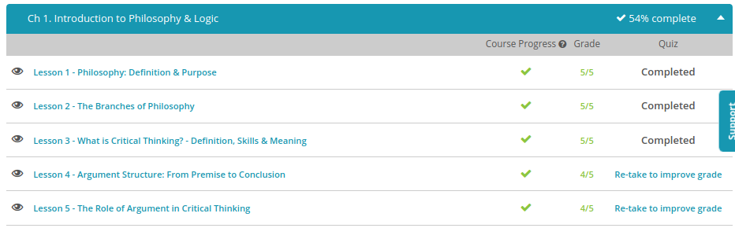

### Andrew Garber
### December 13
### Introduction to Philosophy and Logic

#### Philosophy: Definition & Purpose:
 - Philosophy overall aims to question assumptions we make about our lives and really dig in to the details of why we think what we think and how we choose to act. It can get complicated at times, but it can also help a person to see more clearly that there are other ways of looking at the world than is our habit. Other branches deal with different types of questions. The topic of the different branches of philosophy will be covered in another lesson.
 - Doing philosophy, on the other hand, is actively questioning and inquiring about the nature of our lives and different ways of understanding things. One benefit of doing philosophy is that it helps you think critically. For a small issue, such as whether to eat someone else's ham sandwich, decisions may be simpler, but life is filled with more complicated decisions and debates, and philosophy can help with thinking through these questions, engaging in discussions, and coming to your own conclusions. Other fields of study use philosophy to inquire more deeply about their specific area of interest, whether it's science, art, politics, or any other discipline.
 - If you study philosophy, you will not necessarily have all the answers to what life is about or come to definite conclusions about how to live your life. Experts still debate many of the subjects of philosophy and will indefinitely. What studying philosophy can do is to help you engage in the world around you in a way that is thoughtful, questioning, and open to learning new things. Whether you end up in the world of business, politics, raising children, or any other arena of life, philosophy is concerned with every nook and cranny of existence.

#### The Branches of Philosophy:
 - Epistemology, put simply, is the study of knowledge. Put in a more comprehensive way, epistemology focuses on how we come to acquire knowledge and what type of limits there are to our knowledge. It even asks the question, 'What is the nature of knowledge?' You can remember this term by thinking of how -ology refers to the 'study of', while episteme- refers to 'knowledge'.
 - Metaphysics looks more deeply into topics such as this and focuses on determining what, if anything, can be said to be real. The abstract idea of personal identity, for instance, can benefit from this kind of questioning, as can concepts such as time and space.
 - The idea behind logic is that arguments and claims need to be evaluated closely and weighed to determine whether they involve correct reasoning. In fact, the reason to dig so deeply into topics like personal identity, time, and space is to question our assumptions and assure that our beliefs are valid. Using logic, a person aims to avoid coming to conclusions without evidence. Logic's role, from this perspective, is to clarify our thought process and improve our arguments.
 - The philosophy of art, also sometimes described as aesthetics, is a branch of its own and relates to our beliefs about art and the nature of beauty. In this branch of philosophy, a person might ask questions about what value art contributes to the world, and whether there really is a demarcation between art itself and reality.
 -  Some philosophers have used ethics as an exploration in which actions are praiseworthy and which are not, and whether a particular action is something that society should encourage or discourage. Some may question the categories of 'right' and 'good' and consider what they really mean.
#### What is Critical Thinking:
 - Critical thinking means making reasoned judgments that are logical and well-thought out. It is a way of thinking in which you don't simply accept all arguments and conclusions you are exposed to but rather have an attitude involving questioning such arguments and conclusions. It requires wanting to see what evidence is involved to support a particular argument or conclusion.
  - Additionally, critical thinking can be divided into the following three core skills:
    - Curiosity is the desire to learn more information and seek evidence as well as being open to new ideas.
    - Skepticism involves having a healthy questioning attitude about new information that you are exposed to and not blindly believing everything everyone tells you. (Not the school of Skepticism, but the attitude of skepticism.)
    - Finally, humility is the ability to admit that your opinions and ideas are wrong when faced with new convincing evidence that states otherwise.

#### Argument Structure
 - We're used to thinking of the word 'argument' as meaning a fight or intense back-and-forth where emotions run high. Yet in the context of philosophical arguments, the word doesn't necessarily mean heated conversation, though some conversations have the potential to be intense. An argument, in the philosophical sense, involves a series of assertions meant to demonstrate that a certain claim is true. This is why you hear in academic discussions that a particular scholar argues for their case. It doesn't necessarily mean they have anger or personal grievances. Instead, they want to communicate a claim to others in order to be convincing and to foster better understanding.
 - A premise is a method of establishing a rationale for your conclusion. Typically, this will include ideas that are expected to be generally acceptable to an audience. One possible clue that a premise is being provided is the word 'since,' although other words may be used.
 - A conclusion is the result of linking together each premise in an argument to lead to a specific claim. One possible clue that a conclusion is coming is the word 'therefore.' A conclusion may come toward the end of a conversation or text, but also can occur at any point, or even be unspoken, depending on how the speaker chooses to describe his case.

#### The Role Of Argument
 - Even when there is not a vast amount of data available, many philosophers still aim to make arguments using critical thinking.
 - A critical thinking approach avoids relying on subjective opinions. Subjective opinions are ones that are based on our interpretation of very limited information and making judgment calls before weighing the evidence. Often, opinions rely on emotional responses and assumptions we have made about an issue, rather than careful, conscious thought.
 - So, subjective opinions have their shortcomings. This doesn't make opinions worthless. We often have to make these types of judgments in life. Yet when you are making an argument in philosophy, a person will want to focus more heavily on justified claims, or conclusions that are valid and sound based on evidence.
 - Opinions aren't necessarily false. They could turn out to be true. But until you have reasoned through your assumptions to determine why they are valid, an opinion is limited in its usefulness in many philosophical traditions.
 - Most people do experience a sense of intuition about certain situations in life, coming to a conclusion without a rational explanation or an internal sense of knowing something to be true without knowing why. If you've ever had an uneasy feeling about a situation without being able to pinpoint exactly why, you may have experienced this sense of intuition. We may rely on intuition in various areas of our life, especially ones involving our safety, when all of the needed information is not available and we have to make a snap judgment quickly.
 - Like opinions, our intuition could turn out to prove correct. However, it's also possible that a sense of intuition in some cases could come from less positive qualities, such as our prejudice or personal bias. Imagine having an uneasy feeling about someone of another ethnicity. You might think this is your internal knowledge that something is wrong with that person. What if, in reality, your feelings are just based on prejudice? This is one reason why examining assumptions is important to critical thinking.
 - For many philosophers, logical reasoning is the preferred approach to arguments instead of intuition. Other traditions may place more emphasis on intuition or view it differently. For a critical thinker, balancing intuition with external evidence is important. 

