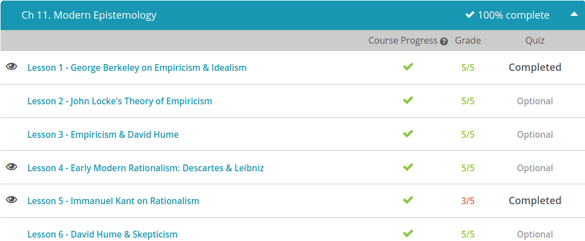

### Andrew Garber
### February 2
### Modern Epistemology

#### George Berkeley
 - Some of Berkeley's views were aligned with the main idea of empiricism, which argues that what we know comes from sense experience. However, unlike some of the other empiricists of his time, such as John Locke, Berkeley did not see a separation between a physical world and a mental world. Instead, his perspective was idealism, the view that mind-independent things do not exist.
 - Berkeley is not saying that our experiences of objects are hallucinations. He recognizes that we do experience sensations that appear to be connected to things like trees and their leaves. However, he doesn't think the cause of those sensations is physical matter, like a material tree that's totally separate from our minds. Instead, the tree, or other objects that we believe we are experiencing, are collections of ideas. 
 - Yet Berkeley's idealism involved more than just an argument for belief in God. He makes an interesting case for his approach by arguing that objects do not really have qualities that we typically ascribe to them.
 - For instance, let's say that you have a pot of boiling water. Heat is one quality of that water. But what about the qualities of room temperature water? If you were to put your hand in the freezer, then put your hand in water at room temperature, the water might seem to have the quality of warmth. Then again, if you put your hand under hot water, then placed it in the warm water, the water would feel cold.
 - Berkeley argues, as others have, that this shows qualities like temperature to be relative, even contradictory, and, in his view, not so material at all. Perceiving hot versus cold is about ideas, not an experience of a separate physical reality, he claims.
 - He goes on to claim that the same sorts of problems come up when we look at qualities like the size of an object. These, too, are relative to who is doing the perceiving. An object can't be said to have any material qualities at all, separate from the mind of a person.

#### Descartes & Leibniz 
 - Rationalism is the view that what we know comes from reason. In philosophy, this approach is often understood in contrast to the view that what we know comes from sense experience, or empiricism. Those who are described as rationalists may see sense experience as beneficial in some respects, but still believe that our rational minds are mainly responsible for determining truth.
 - Let's look to Descartes for his explanation of what this really means. Rene Descartes was a French philosopher, mathematician, and physicist who is often described as the father of modern philosophy.
 - Well, Descartes had set about the task to doubt anything and everything, even his own existence, until he could reasonably conclude that something is true. So if you question even your own existence, how do you go about proving you exist? Descartes pointed out that, in order to doubt, there has to be someone doing the doubting. In fact, to think at all, there must be someone doing the thinking.
 - So starting in a place of complete doubt then, first and foremost is the knowledge that you are thinking, and so your own thinking mind proves you exist: 'I think, therefore I am.' 
 - By being able to ponder the question of his own existence, that is a fundamental proof that he exists. 
 - He also points to examples of where senses could even mislead us. For instance, we might sense something in our dreams, like the idea that we are in a garden, smelling flowers, with a breeze blowing, but in this case, our senses are not accurate. There is no garden and no breeze.
 - But Descartes doesn't poo-poo the senses completely. He does recognize they are useful, insofar as the senses help us move around in the world and do what we need to do. Yet the senses are not the sole basis for our knowledge and are well worth doubting, says Descartes.
 - Like Descartes, Gottfried Wilhelm Leibniz saw reason as the main source of knowledge. A German philosopher and mathematician, he made significant contributions to a variety of disciplines, including physics, logic, ethics, and theology. Born just a few years before the death of Descartes, he is also considered an early modern rationalist.
 - Leibniz also believed the mind was immaterial, but then went even further to question whether even the physical body and other stuff is material in the way we imagine, coming up with his own theory for what makes up the world as we know it. He used the term monads to describe what he saw as the primary elements that make up the universe. These monads contain all the potential properties they could have in the future, and a trace of all of the properties they've had in the past, folded up to appear as we perceive them in the moment.
 - Both Descartes and Leibniz rejected the idea that the mind is a blank slate at birth, as philosopher John Locke had said. The human mind starts off life with some innate ideas all its own. Rather than giving credit to the senses for most of what we know, early modern rationalists saw this innate reasoning as a key basis for gaining knowledge.

#### Immanuel Kant
 - Immanuel Kant was a German philosopher of the 19th century who made big waves in his field. Kant arrived on the philosophy scene with two very strong traditions to understanding knowledge already firmly in place and often at odds. A tradition of rationalism claimed that what we know comes from reason, while a tradition of empiricism took the view that what we know comes from sense experience. He believed that both of these traditions should be combined to form a new approach to knowledge.
 - First, consider 'Dogs are canines' and what this really means. We know that the word 'canine' is another way to describe a dog. Saying dogs are canines holds no information about dogs that is separate from the very definition of a dog. Instead, we're simply using another word in the language to describe what is already true about dogs without any room for question. By definition, a dog is a canine. It's a little like saying, 'Dogs are dogs.' It's not particularly informative, unless you've never heard the term 'canine' before today. Kant referred to this type of statement as an analytic judgment, or put simply, it's definitional.
 - How about 'All dogs bark?' This provides a different kind of information. It's more than a definition of a dog. It's a description that isn't necessarily a given and aims to describe dogs. It's about information and in this case, misinformation about dogs since there are some dogs that do not bark. This type of statement is called a synthetic judgment, one that contains more than just the definition and provides information.
 - Kant called this a synthetic judgment because you have to synthesize one thing, in this case dogs, with another thing, that they bark. The phrase 'Dogs are canines' doesn't require synthesizing because the two ideas - dogs and canines - are really the same thing. In other words, the term 'dogs' contains the idea of canines.
 - A priori synthetic statement helped demonstrate that reason and experience are interrelated. Instead of choosing sides in a rationalism/empiricism debate, Kant worked to show that knowledge comes from the use of reason and our experience, synthesized together. He also recognized that reason could be used to understand the workings of the mind itself, as he made efforts to do in his own philosophy.
