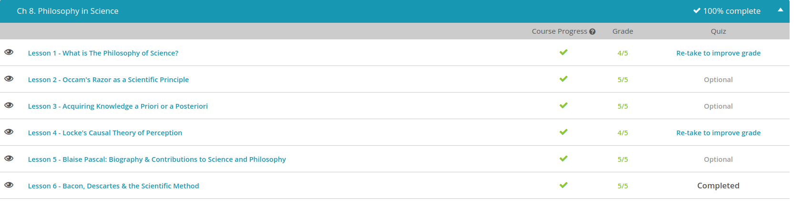

### Andrew Garber
### January 24 2023
### Philosophy and Science

#### What is the Philosophy of Science?
 - This lesson looks at how philosophers define science and how they differ in their views of what it really is. We'll hear from the perspectives of four influential thinkers. By the end of our lesson, you'll better understand what is meant by the philosophy of science, an approach that looks at how we define science, how science works, and how we build scientific knowledge.
 - First up is Karl Popper. Popper would want you to know the meaning of the term falsifiable. This refers to the possibility of proving a statement to be false. Popper argues that scientific knowledge must be falsifiable, meaning that there must be at least the potential to disprove a theory with an observation that would contradict it.
 - Let's look at this more closely with an example. First, consider the claim, 'There is no Big Foot living in the Pacific Northwest.' There is the potential to prove it false if we were able to obtain new information, such as capturing Big Foot. So this can be considered a scientific claim.
 - Now consider the claim, 'Big Foot lives in the Pacific Northwest.' There is no real way to disprove this, to determine it is 100% false. We could comb the region looking for Big Foot in an exhaustive search, but we can't say without a doubt that the statement is false. Therefore, the claim that Big Foot exists is not in the realm of science from Popper's point of view. This is a philosophical version of what statisticians would call "a statistical degree of certainty".
 - Thomas Kuhn is up next. He's more of a historian of science, looking at how science has developed over time. A key term to know for Kuhn is the phrase paradigm shift. Paradigm shifts occur when old scientific theories are questioned by a revolutionary new approach, and a new framework is developed for assessing scientific knowledge.
 - For example, consider a time when people thought the earth was the center of the universe. During this period of time, science was based on certain standards and ideas, while later, these concepts had to be completely revised to adjust to the new understanding of the sun being at the center of our solar system.
 - Now, let's turn to Paul Feyerabend, who is definitely not convinced that there is any one standard approach that can get to the truth. He proposes that science, as we know it, is not as objective as it presents itself to be. He argues that the scientific method is not particularly valuable at all.
 - Feyerabend was interested in completely bending the rules of how we think about science, turning the approach on its head. He questions whether the scientific method really produces useful results at all, compared to any other method.
 - Our final philosopher to consider is Helen Longino. Longino acknowledges that scientists each have their own assumptions and beliefs that influence how they present and argue their claims. Yes, this makes them less than objective. Yet, there is a way to get to a more objective science. She argues that this is why we need forums in society for criticizing and questioning what is claimed by scientific communities.

 
#### Occam's Razor
 - William of Ockham, also spelled with two 'c's' instead of a 'k,' was a Franciscan philosopher who was born in 1285. He was famous for what I just mentioned, Occam's razor. This is a philosophical principle that, in its original form, states, 'Plurality should not be posited without necessity.' A simpler explanation for this is that a simpler explanation is usually better than a more complex one. Or, to put it in an even simpler way, the simplest explanation of some sort of observation in nature is the one that is most likely to be correct. That's the principle of Occam's razor. The reason the word razor is used is because we use this principle to shave away extraneous details from an explanation for something.

#### Acquiring Knowledge a Priori or a Posteriori
 - You knowing broccoli is green is an example of a posteriori knowledge, which is simply knowledge based on experience. Translated from Latin, a posteriori means 'from what is after.' You can remember the term by thinking about how 'post' means after. So, a posteriori refers to what knowledge comes after you experience something, like seeing a bunch of broccoli and learning it is green.
 - Many philosophers agree that much knowledge is gained a posteriori. Modern scientific fields place great importance on knowledge that is gained from the evidence we gather from the world around us.
 - Knowledge that is separate from our experience, memories, body sensations, or what we have learned from others is known as a priori knowledge. For instance, if a person believes in a god, they may also believe that this god has given them some innate knowledge, like a type of wisdom in their own mind, separate from what they learn from what's around them.
 - Another use of the term a priori is for logical statements that we can reason are true. For instance, if I tell you that a person named Ellen is shorter than a person named Kayla, and Kayla is shorter than Matt, you can deduce that Ellen must also be shorter than Matt. You don't have to meet any of these people to know that, you just need to understand the relationship between each of them.
 - Some philosophers believe that math is also a good example of a priori knowledge. This is because there are consistent rules that can be applied to math universally, like knowing that 1 + 1 will always add up to 2. Translated from Latin, a priori means 'from what is before.' 
 - Many of the philosophers who believe that we have knowledge that is separate from our experience are known as rationalists. Rationalists, in philosophy, generally believe that knowledge can come from reason and logic alone and is not dependent on experience. A rationalist might argue that we know things not just because of our world experience, but also because of an innate ability to reason what is true. This makes them big believers in a priori knowledge.

#### John Locke's Casual Theory of Perception
 - This lesson looks at these types of questions in relationship to the thoughts of philosopher John Locke and his causal theory of perception. He rejected the concept that your mind could produce ideas that match the precise truth about the physical world.
 - Locke argues we can never really form a complete picture of an object in our minds that matches the object itself as it really is in the material world. We can only have ideas about that object. For example, let's say you have a slice of lemon in your hand. You look at the lemon, you smell the lemon and then you take a taste of it.
 - Your mind will develop ideas about that lemon from your experience with it. You might even argue that your mental images about that lemon are pretty close to what it's really like in the physical world. Yet, Locke argues that your thought of what this lemon is can only be a representation of the reality of the lemon. It can never match the lemon exactly. This is because your mind is limited, inherently, and while we can gain a lot of knowledge about the world around us, we can never know it completely. (In computer terms, the compute power for that kind of problem would be far in excess of the capacity of the human brain.)
 - Locke distinguishes between two different types of qualities in an object: primary qualities and secondary qualities. He argues that the primary qualities are the undeniable properties of an object, like the size and shape of the lemon. These help us to create mental ideas for what an object is. Primary qualities are quite reliable for producing ideas that resemble the real thing, according to Locke.
 - On the other hand, secondary qualities of an object are attributes like the yellow color of the lemon and the sour taste that are subjective. Locke considers these secondary qualities to be the results of the action of primary qualities on the organs. What does Locke mean by this? 
 - Because secondary qualities are subjective, they can be influenced by a comparison to other objects. If you ate something sweet and then ate the lemon, it would be far more sour than if you had eaten something sour before eating the lemon. This is because your mind is comparing the lemon to the other object you ate. Locke argues that the lemon is still the same size and shape, but your mind is comparing it to something else, which is why it tastes sourer. 
 - Why are Locke's ideas on this topic referred to as the causal theory of perception? In his view, objects have qualities that cause us to have sensations, like when we perceive the qualities of a lemon and then develop ideas for what the lemon is like.
 - In other words, Locke believes there is a real, physical world, and our sensations help us create a mental understanding of that world. Although it's not perfect, this representation of reality we develop through our senses and experience is the best information we have available to us.

#### Blaise Pascal:
 - Pascal was born in Clermont, France, in 1623. Pascal was only three when his mother died, and when he was eight his father moved Pascal and his two sisters to Paris. Once in Paris, Pascal was home-schooled by his father who did not trust the local schools. Pascal's father attempted to steer Pascal - whom he recognized as a prodigy - toward literature and language, forbidding Pascal from studying mathematics and geometry. As an amateur mathematician himself, Pascal's father feared an interest in math would cause his son to forego learning other topics. However, the decree only piqued the young genius' interest, and before long Pascal was teaching himself geometry.
 - After discovering this, Pascal's father relented, teaching his son Euclid and allowing the young Pascal to accompany him to meetings of the local mathematical society. There Pascal met and conversed with many of the leading mathematicians of the period, including Marin Mersenne and Pierre Gassendi. Before long, Pascal was ready to publish his own findings. In 1640, he published the Essay on Conic Sections, which made important advances in the transcription of objects onto two-dimensional paper.
 - Pascal showed his father's fears to be unfounded as Pascal soon found other meaningful pursuits in addition to theoretical math. In 1642, he created a rudimentary calculator to aid his father in tax calculations. In the mid-1640s, Pascal also took up an avid interest in physics, and his 1651 Treatise on the Vacuum turned contemporary attitudes concerning the existence of vacuums on their head.
 - The Pascaline, as he dubbed the calculator already discussed, was only marginally successful, though it did have its intended effect of making his father's job easier. Many of Pascal's greatest accomplishments were in mathematical theory or in physics. For example, when Pascal took interest in physics, he single-handedly changed the prevailing theories on vacuums. Prior to Pascal, most early scientists believed vacuums of space to be virtually non-existent, trusting in the ages-old Aristotelian maxim that 'nature abhors a vacuum.'
 - The achievement Pascal is perhaps most known for is pioneering mathematical probability theory in concert with his colleague Pierre de Fermat. The two exchanged letters discussing thought problems and experiments they both conducted using dice and other seemingly chance outcomes. Through their correspondence, Pascal realized that the outcome of any roll of two dice was not as random as it seemed; indeed, each outcome instead had a fixed probability! For example, rolling two dice can come up 7 several different ways: 3 and 4, 1 and 6, or 2 and 5. However, rolling a 2 can only occur once, when both die come up as 1.
 - Pascal further combined his fervent belief in God and his work on probability theory to show that it is reasonable and prudent to believe in God. According to Pascal, God's existence has only two outcomes: either he does or he does not. If he does not, our choice to believe or not believe has no impact upon our current lives. However, Pascal argued, if he does exist then our choice has an enormous effect, leading to either eternal happiness or eternal damnation. Thus, belief in God is the only rational choice, as it is the only choice that has a positive outcome. (I disagree with this personally, but I see the rationality in Pascal's argument.)

#### Bacon and Descartes
 - The Ancient Greeks were keen students of science, and many Greek philosophers helped develop ways to arrive at scientific knowledge. Aristotle, an ancient Greek philosopher, in particular, helped devise formal ways to inquire about the universe. During the Middle Ages, Christian scholars, called scholastics, combined Christian teachings with Greek logic, and came up with improved ways of ascertaining knowledge.
 - The real breakthrough in the development of the scientific method, however, came from a man named Roger Bacon. Roger Bacon (1214-1294) was an English philosopher. Bacon's contribution to the development of the scientific method stems from his emphasis on experimentation. Bacon suggested scientific truth could be found out through the cycle of observation, hypothesis, experimentation, and independent verification.
 - Francis Bacon (1561-1626) was another English philosopher. He is sometimes known as 'the Father of Empiricism'. Francis Bacon stressed inductive reasoning, which involves reasoning through specific cases in order to reach broader conclusions.
 - Another important figure in the development of the scientific method was René Descartes. Descartes (1596-1650) was a French philosopher who has often been called 'the Father of Modern Philosophy'. Descartes was a rationalist, which means that he believed that human reason was the chief source of knowledge, not sensory experience. Descartes is famous for his axiom, 'I think, therefore I am.' He published many important works, notably Rules for the Direction of the Mind and Discourse on Method.

