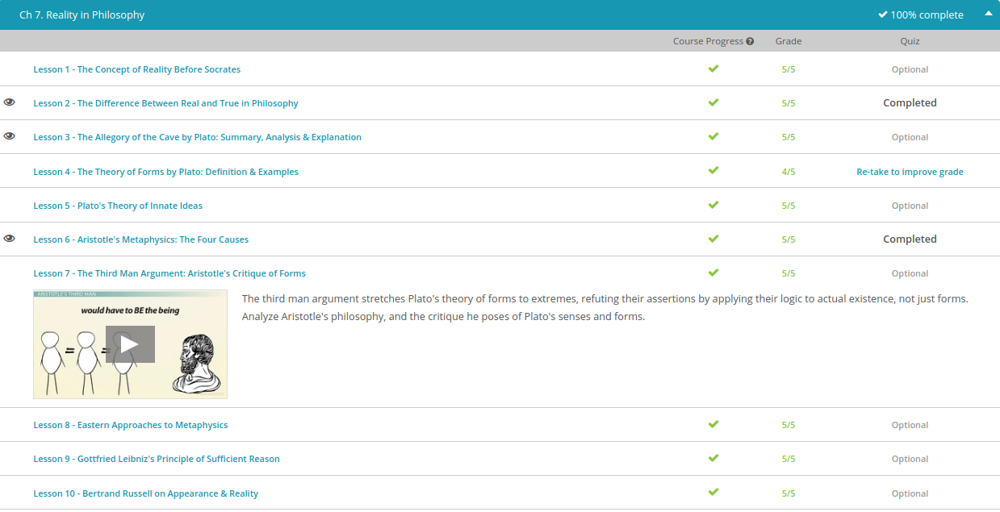

### Andrew Garber
### January 23
### Philosophy 101
### Reality in Philosophy

#### The difference between real and true in philosophy
 -  Trying to explain the difference between real and true is pretty much an exercise in subjectivity. One person has one opinion, while another has the exact opposite. For this reason, today's lesson on true and real in philosophy will be easy to take issue with. Despite this, we're going to give it a whirl and give some of the more accepted and traditional theories and ideas.
 - With that rather odd admittance of our lesson's shortcomings, we'll start by trying our best to define truth. Many philosophers define truth as what is empirical and logical. It can be studied, and it can be what scientist would deem proven. When speaking of this concept of truth, there are a few things philosophers give as guidelines for truth.
 - First, truth must adhere to the correspondence theory. Stated as simply as I can think to, the correspondence theory asserts that truth must be congruent with accepted fact. Second, truth must uphold the principle of non-contradiction. Again trying to keep things simple, this asserts that what is true cannot contradict what is already known. To try to bring all this abstract stuff down a bit, let's use an example.
 - Without overthinking it, let's all agree that if I go out in the rain unprotected, I will get wet. This is something we'd say is true. We can prove it. If I go outside in a rainstorm, I'll come in drenched. Since I've done this before, it passes the correspondence theory test. In other words, it jives with what we already know.
 - It also adheres to the principle of non-contradiction. Never once have I gone out unprotected in the rain and stayed dry. Therefore, our statement is true. It can be studied and it can be empirically proven. It does not contradict our experience or our senses.
 - Differing from the concept of true, many philosophers would assert that something is real if it has actual existence and substance. Unlike truth, something that is real does not have to be proven. It just is because it is. In the same way that in Stoic philosophy something can happen, but it doesn't have to affect you, something can be real just because it is.
 - Something that is real is not context-dependent. In other words, if any object that is real was moved to a different location it would still be real on the way there and once it got there - even if it was in a different context or situation.
 - According to many philosophers, the same cannot be said of truth. Because truth is based on empirical evidence - it's derived from reality instead of being reality, if that makes sense - it can cease to be truth. This is rather heady stuff, which has kept lots of philosophers spinning, so we'll just touch on it lightly.
 - For instance, if I lived back a thousand years, I would believe the earth was flat and that the sun rotated around the earth. In fact, people thought the latter was so true they were willing to kill people over it. Somehow and some way, the context of their lives made it true to them the earth was at the center of all.
 0 However, in our modern lives of satellites, space missions, and amazing telescopes, this idea has been completely rebuffed. In other words, it definitely doesn't fit the context of today's science. Yes, they thought a flat world was real, but it wasn't!
 - With this mention of real, we come to a bit of an impasse. Here's the problem. What if people think something is real just because it corresponds to some truth? Using our ancient relatives, they thought the earth was a real flat object because they believed the idea that the earth was flat!

#### The Allegory of the Cave by Plato
 - Plato, a famous Greek philosopher who wrote the Allegory of the Cave, attempted to answer some of these philosophical questions, most notably about the nature of reality. He tells the 'Allegory of the Cave' as a conversation between his mentor, Socrates, who inspired many of Plato's philosophical theories, and one of Socrates' students, Glaucon. 
 - One of Socrates' (and Plato's) chief ideas was that of forms, which explains that the world is made up of reflections of more perfect and ideal forms. The material world, the one we can see, touch, hear and smell, is really just half-seen images of the reality of the forms. Relying on your physical senses alone - trusting what you see, for instance, is, to Socrates, making yourself effectively blind. The world we see is only a reflection of the forms the world represents (and not even that accurately). A form, whether it's a circle, or a table, or a tree or a dog, is, for Socrates, the answer to the question, What is that? Only understanding forms can lead to true knowledge.
 - In the dialogue, Socrates asks Glaucon to imagine a cave, in which prisoners are kept. These prisoners have been in the cave since their childhood, and each of them is held there in a peculiar manner. They are all chained so that their legs and necks are immobile, forced to look at a wall in front of them. Behind the prisoners is a fire and between the fire and the prisoners is a raised walkway, on which people can walk.
 - These people are puppeteers, and they are carrying objects, in the shape of human and animal figures, as well as everyday items. The prisoners could only see these flickering images on the wall, since they could not move their heads; and so, naturally enough, they presumed the images to be real, rather than just shadowy representations of what is actually real.
 - In fact, Socrates claimed, the images on the wall would be so real that the prisoners would assign prestige among each other to the one who could recall the most detail about the shapes, the order in which they appeared and which might typically be found together or in tandem. Of course, Socrates would point out, this was hollow praise, since, in fact, the images were not real.
 - Then Socrates offered a twist in the plot - what if one of the prisoners were to be freed and made to turn and look at the fire? The bright light would hurt his eyes, as accustomed as he was to the shadows, and even in turning back to the wall and its flickering images (which would only be natural), the prisoner couldn't help but notice that they weren't real at all, but only shadows of the real items on the walkway behind him.
 - After learning of the reality of the world, the prisoner now sees how 'pitiable' his former colleagues in the cave really are. If he returned to the cave and rejoined them, he would take no pleasure in their accolades or praise for knowledge of the shadow-figures. For their own part, the prisoners would see him as deranged, not really knowing what reality is and would say of him that he left the cave and returned with corrupted eyes.
 - The Allegory of the Cave is particularly important not only for how elegantly it explains the philosophy of the forms and of reality, but for how it illustrates the concept of reality as a philosophical construct. Socrates, Plato and their followers believed there was an external world of truth that was knowable to human beings, not a mystery or something beyond their understanding. The 'cave' doesn't have to be a permanent condition; instead, enlightenment can be gained, but only if one is willing to endure the blinding light. 

#### Aristotle's Metaphysics
 - Today I'm going to use these two rather old things to teach you about Aristotle's very ancient metaphysics. However, before we get to them, let's define metaphysics. Metaphysics is the part of philosophy that deals with concepts like being, substance, cause and identity. To really oversimplify, we could say it's the study of how things came to be and what caused them.
 - When speaking of Aristotle's metaphysics, lots of sources center on his idea of cause. According to his ancient work, there are four causes behind all the change in the world. They are the material cause, the formal cause, the efficient cause, and the final cause.
 - According to our famous Greek philosopher, the material cause is the actual physical properties or makeup of a thing that is. It's the stuff we can see, touch, taste, and so on. Using my table, the wood is the material cause of the table. This is the simplest of the four causes, anything with substance has a material cause of that substance.
 - Next is the formal cause. Stated a bit academically, the formal cause is the structure or design of a being. In layman's terms, we can call it the blueprints, or the plan. The formal cause is what makes it one thing rather than another. Going back to my table, we already know its material cause is wood. That's what it's made of. However, the original carpenter could have chosen to make the very same wood into a chair, but he didn't. The carpenter chose to make it into a table, and that planning is the formal cause.
 - Aristotle's next cause is known as the efficient cause. Stated very simply, this is the thing or agent which actually brings something about. It's not what it's made of or the plan for how to make it. It's the actual force that brings something into being. Again using our table, Aristotle would tell us the carpenter is the efficient cause. It's his swinging of a hammer and sawing that actually brought the table into being.
 - Our last cause is aptly named the final cause. Being a bit more abstract, the final cause is the ultimate purpose for being. The table's final cause is its purpose in the universe, to be a thing that people eat off of and use in their daily lives. It's the reason it was made.

