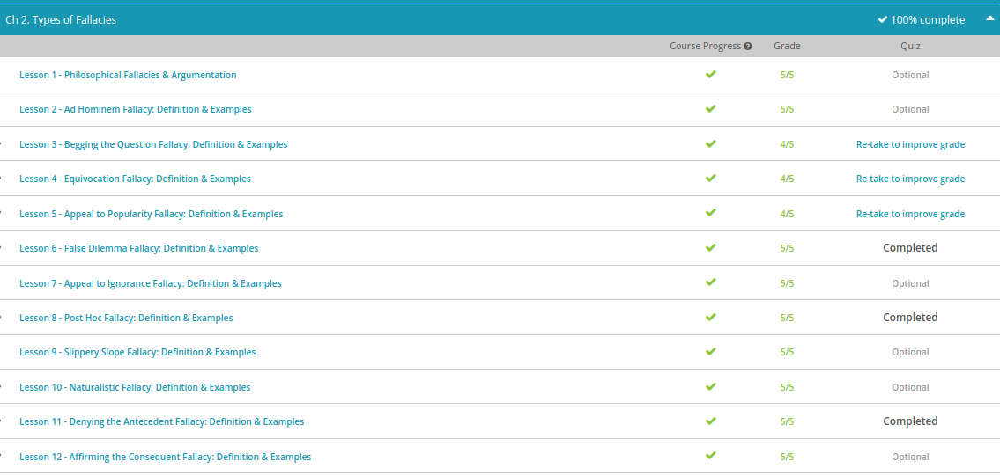

### Andrew Garber
### December 15 2022
### Types of Fallacies

#### Begging the Question Fallacy
 - But when a person uses evidence that is just restating their claim, it's known as begging the question, a form of circular reasoning. This is an argument with a conclusion that appears as one of its premises. This is how people typically make a faulty argument by begging the question.'
 - A person starts off by stating that a certain thing is true, then they do not give any real evidence for that. Instead, they restate the same general information. So, no evidence is really given. No progress is made in the argument. A parent saying you have to listen to me because I said you should listen to me uses this fallacy.

#### Equivocation Fallacy
 - An equivocation fallacy involves using different meanings for a word or phrase at different points in the argument.
 - A helpful way to remember this fallacy is to think about equivocation as related to the words 'equivalent' or 'equal,' meaning the same or similar. The equivocation fallacy relies on the use of equivalent words or phrases that don't mean exactly the same thing, but are used as though they do to try to prove a point. 

#### Appeal to Popularity Fallacy
 - In philosophy, a fallacy called appeal to popularity is known to be a faulty approach to making an argument. You can tell this fallacy is being used when an argument relies on public opinion to determine what is true, right, or good.
 - Are there times when using popular opinion makes sense? Well, it's definitely possible that something that is a popular choice turns out to be a better choice.
 

#### False Dilemma Fallacy
 - A false dilemma fallacy, or an argument that presents a few options as though one of them must be true if the others are false. This is a fallacy because it is not always the case that one of the options must be true. 
 - It leaves no room for other options, and instead enforces that one of whatever they have stated must be true.

#### Post Hoc Fallacy
 - Post Hoc Ergo Propter Hoc - After it, therefore because of it.
 - post hoc fallacy, or an argument that draws the conclusion that one event is directly caused by another event without evidence to prove this. For instance, when events happen close together in time,
 - The fallacy is sometimes known as a false cause fallacy because the argument is claiming a cause for an event that could turn out to be false. To remember the Latin phrase, post hoc, you can think of how 'post' can mean 'after' and how this fallacy is used when one thing happens after another.
 -  A correlation is a relationship between two things or events. It's common in science to find correlation between two events, without being able to claim that there is causation.
 - Causation is one event or thing causing a specific effect. Are there times when it's reasonable to claim cause and effect? Certainly. A pileup of cars on the highway could be said to be caused by the first car skidding and crashing. But, it's important to remember that correlation does not equal causation.

#### Naturalistic Fallacy:
 - Do you think you should get regular exercise? If so, why do you think you should, logically speaking? One reason you might give is because of the health benefits that occur when you get exercise. Therefore, you should get exercise. Some would argue that the argument you've just made for why you should get exercise is a type of naturalistic fallacy. This fallacy is inherently controversial, and it's important to understand what it is and why it's controversial.
 - It seems like a no-brainer to say that's it's good to get physical activity. But, while few people would argue that it's a bad idea to aim for more physical movement in your life, some might take you to task for how you logically argue for why you should. Consider for a moment what benefits you might know exist for physical activity. You might look at research for its impact on your life span, quality of life, and a correlation to preventing certain health problems.
 - If these are scientific facts, then few will argue these points. What they might argue about is whether you can take a leap from saying that exercise improves these various areas to saying that it is, therefore, something you should do, as an obligation, something that is 'good' with a capital G. Using a broad definition, a naturalistic fallacy is an argument that derives what ought to be from what is. In other words, it's an argument that moves from facts (what is) to value judgments (what ought to be).
 - The data in question here is not the controversial part of this, quite the opposite in fact - most logicians use the scientific method as the bedrock of argument - but assuming that scientifically proven = Virtuous is a big claim.

#### Denying the Antecedent Fallacy
 - A conditional statement is an if-then statement that includes two parts, an antecedent and a consequent. The antecedent is the 'if' part of a conditional statement. The antecedent often begins the statement. 
 - The consequent is the 'then' part of a conditional statement, like a consequence to the antecedent. The word 'then' may not always be used to denote the second part of the sentence, but when it makes sense to add that word, you probably have a conditional statement.
 - Using conditional statements does not always involve faulty logic. If-then statements are used quite often and usually are an acceptable way to describe the relationship between an antecedent and a consequent. However, a fallacy occurs when conclusions are drawn from denying the antecedent in a conditional statement.
 - Denying the antecedent means the antecedent in a conditional statement is denied, or rejected. This may be a true statement in itself. However, the act of denying the antecedent becomes a fallacy when a conclusion is made that the consequent can therefore also be denied.

#### Affirming The Consequent Fallacy
 - an if-then statement which includes two parts: an antecedent and a consequent. The antecedent is the 'if' part of a conditional statement, and the consequent is the 'then' part of a conditional statement. Sometimes 'then' won't be used in the sentence, but the format is still basically 'If A is true, then C is true.'
 - The fallacy of affirming the consequent occurs when a person draws a conclusion that if the consequent is true, then the antecedent must also be true. The consequent is the 'then' part of a conditional statement, though at times you won't see the word 'then' used.

